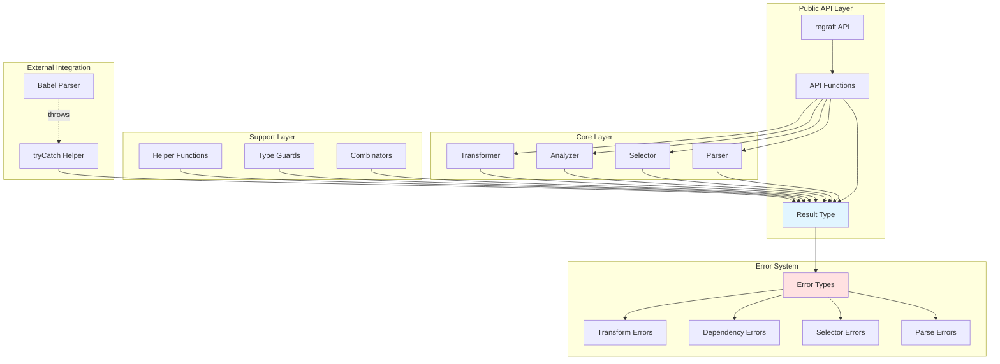
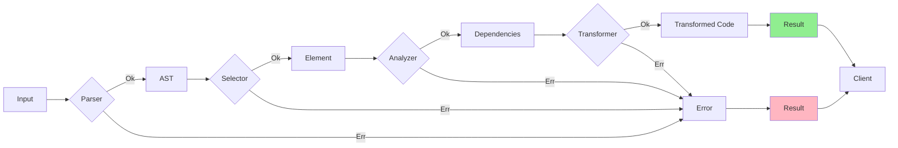
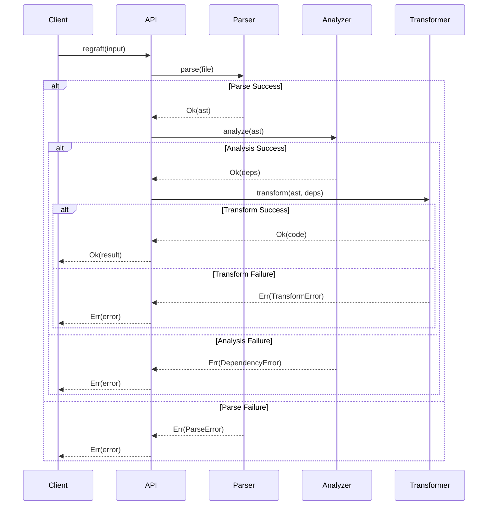
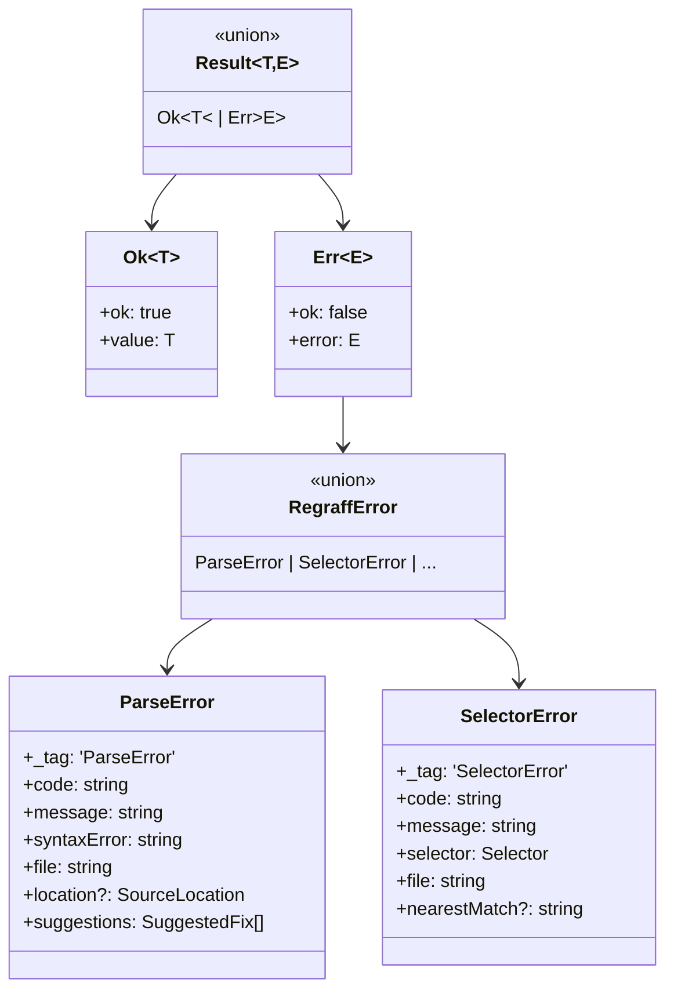
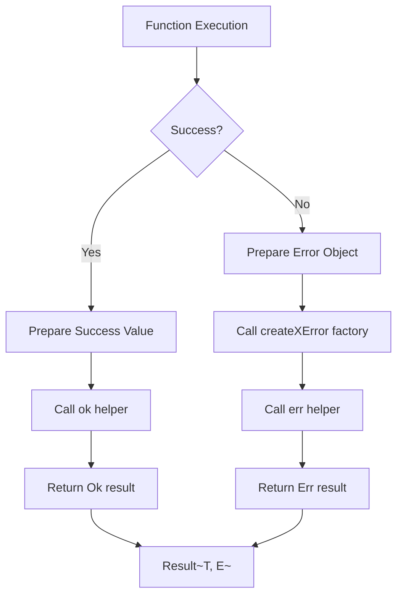
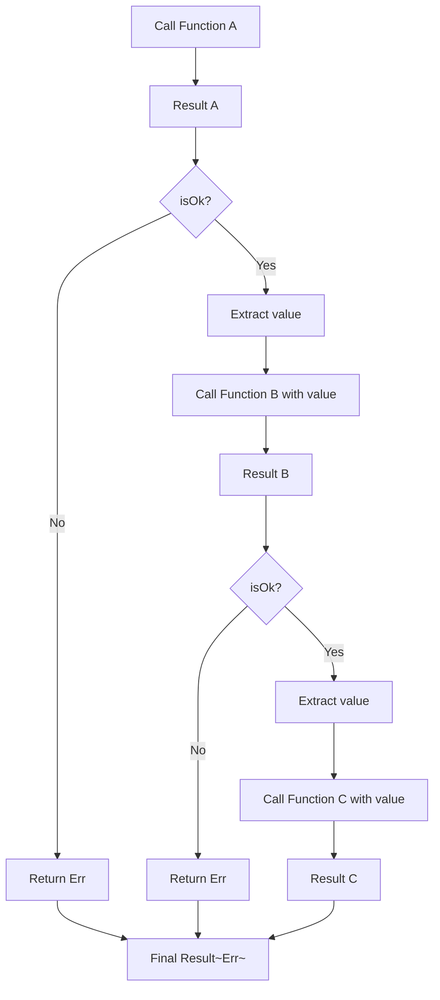
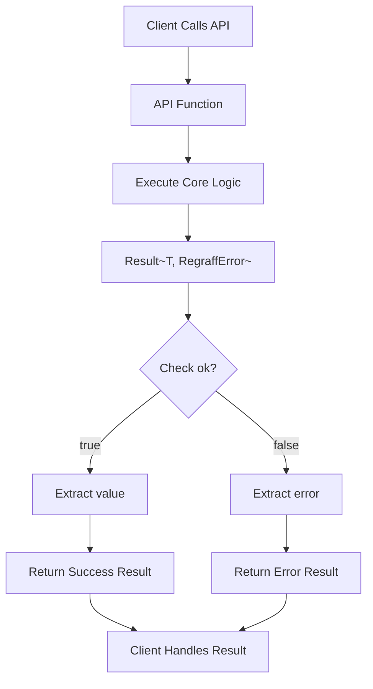
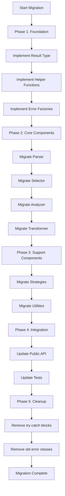

# Design Document: Consolidate Error Handling

## Overview

This design document outlines the implementation of a functional error handling system for the regrafter codebase using the Result/Either pattern. The goal is to replace exception-based error handling (try-catch blocks) with an explicit, type-safe Result type that makes error handling predictable, composable, and consistent throughout the codebase.

**Key Design Decisions**:

1. **Generic Result Pattern**: This design uses generic `Result<T, E>` consistently throughout the codebase instead of domain-specific wrapper types. This allows all helper functions (map, flatMap, unwrap, etc.) to work with any Result type, eliminating code duplication and ensuring maximum reusability. Type aliases like `type MoveResult = Result<Move, RegraffError>` are used for readability when needed, without sacrificing the benefits of the generic approach.

2. **Public API Returns Result Directly (Breaking Change)**: The public API will return `Result<T, E>` directly with no legacy wrappers or backward compatibility layer. This is a clean, consistent approach that prioritizes type safety and composability over backward compatibility. See DDR-001 for detailed rationale.

### Design Goals

1. **Eliminate Exception Throwing**: Replace all try-catch blocks with Result-returning functions
2. **Type Safety**: Make all potential errors explicit in function signatures
3. **Referential Transparency**: Ensure functions are pure and predictable
4. **Generic Result Pattern**: Use `Result<T, E>` consistently instead of domain-specific wrapper types
5. **DRY Error Creation**: Centralize error creation and eliminate duplication
6. **Composability**: Enable functional composition of operations that may fail with reusable helper functions
7. **Performance**: Minimize overhead compared to exception-based error handling
8. **Clean Public API**: Public API returns `Result<T, E>` directly - no legacy wrappers or backward compatibility layers
9. **Migration Path**: Provide a clear, incremental migration strategy with breaking changes clearly documented

### Scope

This design covers:
- Result<T, E> type system implementation
- Error type hierarchy refinement
- Helper functions for Result operations
- Migration strategy for existing code
- Integration with external libraries
- Testing approach
- Public API migration to Result-based signatures (breaking change)

Out of scope:
- Changes to existing error recovery mechanisms (will be adapted to work with Result)
- Backward compatibility layer for legacy code (clean break approach chosen)

## Architecture Design

### System Architecture Diagram



### Data Flow Diagram



### Error Propagation Flow



## Component Design

### Result Type Component

**Responsibilities:**
- Represent success (Ok) or failure (Err) states
- Provide type-safe access to success or error values
- Support functional operations (map, flatMap, etc.)

**Interfaces:**
```typescript
// Core Result type - Generic and reusable
type Result<T, E> = Ok<T> | Err<E>;

interface Ok<T> {
  readonly ok: true;
  readonly value: T;
}

interface Err<E> {
  readonly ok: false;
  readonly error: E;
}

// Constructor functions
function ok<T>(value: T): Ok<T>;
function err<E>(error: E): Err<E>;

// Type guards
function isOk<T, E>(result: Result<T, E>): result is Ok<T>;
function isErr<T, E>(result: Result<T, E>): result is Err<E>;

// Type Aliases Pattern
// Use type aliases for commonly-used Result combinations
// This improves readability while maintaining compatibility with all helper functions
type ParseResult = Result<BabelFile, ParseError>;
type SelectorResult = Result<Element, SelectorError>;
type MoveResult = Result<Move, RegraffError>;
```

**Key Design Principle: Generic Result<T, E>**

The design uses generic `Result<T, E>` throughout instead of domain-specific wrapper types.
This ensures:
1. All helper functions (map, flatMap, etc.) work with any Result type
2. No duplication of Result-handling logic
3. Consistent patterns across the codebase
4. Type aliases provide domain-specific naming when needed

**When to Use Type Aliases:**
- Use type aliases for frequently-used Result combinations to improve readability
- Use direct `Result<T, E>` syntax in function signatures for maximum clarity
- Avoid creating custom wrapper types that duplicate Result functionality

**Dependencies:**
- None (pure type implementation)

### Helper Functions Component

**Responsibilities:**
- Provide common Result operations
- Handle async Result operations
- Combine multiple Results
- Convert between exceptions and Results

**Interfaces:**
```typescript
// Mapping operations
function map<T, U, E>(
  result: Result<T, E>,
  fn: (value: T) => U
): Result<U, E>;

function flatMap<T, U, E>(
  result: Result<T, E>,
  fn: (value: T) => Result<U, E>
): Result<U, E>;

function mapErr<T, E, F>(
  result: Result<T, E>,
  fn: (error: E) => F
): Result<T, F>;

// Unwrapping operations
function unwrap<T, E>(result: Result<T, E>): T;
function unwrapOr<T, E>(result: Result<T, E>, defaultValue: T): T;
function unwrapOrElse<T, E>(
  result: Result<T, E>,
  fn: (error: E) => T
): T;

// Combining operations
function all<T, E>(results: Result<T, E>[]): Result<T[], E>;
function any<T, E>(results: Result<T, E>[]): Result<T, E[]>;

// Exception conversion
function tryCatch<T>(fn: () => T): Result<T, Error>;
function tryCatchAsync<T>(
  fn: () => Promise<T>
): Promise<Result<T, Error>>;

// Async operations
function mapAsync<T, U, E>(
  result: Result<T, E>,
  fn: (value: T) => Promise<U>
): Promise<Result<U, E>>;

function flatMapAsync<T, U, E>(
  result: Result<T, E>,
  fn: (value: T) => Promise<Result<U, E>>
): Promise<Result<U, E>>;
```

**Dependencies:**
- Result type

### Error Type Component

**Responsibilities:**
- Define domain-specific error types
- Maintain error hierarchy
- Provide error creation utilities

**Interfaces:**
```typescript
// Error union type
type RegraffError =
  | ParseError
  | SelectorError
  | DependencyError
  | ValidationError
  | TransformError
  | CircularError
  | InternalError;

// Error types remain as classes with discriminated tags
interface ParseError {
  readonly _tag: 'ParseError';
  readonly code: string;
  readonly message: string;
  readonly syntaxError: string;
  readonly file: string;
  readonly location?: SourceLocation;
  readonly suggestions: SuggestedFix[];
}

// Factory functions
function createParseError(params: {
  code: string;
  message: string;
  syntaxError: string;
  file: string;
  location?: SourceLocation;
  suggestions?: SuggestedFix[];
}): ParseError;

// Type guards
function isParseError(error: RegraffError): error is ParseError;
```

**Dependencies:**
- Existing error code definitions
- Source location types

### Integration Layer Component

**Responsibilities:**
- Wrap external library calls that throw exceptions
- Convert exceptions to Result types at boundaries
- Provide adapters for Babel parser, file system, etc.

**Interfaces:**
```typescript
// Babel parser wrapper
function parseFile(filename: string, source: string): Result<BabelFile, ParseError>;

// File system wrappers
function readFile(path: string): Result<string, FileError>;
function writeFile(path: string, content: string): Result<void, FileError>;

// AST operation wrappers
function traverseAST<T>(
  ast: BabelFile,
  visitor: Visitor
): Result<T, TransformError>;
```

**Dependencies:**
- Result type
- Error types
- tryCatch helper
- External libraries (@babel/parser, fs, etc.)

## Data Model

### Core Data Structures

```typescript
/**
 * Result type representing either success (Ok) or failure (Err)
 *
 * This is a discriminated union that ensures type-safe access to values.
 * The 'ok' field is the discriminant.
 */
type Result<T, E> = Ok<T> | Err<E>;

/**
 * Success variant containing a value of type T
 */
interface Ok<T> {
  /** Discriminant: always true for Ok */
  readonly ok: true;
  /** The success value */
  readonly value: T;
}

/**
 * Failure variant containing an error of type E
 */
interface Err<E> {
  /** Discriminant: always false for Err */
  readonly ok: false;
  /** The error value */
  readonly error: E;
}

/**
 * Error types remain as discriminated unions
 */
type RegraffError =
  | ParseErrorType
  | SelectorErrorType
  | DependencyErrorType
  | ValidationErrorType
  | TransformErrorType
  | CircularErrorType
  | InternalErrorType;

/**
 * Each error type uses _tag as discriminant
 */
interface ParseErrorType {
  readonly _tag: 'ParseError';
  readonly code: string;
  readonly message: string;
  readonly syntaxError: string;
  readonly file: string;
  readonly location?: SourceLocation;
  readonly suggestions: SuggestedFix[];
  readonly recoverable: false;
}

interface SelectorErrorType {
  readonly _tag: 'SelectorError';
  readonly code: string;
  readonly message: string;
  readonly selector: Selector;
  readonly file: string;
  readonly location?: SourceLocation;
  readonly nearestMatch?: string;
  readonly suggestions: SuggestedFix[];
  readonly recoverable: false;
}

// ... (similar for other error types)

/**
 * Helper function return types
 */
interface ResultHelpers {
  // Construction
  ok: <T>(value: T) => Ok<T>;
  err: <E>(error: E) => Err<E>;

  // Type guards
  isOk: <T, E>(result: Result<T, E>) => result is Ok<T>;
  isErr: <T, E>(result: Result<T, E>) => result is Err<E>;

  // Mapping
  map: <T, U, E>(result: Result<T, E>, fn: (value: T) => U) => Result<U, E>;
  flatMap: <T, U, E>(result: Result<T, E>, fn: (value: T) => Result<U, E>) => Result<U, E>;
  mapErr: <T, E, F>(result: Result<T, E>, fn: (error: E) => F) => Result<T, F>;

  // Unwrapping
  unwrap: <T, E>(result: Result<T, E>) => T;
  unwrapOr: <T, E>(result: Result<T, E>, defaultValue: T) => T;
  unwrapOrElse: <T, E>(result: Result<T, E>, fn: (error: E) => T) => T;

  // Combining
  all: <T, E>(results: Result<T, E>[]) => Result<T[], E>;
  any: <T, E>(results: Result<T, E>[]) => Result<T, E[]>;

  // Exception conversion
  tryCatch: <T>(fn: () => T) => Result<T, Error>;
  tryCatchAsync: <T>(fn: () => Promise<T>) => Promise<Result<T, Error>>;
}

/**
 * Type Aliases for Domain-Specific Results
 *
 * Use type aliases for commonly-used Result types to improve readability
 * while maintaining the generic Result<T, E> pattern throughout the codebase.
 * This allows all Result helper functions to work with any Result type.
 */

// Parser results
type ParseResult = Result<BabelFile, ParseError>;

// Selector results
type SelectorResult = Result<Element, SelectorError>;

// Analyzer results
type AnalysisResult = Result<Dependencies, DependencyError>;

// Transformer results
type TransformResult = Result<Code, TransformError>;

// Top-level API results
type MoveResult = Result<Move, RegraffError>;
type RegraftResult = Result<RefactoredCode, RegraffError>;
```

### Type Relationships Diagram



## Business Process

### Process 1: Creating Result Values



**Implementation Example:**
```typescript
// In parser.ts
function parseFile(filename: string, source: string): Result<BabelFile, ParseError> {
  if (!source || source.trim().length === 0) {
    return err(createParseError({
      code: 'E004',
      message: 'Empty source',
      syntaxError: 'Source file is empty',
      file: filename,
    }));
  }

  const parseResult = tryCatch(() =>
    babelParse(source, getParserOptions(filename))
  );

  return mapErr(parseResult, (error) =>
    createParseError({
      code: 'E001',
      message: `Failed to parse ${filename}`,
      syntaxError: error.message,
      file: filename,
    })
  );
}
```

### Process 2: Propagating Results Through Function Calls



**Implementation Example:**
```typescript
// Using flatMap for chaining
function processFile(filename: string, source: string): Result<Code, RegraffError> {
  return flatMap(
    parseFile(filename, source),
    (ast) => flatMap(
      resolveSelector(ast, selector),
      (element) => flatMap(
        analyzeDependencies(element),
        (deps) => transformElement(element, deps)
      )
    )
  );
}

// Alternative: Early return pattern
function processFileEarlyReturn(filename: string, source: string): Result<Code, RegraffError> {
  const parseResult = parseFile(filename, source);
  if (!parseResult.ok) return parseResult;

  const selectorResult = resolveSelector(parseResult.value, selector);
  if (!selectorResult.ok) return selectorResult;

  const analysisResult = analyzeDependencies(selectorResult.value);
  if (!analysisResult.ok) return analysisResult;

  return transformElement(selectorResult.value, analysisResult.value);
}
```

### Process 3: Handling Results at API Boundaries



**Implementation Example (Selected Approach):**
```typescript
// Type alias for convenience (optional but recommended)
type MoveResult = Result<Move, RegraffError>;

// ✅ SELECTED APPROACH - Option 1: Return Result directly
// Public API returns Result<T, E> directly - clean and consistent
export function regraft(input: MoveInput): Result<Move, RegraffError> {
  return processMove(input);
}

// Alternative with type alias (also acceptable)
export function regraftWithAlias(input: MoveInput): MoveResult {
  return processMove(input);
}

// Client usage
const result = regraft(input);
if (result.ok) {
  console.log('Success:', result.value);
} else {
  console.error('Error:', result.error.message);
}
```

**Alternative Approaches (Rejected):**

```typescript
// ❌ REJECTED - Option 2: Legacy wrapper with success/error fields
// This was considered for backward compatibility but rejected
// Reason: Adds unnecessary complexity and inconsistency
export function regraftLegacy(input: MoveInput): LegacyMoveResult {
  const result: Result<Move, RegraffError> = processMove(input);

  if (result.ok) {
    return {
      success: true,
      code: result.value.code,
      files: result.value.files,
    };
  } else {
    return {
      success: false,
      error: {
        code: result.error.code,
        message: result.error.message,
        category: result.error._tag,
        suggestions: result.error.suggestions,
      },
    };
  }
}

// ❌ REJECTED - Option 3: Throwing wrapper
// This was considered for gradual migration but rejected
// Reason: Defeats the purpose of Result-based error handling
export function regraftThrows(input: MoveInput): Move {
  const result = processMove(input);
  if (result.ok) {
    return result.value;
  } else {
    throw new Error(result.error.message);
  }
}
```

### Process 4: Migration Strategy



**Migration Checklist:**
1. Create Result type and helpers
2. Refactor error classes to plain objects with _tag
3. For each module:
   - Identify all functions that can fail
   - Change return type to Result<T, E>
   - Replace throw statements with err() returns
   - Wrap external library calls with tryCatch
   - Update all call sites to handle Result
   - Update tests
4. Remove all try-catch blocks
5. Update documentation

### Process 5: Combining Multiple Results

```mermaid
flowchart TD
    A[Multiple Operations] --> B[Array of Results]
    B --> C{Use all or any?}

    C -->|all| D[Check all Results]
    D --> E{All Ok?}
    E -->|Yes| F[Collect all values]
    E -->|No| G[Return first Err]

    C -->|any| H[Check all Results]
    H --> I{Any Ok?}
    I -->|Yes| J[Return first Ok]
    I -->|No| K[Collect all errors]

    F --> L[Return Ok~T[]~]
    G --> M[Return Err~E~]
    J --> N[Return Ok~T~]
    K --> O[Return Err~E[]~]
```

**Implementation Example:**
```typescript
// Parse multiple files - fail if any fail
function parseAllFiles(files: FileInput[]): Result<BabelFile[], ParseError> {
  const results = files.map(f => parseFile(f.filename, f.source));
  return all(results);
}

// Find any valid selector - succeed if any succeed
function findAnyElement(selectors: Selector[]): Result<Element, SelectorError[]> {
  const results = selectors.map(s => resolveSelector(ast, s));
  return any(results);
}
```

## Error Handling Strategy

### Error Categories

The existing error categories will be preserved:
- **Parse Errors**: File parsing failures (syntax errors, invalid tokens)
- **Selector Errors**: Element selection failures (not found, invalid path)
- **Dependency Errors**: Dependency analysis failures (unresolvable references, eval())
- **Validation Errors**: Constraint violations (Hook rules, scope constraints)
- **Transform Errors**: AST transformation failures (insertion failures)
- **Circular Errors**: Circular dependency detection (import cycles)
- **Internal Errors**: Unexpected states (assertion failures, bugs)

### Error Recovery

The existing error recovery system will be adapted to work with Result:

```typescript
// Error recovery returns a Result
function attemptRecovery<T>(error: RegraffError): Result<T, RegraffError> {
  if (!error.recoverable) {
    return err(error);
  }

  const strategy = getRecoveryStrategy(error);
  const recoveryResult = strategy.recover(error);

  if (recoveryResult.recovered) {
    return ok(recoveryResult.value);
  } else {
    return err(error);
  }
}

// Usage in pipeline
function processWithRecovery(input: Input): Result<Output, RegraffError> {
  const result = processInput(input);

  if (!result.ok && result.error.recoverable) {
    return attemptRecovery(result.error);
  }

  return result;
}
```

### Error Aggregation

For batch operations, errors should be collected:

```typescript
interface BatchResult<T, E> {
  successes: T[];
  failures: E[];
}

function processBatch<T, E>(
  items: Input[],
  processor: (item: Input) => Result<T, E>
): BatchResult<T, E> {
  const successes: T[] = [];
  const failures: E[] = [];

  for (const item of items) {
    const result = processor(item);
    if (result.ok) {
      successes.push(result.value);
    } else {
      failures.push(result.error);
    }
  }

  return { successes, failures };
}
```

## Testing Strategy

### Unit Tests for Result Type

```typescript
describe('Result type', () => {
  describe('ok', () => {
    it('should create Ok variant', () => {
      const result = ok(42);
      expect(result.ok).toBe(true);
      if (result.ok) {
        expect(result.value).toBe(42);
      }
    });
  });

  describe('err', () => {
    it('should create Err variant', () => {
      const result = err('error');
      expect(result.ok).toBe(false);
      if (!result.ok) {
        expect(result.error).toBe('error');
      }
    });
  });

  describe('map', () => {
    it('should transform Ok value', () => {
      const result = map(ok(2), x => x * 2);
      expect(result).toEqual(ok(4));
    });

    it('should pass through Err', () => {
      const result = map(err('error'), x => x * 2);
      expect(result).toEqual(err('error'));
    });
  });

  describe('flatMap', () => {
    it('should chain Ok values', () => {
      const result = flatMap(ok(2), x => ok(x * 2));
      expect(result).toEqual(ok(4));
    });

    it('should propagate Err from first', () => {
      const result = flatMap(err('error1'), x => ok(x * 2));
      expect(result).toEqual(err('error1'));
    });

    it('should propagate Err from second', () => {
      const result = flatMap(ok(2), x => err('error2'));
      expect(result).toEqual(err('error2'));
    });
  });
});
```

### Integration Tests for Migrated Functions

```typescript
describe('parseFile', () => {
  it('should return Ok for valid file', () => {
    const result = parseFile('test.tsx', 'const x = 1;');
    expect(result.ok).toBe(true);
    if (result.ok) {
      expect(result.value.program).toBeDefined();
    }
  });

  it('should return Err for invalid syntax', () => {
    const result = parseFile('test.tsx', 'const x =');
    expect(result.ok).toBe(false);
    if (!result.ok) {
      expect(result.error._tag).toBe('ParseError');
      expect(result.error.code).toBe('E001');
    }
  });

  it('should return Err for empty source', () => {
    const result = parseFile('test.tsx', '');
    expect(result.ok).toBe(false);
    if (!result.ok) {
      expect(result.error.code).toBe('E004');
    }
  });
});
```

### Property-Based Tests

```typescript
describe('Result properties', () => {
  it('map preserves Ok', () => {
    fc.assert(
      fc.property(fc.anything(), (value) => {
        const result = map(ok(value), x => x);
        return result.ok && result.value === value;
      })
    );
  });

  it('flatMap is associative', () => {
    fc.assert(
      fc.property(fc.integer(), (n) => {
        const f = (x: number) => ok(x + 1);
        const g = (x: number) => ok(x * 2);

        const left = flatMap(flatMap(ok(n), f), g);
        const right = flatMap(ok(n), x => flatMap(f(x), g));

        return JSON.stringify(left) === JSON.stringify(right);
      })
    );
  });
});
```

### Migration Validation Tests

```typescript
describe('migration validation', () => {
  it('should have no try-catch blocks in src/', () => {
    const sourceFiles = glob.sync('src/**/*.ts');
    const violations: string[] = [];

    for (const file of sourceFiles) {
      const content = fs.readFileSync(file, 'utf-8');
      if (content.includes('try {') || content.includes('catch (')) {
        violations.push(file);
      }
    }

    expect(violations).toEqual([]);
  });

  it('should have Result return types for all fallible functions', () => {
    // Use TypeScript compiler API to verify signatures
    // This ensures type safety at compile time
  });
});
```

### Performance Tests

```typescript
describe('Result performance', () => {
  it('should have minimal overhead vs try-catch', () => {
    const iterations = 100000;

    // Result-based approach
    const startResult = performance.now();
    for (let i = 0; i < iterations; i++) {
      const result = ok(i);
      map(result, x => x * 2);
    }
    const endResult = performance.now();

    // Try-catch approach (for comparison)
    const startTryCatch = performance.now();
    for (let i = 0; i < iterations; i++) {
      try {
        const x = i * 2;
      } catch (e) {
        // handle error
      }
    }
    const endTryCatch = performance.now();

    const resultTime = endResult - startResult;
    const tryCatchTime = endTryCatch - startTryCatch;

    // Result should be within 2x of try-catch
    expect(resultTime).toBeLessThan(tryCatchTime * 2);
  });
});
```

## Implementation Plan

### Phase 1: Foundation (Week 1)

**Files to create:**
- `src/result/index.ts` - Result type and helpers
- `src/result/types.ts` - Type definitions
- `src/result/helpers.ts` - Helper functions
- `src/result/async.ts` - Async helpers
- `src/result/__tests__/result.test.ts` - Unit tests

**Deliverables:**
- Complete Result<T, E> implementation
- All helper functions tested
- Documentation with examples

### Phase 2: Error Type Refactoring (Week 1)

**Files to modify:**
- `src/errors/error-category.ts` - Convert classes to interfaces with _tag
- `src/errors/error-codes.ts` - Update factory functions to return plain objects
- `src/errors/__tests__/errors.test.ts` - Update tests

**Deliverables:**
- Error types as discriminated unions
- Factory functions returning plain objects
- All tests passing

### Phase 3: Core Component Migration (Week 2-3)

**Order of migration:**
1. Parser (`src/parser/parser.ts`)
2. Selector (`src/selector/selector-resolver.ts`)
3. Analyzer (`src/analyzer/dependency-analyzer.ts`)
4. Transformer (`src/transformer/index.ts`)

**For each component:**
- Change function signatures to return Result
- Replace throw with err()
- Wrap external calls with tryCatch
- Update all call sites
- Update tests

### Phase 4: Strategy and Support Migration (Week 3-4)

**Modules to migrate:**
- Strategies (`src/strategies/`)
- Optimizer (`src/optimizer/`)
- Generator (`src/generator/`)
- Scope (`src/scope/`)

### Phase 5: Public API Migration and Documentation (Week 4)

**Tasks:**
- Update public API to return `Result<T, E>` directly (breaking change)
- Remove any legacy wrapper functions
- Write comprehensive migration guide with before/after examples
- Update README with Result patterns and usage examples
- Create example client code demonstrating Result handling
- Document breaking changes in CHANGELOG
- Update API documentation with Result-based signatures
- Benchmark performance

### Phase 6: Cleanup and Validation (Week 5)

**Tasks:**
- Remove all try-catch blocks
- Run full test suite
- Performance benchmarking
- Documentation review
- Code review

## Performance Considerations

### Memory Optimization

Result objects should be lightweight:
```typescript
// Optimized implementation avoids unnecessary allocations
const OK_TRUE = { ok: true as const };
const OK_FALSE = { ok: false as const };

export function ok<T>(value: T): Ok<T> {
  return { ...OK_TRUE, value };
}

export function err<E>(error: E): Err<E> {
  return { ...OK_FALSE, error };
}
```

### Inline Helpers

Critical path helpers should be inlined:
```typescript
// Use inline checks in hot paths
if (result.ok) {
  // Fast path: direct property access
  process(result.value);
} else {
  // Error path
  handleError(result.error);
}
```

### Benchmark Targets

- Result creation: <1μs
- map/flatMap operations: <2μs
- No measurable difference in end-to-end performance vs try-catch
- Memory overhead: <100 bytes per Result object

## Documentation Requirements

### API Documentation

Each Result-returning function must document:
```typescript
/**
 * Parses a source file into a Babel AST.
 *
 * @param filename - The name of the file being parsed
 * @param source - The source code to parse
 * @returns Ok with the parsed AST, or Err with a ParseError
 *
 * @example
 * ```typescript
 * const result = parseFile('app.tsx', sourceCode);
 * if (result.ok) {
 *   console.log('Parsed successfully:', result.value);
 * } else {
 *   console.error('Parse failed:', result.error.message);
 * }
 * ```
 */
function parseFile(filename: string, source: string): Result<BabelFile, ParseError>;
```

### Migration Guide

Topics to cover:
1. Overview of Result pattern
2. **Breaking Change**: Public API now returns `Result<T, E>` directly
3. Why generic `Result<T, E>` instead of domain-specific wrappers
4. Benefits over exceptions
5. Basic usage patterns with type aliases
6. Migrating from legacy API (before/after examples)
7. Chaining operations with flatMap
8. How helper functions work with any Result type
9. Error handling best practices
10. Async operations
11. Common pitfalls (e.g., creating custom wrapper types)
12. Comprehensive before/after code examples for common use cases

### Style Guide

Rules for Result usage:
1. **Use generic Result<T, E> consistently**: Always use `Result<ConcreteType, ConcreteError>` instead of creating domain-specific wrapper types
2. **Type aliases for readability**: Define type aliases like `type MoveResult = Result<Move, RegraffError>` for commonly-used combinations
3. **Early return for readability**: Always use early return pattern when checking Result
4. **Prefer flatMap for chaining**: Use flatMap to chain operations that return Results
5. **Never throw exceptions**: Result-returning functions must never throw exceptions
6. **Descriptive error messages**: Use clear, actionable error messages
7. **Include suggestions**: Always include suggestions in errors when possible
8. **Test both paths**: Test both Ok and Err paths for every Result-returning function

Example of correct style:
```typescript
// Good: Generic Result with type alias
type ParseResult = Result<BabelFile, ParseError>;

function parseFile(filename: string, source: string): ParseResult {
  // Implementation
}

// Bad: Custom wrapper type
interface ParseResult {
  success: boolean;
  ast?: BabelFile;
  error?: ParseError;
}
```

## Design Decision Records

### DDR-001: Public API Returns Result<T, E> Directly

**Date**: 2025-12-18

**Status**: ✅ ACCEPTED

**Context**:
During the design phase, three options were considered for how the public API should handle Results:
1. Return `Result<T, E>` directly
2. Provide backward-compatible wrapper with success/error fields
3. Provide throwing wrapper for gradual migration

**Decision**:
**Option 1 (Return Result directly) has been selected** as the approach for the public API.

**Rationale**:

1. **Consistency and Simplicity**:
   - The entire codebase uses `Result<T, E>` internally
   - Having the public API use the same pattern eliminates cognitive overhead
   - No need to maintain multiple API styles or conversion layers
   - Cleaner, more maintainable codebase

2. **Type Safety**:
   - Clients are forced to handle errors explicitly at compile time
   - No possibility of forgetting to check success/error fields
   - TypeScript's discriminated union provides excellent type inference
   - Errors are part of the function signature, making them discoverable

3. **Composability**:
   - Clients can use all the Result helper functions (map, flatMap, etc.)
   - Enables functional composition patterns for client code
   - Easier to chain multiple API calls together
   - Better integration with modern functional TypeScript patterns

4. **No Hidden Complexity**:
   - Option 2 (legacy wrapper) would require maintaining conversion logic
   - Option 3 (throwing wrapper) defeats the entire purpose of Result-based error handling
   - Both alternatives add complexity without providing real value

5. **Clear Migration Path**:
   - While this is a breaking change, it's a clean break
   - No confusion about which API style to use
   - Better long-term maintainability
   - Clear upgrade path for clients (documented in migration guide)

6. **Industry Alignment**:
   - Follows patterns from Rust, Haskell, and other functional languages
   - Modern TypeScript ecosystem is moving toward explicit error handling
   - Libraries like fp-ts demonstrate successful adoption of this pattern

**Consequences**:

✅ **Positive**:
- Clean, consistent API surface
- Compile-time error handling guarantees
- Better composability for clients
- Simpler codebase to maintain
- No legacy code to support

❌ **Negative**:
- Breaking change for existing clients
- Requires client code updates
- Learning curve for developers unfamiliar with Result pattern

**Migration Impact**:
- Existing clients will need to update their code
- Migration guide will provide before/after examples
- Helper functions will ease the transition
- Breaking change will be clearly documented in release notes

**Alternatives Rejected**:
- **Option 2 (Legacy wrapper)**: Rejected due to added complexity and maintenance burden
- **Option 3 (Throwing wrapper)**: Rejected as it defeats the purpose of Result-based error handling

## Appendix

### Alternative Designs Considered

**Option 1: Rust-style Result with match**
- Pros: More functional, explicit pattern matching
- Cons: TypeScript lacks exhaustive pattern matching

**Option 2: fp-ts Either**
- Pros: Battle-tested library, rich ecosystem
- Cons: Adds dependency, learning curve, heavyweight

**Option 3: Exceptions with better typing**
- Pros: Familiar pattern
- Cons: Doesn't solve fundamental issues, not referentially transparent

**Option 4: Domain-specific wrapper types (e.g., MoveResult, ParseResult as custom interfaces)**
- Pros: More specific to domain
- Cons: Requires duplicating Result logic for each domain, helper functions don't work across types

**Selected: Generic Result<T, E> with Type Aliases**
- Pros: Lightweight, TypeScript-native, full control, no dependencies, reusable helpers, consistent patterns
- Cons: Requires implementation, learning curve for team
- Rationale: Using generic `Result<T, E>` instead of domain-specific wrappers allows all helper functions (map, flatMap, etc.) to work with any Result type, eliminating code duplication and ensuring consistency. Type aliases provide domain-specific naming when needed for readability without sacrificing the benefits of the generic approach.

### Design Rationale: Generic Result<T, E>

**Why Generic Result<T, E> Instead of Domain-Specific Wrappers?**

1. **Helper Function Reusability**: All Result helper functions (map, flatMap, unwrap, etc.) work with any `Result<T, E>`, regardless of the concrete types T and E. This eliminates the need to reimplement these functions for each domain type.

2. **Consistency**: Using the same pattern throughout the codebase makes it easier to understand and maintain.

3. **Type Safety**: TypeScript's type inference ensures type safety even with generic types, so we don't lose any safety compared to domain-specific types.

4. **Flexibility**: Type aliases like `type MoveResult = Result<Move, RegraffError>` provide domain-specific naming when it improves readability, without creating separate incompatible types.

5. **DRY Principle**: Avoids duplicating Result-handling logic across different wrapper types.

**Example Comparison:**

```typescript
// ❌ Domain-Specific Wrapper (NOT RECOMMENDED)
interface MoveResult {
  success: boolean;
  value?: Move;
  error?: MoveError;
}

// Need custom helpers for each wrapper type
function mapMoveResult(result: MoveResult, fn: (m: Move) => Move): MoveResult {
  // Custom implementation
}

// ✅ Generic Result with Type Alias (RECOMMENDED)
type MoveResult = Result<Move, MoveError>;

// Reuse generic map function for any Result type
const result: MoveResult = ok(move);
const mapped = map(result, transformMove); // Works automatically!
```

### References

- Rust Result type: https://doc.rust-lang.org/std/result/
- Railway Oriented Programming: https://fsharpforfunandprofit.com/rop/
- TypeScript Discriminated Unions: https://www.typescriptlang.org/docs/handbook/2/narrowing.html#discriminated-unions
- Functional Error Handling: https://khalilstemmler.com/articles/enterprise-typescript-nodejs/functional-error-handling/

---

**Document Status**: Updated - Public API Decision Finalized
**Last Updated**: 2025-12-18
**Author**: Claude Code (AI Assistant)
**Reviewers**: TBD

**Change Log**:
- 2025-12-18: Updated design to reflect Option 1 (Return Result directly) as selected approach for public API
  - Added DDR-001: Public API Returns Result<T, E> Directly
  - Updated design goals to include "Clean Public API"
  - Updated scope to reflect breaking change approach
  - Updated system architecture diagram to remove Result Wrapper
  - Updated Process 3 to mark Option 1 as selected, Options 2 and 3 as rejected
  - Updated Phase 5 implementation plan with breaking change details
  - Updated migration guide topics to cover breaking changes
