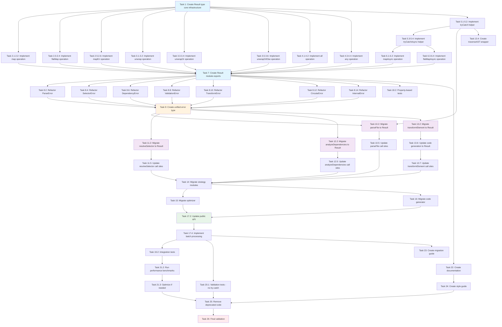

# Implementation Plan: Consolidate Error Handling

This document outlines the implementation tasks for consolidating error handling throughout the regrafter codebase by replacing exception-based error handling with a functional Result/Either pattern. All tasks follow Test-Driven Development (TDD) principles: write failing tests first, implement minimum code to pass, then refactor.

## Phase 1: Foundation - Result Type System

- [x] 1. Create Result type core infrastructure
  - Create `src/result/types.ts` with Result<T, E>, Ok<T>, and Err<E> type definitions
  - Implement ok() and err() constructor functions
  - Implement isOk() and isErr() type guards
  - Write unit tests verifying type discrimination works correctly
  - _Requirements: 1.1, 1.2, 1.3, 1.4, 1.5, 1.6, 1.7_

- [x] 2. Implement basic Result mapping operations
  - [x] 2.1 Write tests for map() operation
    - Test that map transforms Ok values
    - Test that map passes through Err unchanged
    - Test type safety of transformed values
    - _Requirements: 1.8, 8.1_

  - [x] 2.2 Implement map() function
    - Create `src/result/helpers.ts`
    - Implement map() to satisfy tests
    - Ensure proper TypeScript type inference
    - _Requirements: 1.8, 5.6_

  - [x] 2.3 Write tests for flatMap() operation
    - Test that flatMap chains Ok values
    - Test that flatMap propagates Err from first argument
    - Test that flatMap propagates Err from function result
    - Test type safety across chained operations
    - _Requirements: 1.8, 8.1_

  - [x] 2.4 Implement flatMap() function
    - Implement flatMap() to satisfy tests
    - Ensure proper error propagation
    - _Requirements: 1.8, 3.4, 5.6_

  - [x] 2.5 Write tests for mapErr() operation
    - Test that mapErr transforms Err values
    - Test that mapErr passes through Ok unchanged
    - Test type safety of error transformations
    - _Requirements: 1.8, 8.1_

  - [x] 2.6 Implement mapErr() function
    - Implement mapErr() to satisfy tests
    - _Requirements: 1.8, 5.6_

- [x] 3. Implement Result unwrapping operations
  - [x] 3.1 Write tests for unwrap() operation
    - Test that unwrap extracts Ok value
    - Test that unwrap throws on Err (controlled behavior for debugging)
    - Test edge cases (null, undefined values)
    - _Requirements: 1.8, 8.1_

  - [x] 3.2 Implement unwrap() function
    - Implement unwrap() to satisfy tests
    - _Requirements: 1.8, 5.5_

  - [x] 3.3 Write tests for unwrapOr() operation
    - Test that unwrapOr extracts Ok value
    - Test that unwrapOr returns default on Err
    - Test type safety of default value
    - _Requirements: 1.8, 8.1_

  - [x] 3.4 Implement unwrapOr() function
    - Implement unwrapOr() to satisfy tests
    - _Requirements: 1.8, 5.5_

  - [x] 3.5 Write tests for unwrapOrElse() operation
    - Test that unwrapOrElse extracts Ok value
    - Test that unwrapOrElse calls function on Err
    - Test that function receives error value
    - _Requirements: 1.8, 8.1_

  - [x] 3.6 Implement unwrapOrElse() function
    - Implement unwrapOrElse() to satisfy tests
    - _Requirements: 1.8, 5.5_

- [x] 4. Implement Result combining operations
  - [x] 4.1 Write tests for all() operation
    - Test that all() returns Ok with array of values when all Results are Ok
    - Test that all() returns first Err when any Result is Err
    - Test that all() handles empty array
    - Test type safety of result array
    - _Requirements: 5.2, 8.1, 8.5_

  - [x] 4.2 Implement all() function
    - Implement all() to satisfy tests
    - _Requirements: 5.2_

  - [x] 4.3 Write tests for any() operation
    - Test that any() returns first Ok when any Result is Ok
    - Test that any() returns Err with array of errors when all Results are Err
    - Test that any() handles empty array
    - _Requirements: 5.2, 8.1_

  - [x] 4.4 Implement any() function
    - Implement any() to satisfy tests
    - _Requirements: 5.2_

- [ ] 5. Implement exception conversion helpers
  - [x] 5.1 Write tests for tryCatch() helper
    - Test that tryCatch returns Ok for successful function execution
    - Test that tryCatch returns Err for thrown exceptions
    - Test that Err contains original error message
    - Test with different error types (Error, string, object)
    - _Requirements: 4.2, 5.3, 8.1_

  - [x] 5.2 Implement tryCatch() function
    - Implement tryCatch() to satisfy tests
    - Ensure proper error context preservation
    - _Requirements: 4.2, 4.5, 5.3_

  - [x] 5.3 Write tests for tryCatchAsync() helper
    - Test that tryCatchAsync returns Promise<Ok> for successful async operations
    - Test that tryCatchAsync returns Promise<Err> for rejected promises
    - Test that tryCatchAsync returns Promise<Err> for thrown exceptions in async code
    - Test async error context preservation
    - _Requirements: 4.7, 5.4, 8.8_

  - [x] 5.4 Implement tryCatchAsync() function
    - Implement tryCatchAsync() to satisfy tests
    - _Requirements: 4.7, 5.4_

- [x] 6. Implement async Result operations
  - [x] 6.1 Write tests for mapAsync() operation
    - Test that mapAsync transforms Ok values asynchronously
    - Test that mapAsync passes through Err unchanged
    - Test error handling in async transformation
    - _Requirements: 5.4, 8.8_

  - [x] 6.2 Implement mapAsync() function
    - Create `src/result/async.ts`
    - Implement mapAsync() to satisfy tests
    - _Requirements: 5.4_

  - [x] 6.3 Write tests for flatMapAsync() operation
    - Test that flatMapAsync chains Ok values asynchronously
    - Test that flatMapAsync propagates Err
    - Test error handling in async chaining
    - _Requirements: 5.4, 8.8_

  - [x] 6.4 Implement flatMapAsync() function
    - Implement flatMapAsync() to satisfy tests
    - _Requirements: 5.4_

- [x] 7. Create Result module exports and documentation
  - Create `src/result/index.ts` to export all Result functions
  - Add comprehensive JSDoc documentation to all exported functions
  - Include TypeScript signature examples in documentation
  - Add usage examples for each function
  - _Requirements: 5.7, 5.8, 10.1, 10.2, 10.4_

## Phase 2: Error Type Refactoring

- [ ] 8. Refactor error types to discriminated unions
  - [ ] 8.1 Write tests for ParseError factory function
    - Test that createParseError returns object with _tag discriminant
    - Test that all required fields are present
    - Test that optional fields work correctly
    - Test type guard isParseError works correctly
    - _Requirements: 2.1, 2.2, 2.3, 2.4, 2.7, 8.3_

  - [ ] 8.2 Refactor ParseError to interface with factory
    - Convert ParseError class to interface with _tag: 'ParseError'
    - Implement createParseError factory function
    - Implement isParseError type guard
    - Update `src/errors/error-category.ts`
    - _Requirements: 2.1, 2.2, 2.3, 2.4, 2.7_

  - [ ] 8.3 Write tests for SelectorError factory function
    - Test createSelectorError returns correct structure
    - Test all fields including nearestMatch
    - Test type guard isSelectorError
    - _Requirements: 2.1, 2.2, 2.3, 2.4, 2.7, 8.3_

  - [ ] 8.4 Refactor SelectorError to interface with factory
    - Convert SelectorError to interface
    - Implement createSelectorError factory
    - Implement isSelectorError type guard
    - _Requirements: 2.1, 2.2, 2.3, 2.4, 2.7_

  - [ ] 8.5 Write tests for DependencyError factory function
    - Test createDependencyError returns correct structure
    - Test dependency chain field
    - Test type guard isDependencyError
    - _Requirements: 2.1, 2.2, 2.3, 2.4, 2.6, 2.7, 8.3_

  - [ ] 8.6 Refactor DependencyError to interface with factory
    - Convert DependencyError to interface
    - Implement createDependencyError factory
    - Implement isDependencyError type guard
    - _Requirements: 2.1, 2.2, 2.3, 2.4, 2.6, 2.7_

  - [ ] 8.7 Write tests for ValidationError factory function
    - Test createValidationError returns correct structure
    - Test validation failure information field
    - Test type guard isValidationError
    - _Requirements: 2.1, 2.2, 2.3, 2.4, 2.5, 2.7, 8.3_

  - [ ] 8.8 Refactor ValidationError to interface with factory
    - Convert ValidationError to interface
    - Implement createValidationError factory
    - Implement isValidationError type guard
    - _Requirements: 2.1, 2.2, 2.3, 2.4, 2.5, 2.7_

  - [ ] 8.9 Write tests for TransformError factory function
    - Test createTransformError returns correct structure
    - Test type guard isTransformError
    - _Requirements: 2.1, 2.2, 2.3, 2.4, 2.7, 8.3_

  - [ ] 8.10 Refactor TransformError to interface with factory
    - Convert TransformError to interface
    - Implement createTransformError factory
    - Implement isTransformError type guard
    - _Requirements: 2.1, 2.2, 2.3, 2.4, 2.7_

  - [ ] 8.11 Write tests for CircularError factory function
    - Test createCircularError returns correct structure
    - Test circular dependency information
    - Test type guard isCircularError
    - _Requirements: 2.1, 2.2, 2.3, 2.4, 2.7, 8.3_

  - [ ] 8.12 Refactor CircularError to interface with factory
    - Convert CircularError to interface
    - Implement createCircularError factory
    - Implement isCircularError type guard
    - _Requirements: 2.1, 2.2, 2.3, 2.4, 2.7_

  - [ ] 8.13 Write tests for InternalError factory function
    - Test createInternalError returns correct structure
    - Test type guard isInternalError
    - _Requirements: 2.1, 2.2, 2.3, 2.4, 2.7, 8.3_

  - [ ] 8.14 Refactor InternalError to interface with factory
    - Convert InternalError to interface
    - Implement createInternalError factory
    - Implement isInternalError type guard
    - _Requirements: 2.1, 2.2, 2.3, 2.4, 2.7_

- [ ] 9. Create unified error type and exports
  - Create RegraffError union type of all error interfaces
  - Export all error types, factories, and type guards from `src/errors/index.ts`
  - Ensure error type hierarchy supports extensibility
  - _Requirements: 2.4, 2.8_

## Phase 3: Core Component Migration - Parser

- [ ] 10. Migrate parser to Result-based error handling
  - [ ] 10.1 Write tests for parseFile with Result return type
    - Test parseFile returns Ok<BabelFile> for valid source
    - Test parseFile returns Err<ParseError> for syntax errors
    - Test parseFile returns Err<ParseError> for empty source
    - Test error contains file path and syntax error message
    - Test error includes location information when available
    - _Requirements: 3.1, 3.2, 3.3, 3.5, 4.1, 6.1, 6.3, 8.3, 8.4_

  - [ ] 10.2 Refactor parseFile to return Result
    - Update parseFile signature to return Result<BabelFile, ParseError>
    - Replace throw statements with err(createParseError(...))
    - Wrap Babel parser call with tryCatch
    - Convert caught exceptions to ParseError using mapErr
    - Remove try-catch blocks
    - _Requirements: 3.1, 4.1, 4.2, 4.5, 4.6_

  - [ ] 10.3 Write tests for parser helper functions with Result
    - Test getParserOptions returns valid options
    - Test any parser validation functions return Result types
    - _Requirements: 8.1, 8.2_

  - [ ] 10.4 Update parser helper functions to use Result
    - Update any helper functions to return Result where appropriate
    - Ensure all error paths return proper ParseError types
    - _Requirements: 3.1, 3.6_

  - [ ] 10.5 Update all parseFile call sites
    - Find all locations calling parseFile
    - Update to handle Result return type using isOk/isErr checks or flatMap
    - Ensure error propagation works correctly
    - Update related tests to verify Result handling
    - _Requirements: 3.3, 8.2, 8.5_

## Phase 4: Core Component Migration - Selector

- [ ] 11. Migrate selector to Result-based error handling
  - [ ] 11.1 Write tests for resolveSelector with Result return type
    - Test resolveSelector returns Ok<Element> when element is found
    - Test resolveSelector returns Err<SelectorError> when element not found
    - Test error contains selector information and file path
    - Test error includes nearestMatch when available
    - Test error includes suggestions
    - _Requirements: 3.1, 3.2, 3.3, 3.5, 4.1, 6.1, 6.3, 8.3, 8.4_

  - [ ] 11.2 Refactor resolveSelector to return Result
    - Update resolveSelector signature to return Result<Element, SelectorError>
    - Replace throw statements with err(createSelectorError(...))
    - Ensure all selector resolution logic returns Result
    - Remove try-catch blocks
    - _Requirements: 3.1, 4.1, 4.6_

  - [ ] 11.3 Write tests for selector helper functions with Result
    - Test selector parsing functions return Result
    - Test selector validation returns Result
    - Test any path resolution returns Result
    - _Requirements: 8.1, 8.2_

  - [ ] 11.4 Update selector helper functions to use Result
    - Update helper functions to return Result where appropriate
    - Ensure proper SelectorError creation
    - _Requirements: 3.1, 3.6_

  - [ ] 11.5 Update all resolveSelector call sites
    - Find all locations calling resolveSelector
    - Update to handle Result return type
    - Use flatMap for chaining with other Result-returning operations
    - Update related tests
    - _Requirements: 3.3, 3.4, 8.2, 8.5_

## Phase 5: Core Component Migration - Analyzer

- [ ] 12. Migrate dependency analyzer to Result-based error handling
  - [ ] 12.1 Write tests for analyzeDependencies with Result return type
    - Test analyzeDependencies returns Ok<Dependencies> for valid elements
    - Test analyzeDependencies returns Err<DependencyError> for unresolvable references
    - Test analyzeDependencies returns Err<DependencyError> for eval() usage
    - Test error contains dependency chain information
    - Test error includes file path and location
    - _Requirements: 3.1, 3.2, 3.3, 3.5, 4.1, 6.1, 6.3, 6.4, 8.3, 8.4_

  - [ ] 12.2 Refactor analyzeDependencies to return Result
    - Update analyzeDependencies signature to return Result<Dependencies, DependencyError>
    - Replace throw statements with err(createDependencyError(...))
    - Use tryCatch for any operations that might throw
    - Remove try-catch blocks
    - _Requirements: 3.1, 4.1, 4.2, 4.6_

  - [ ] 12.3 Write tests for dependency analysis helpers with Result
    - Test dependency resolution functions return Result
    - Test hoisting analysis returns Result
    - Test circular dependency detection returns Result<void, CircularError>
    - _Requirements: 8.1, 8.2_

  - [ ] 12.4 Update dependency analysis helpers to use Result
    - Update helper functions to return Result
    - Ensure proper error type usage (DependencyError, CircularError)
    - _Requirements: 3.1, 3.6_

  - [ ] 12.5 Update all analyzeDependencies call sites
    - Find all locations calling analyzeDependencies
    - Update to handle Result return type
    - Chain with selector and transformer using flatMap
    - Update related tests
    - _Requirements: 3.3, 3.4, 8.2, 8.5_

## Phase 6: Core Component Migration - Transformer

- [ ] 13. Migrate transformer to Result-based error handling
  - [ ] 13.1 Write tests for transformElement with Result return type
    - Test transformElement returns Ok<TransformedCode> for valid transformations
    - Test transformElement returns Err<TransformError> for insertion failures
    - Test transformElement returns Err<ValidationError> for constraint violations
    - Test error contains element identifier and file path
    - Test error includes transformation context
    - _Requirements: 3.1, 3.2, 3.3, 3.5, 4.1, 6.1, 6.3, 8.3, 8.4_

  - [ ] 13.2 Refactor transformElement to return Result
    - Update transformElement signature to return Result<TransformedCode, TransformError | ValidationError>
    - Replace throw statements with err(createTransformError(...)) or err(createValidationError(...))
    - Use tryCatch for AST manipulation that might throw
    - Remove try-catch blocks
    - _Requirements: 3.1, 3.5, 4.1, 4.2, 4.6_

  - [ ] 13.3 Write tests for AST traversal with Result
    - Test traverseAST returns Ok for successful traversals
    - Test traverseAST returns Err<TransformError> for traversal failures
    - Test AST modification functions return Result
    - _Requirements: 8.1, 8.2_

  - [ ] 13.4 Create traverseAST wrapper that returns Result
    - Implement traverseAST wrapper in integration layer
    - Wrap Babel traverse with tryCatch
    - Return Result<T, TransformError>
    - _Requirements: 4.2, 4.4_

  - [ ] 13.5 Write tests for code generation with Result
    - Test generateCode returns Ok<string> for valid AST
    - Test generateCode returns Err<TransformError> for generation failures
    - _Requirements: 8.1, 8.2_

  - [ ] 13.6 Update code generation to return Result
    - Update generateCode to return Result
    - Wrap Babel generate with tryCatch
    - _Requirements: 3.1, 4.2_

  - [ ] 13.7 Update all transformElement call sites
    - Find all locations calling transformElement
    - Update to handle Result return type
    - Complete the full pipeline: parse -> select -> analyze -> transform
    - Update related tests
    - _Requirements: 3.3, 3.4, 8.2, 8.5_

## Phase 7: Strategy and Support Migration

- [ ] 14. Migrate strategy modules to Result-based error handling
  - [ ] 14.1 Migrate insertion strategies
    - Write tests for insertion strategy functions returning Result
    - Update each strategy to return Result<InsertionPoint, TransformError>
    - Replace throw statements with err() returns
    - Update call sites
    - _Requirements: 3.1, 3.3, 8.2_

  - [ ] 14.2 Migrate hoisting strategies
    - Write tests for hoisting strategy functions returning Result
    - Update hoisting strategies to return Result
    - Update call sites
    - _Requirements: 3.1, 3.3, 8.2_

  - [ ] 14.3 Migrate scope handling
    - Write tests for scope analysis functions returning Result
    - Update scope functions to return Result<Scope, ValidationError>
    - Update call sites
    - _Requirements: 3.1, 3.3, 8.2_

- [ ] 15. Migrate optimizer to Result-based error handling
  - Write tests for optimizer functions returning Result
  - Update optimizer to return Result
  - Replace any throw statements with err() returns
  - Update call sites
  - _Requirements: 3.1, 3.3, 8.2_

- [ ] 16. Migrate code generator to Result-based error handling
  - Write tests for generator functions returning Result
  - Update generator to return Result<GeneratedCode, TransformError>
  - Update call sites
  - _Requirements: 3.1, 3.3, 8.2_

## Phase 8: Public API Migration (Breaking Change)

- [ ] 17. Migrate public API to return Result directly
  - [ ] 17.1 Write tests for public API returning Result directly
    - Test regraft() API returns Ok<TransformedCode> for successful transformations
    - Test regraft() API returns Err<RegraffError> for various error scenarios
    - Test error includes code, message, category, location, and suggestions
    - Test success includes transformed code and file information
    - Test type safety of Result return type
    - _Requirements: 3.1, 3.7, 6.1, 6.2, 6.3, 6.5, 7.1, 8.3, 8.4_

  - [ ] 17.2 Migrate regraft() API to return Result directly (breaking change)
    - Update regraft() signature to return Result<T, E> directly
    - Remove internal Result-to-response conversion layer
    - Ensure error types include all required debugging information
    - Document breaking change in API comments
    - This is an intentional breaking change with no compatibility layer
    - _Requirements: 3.1, 3.7, 7.1, 7.2, 7.3_

  - [ ] 17.3 Write tests for batch API operations
    - Test batch operations collect both successes and failures
    - Test batch results include all errors
    - _Requirements: 6.6, 8.3_

  - [ ] 17.4 Implement batch processing with Result
    - Create processBatch helper that collects Result successes and failures
    - Return BatchResult<T, E> with separate arrays
    - _Requirements: 6.6_

  - [ ] 17.5 Document breaking changes for public API
    - Add clear JSDoc comments explaining the breaking change
    - Document that this is a direct Result<T, E> return (no compatibility layer)
    - Include migration examples in API documentation
    - Reference migration guide in comments
    - _Requirements: 7.2, 7.3, 7.4_

## Phase 9: Testing and Validation

- [ ] 18. Property-based testing for Result operations
  - [ ] 18.1 Write property-based tests for Result laws
    - Test that map preserves Ok values (identity)
    - Test that flatMap is associative
    - Test that ok() followed by map() equals calling function directly
    - Test that err() short-circuits operations
    - _Requirements: 8.1, 8.5_

  - [ ] 18.2 Add fast-check library and implement property tests
    - Install fast-check
    - Implement property tests for Result type laws
    - _Requirements: 8.1_

- [ ] 19. Integration tests for end-to-end Result flow
  - [ ] 19.1 Write integration test for successful pipeline
    - Test full pipeline: parse -> select -> analyze -> transform returns Ok
    - Verify final result contains expected code
    - _Requirements: 8.7, 8.5_

  - [ ] 19.2 Write integration tests for error propagation
    - Test parse error propagates through pipeline
    - Test selector error propagates through pipeline
    - Test dependency error propagates through pipeline
    - Test transform error propagates through pipeline
    - Verify error context is preserved
    - _Requirements: 8.7, 8.5, 6.1, 6.3, 6.4_

  - [ ] 19.3 Write integration tests for async operations
    - Test async file operations return Promise<Result>
    - Test async operation chaining with flatMapAsync
    - Test async error handling
    - _Requirements: 8.8, 4.7_

- [ ] 20. Migration validation tests
  - [ ] 20.1 Write test to verify no try-catch blocks remain
    - Create validation test that scans src/ directory
    - Fail test if any try-catch blocks are found
    - Exclude test files and external integration boundaries if necessary
    - _Requirements: 4.3, 4.6_

  - [ ] 20.2 Write test to verify no throw statements remain
    - Create validation test that scans src/ directory
    - Fail test if any throw statements are found
    - Exclude test files
    - _Requirements: 4.1, 4.6_

  - [ ] 20.3 Ensure 100% test coverage of error paths
    - Run coverage report
    - Verify all Err branches are tested
    - Add missing tests for uncovered error paths
    - _Requirements: 8.6_

## Phase 10: Performance Optimization

- [ ] 21. Performance benchmarking
  - [ ] 21.1 Create performance benchmark suite
    - Create benchmark tests for Result creation (ok/err)
    - Create benchmark tests for map/flatMap operations
    - Create benchmark tests for end-to-end pipeline
    - Compare Result-based code vs try-catch baseline
    - _Requirements: 9.1, 9.2, 9.3_

  - [ ] 21.2 Run benchmarks and verify performance targets
    - Verify Result creation < 1μs
    - Verify map/flatMap operations < 2μs
    - Verify no significant end-to-end performance degradation
    - Verify memory overhead < 100 bytes per Result
    - _Requirements: 9.1, 9.2, 9.3, 9.4_

  - [ ] 21.3 Optimize critical paths if needed
    - If benchmarks show issues, optimize ok()/err() constructors
    - Inline critical helpers in hot paths
    - Minimize object allocations in success path
    - Re-run benchmarks to verify improvements
    - _Requirements: 9.5, 9.6_

## Phase 11: Documentation

- [ ] 22. Create comprehensive Result pattern documentation
  - [ ] 22.1 Write Result pattern overview
    - Document what Result pattern is and its benefits
    - Explain Ok and Err variants
    - Show basic usage examples
    - Add to main project documentation
    - _Requirements: 10.1, 10.2_

  - [ ] 22.2 Document all helper functions
    - Add detailed JSDoc to each helper (map, flatMap, etc.)
    - Include TypeScript signatures
    - Add usage examples for each function
    - Document parameters and return types
    - _Requirements: 10.4, 5.7_

  - [ ] 22.3 Document error types
    - Document each error type (ParseError, SelectorError, etc.)
    - Include description of when each error occurs
    - Provide usage examples for error handling
    - _Requirements: 10.3_

  - [ ] 22.4 Create async operations guide
    - Document Promise<Result<T, E>> pattern
    - Show examples of mapAsync and flatMapAsync
    - Explain error handling in async contexts
    - _Requirements: 10.8_

- [ ] 23. Create migration guide
  - [ ] 23.1 Write migration guide overview
    - Explain why Result pattern is being adopted
    - Describe benefits over exceptions
    - Outline migration timeline
    - _Requirements: 7.2, 10.1_

  - [ ] 23.2 Create before/after code examples
    - Show try-catch pattern vs Result pattern
    - Show error propagation examples
    - Show public API migration (old response format vs Result<T, E>)
    - Include examples of handling Ok and Err cases
    - Show chaining operations with flatMap
    - _Requirements: 7.1, 7.4, 10.7_

  - [ ] 23.3 Document breaking changes
    - Document public API change to return Result<T, E> directly
    - Explain removal of response wrapper format
    - Provide step-by-step migration instructions for API consumers
    - Include code examples showing old vs new API usage
    - Document how to handle Ok and Err cases
    - Include version information and upgrade path
    - _Requirements: 7.1, 7.2, 7.4_

- [ ] 24. Create error handling style guide
  - Document best practices for Result usage
  - Show recommended patterns (early return vs flatMap chaining)
  - Document common pitfalls and how to avoid them
  - Include do's and don'ts
  - _Requirements: 10.5, 10.6_

## Phase 12: Cleanup and Final Validation

- [ ] 25. Remove deprecated code
  - [ ] 25.1 Remove old error classes
    - Remove Error class implementations
    - Keep only interface definitions and factories
    - Update any remaining references
    - _Requirements: 2.1, 2.7_

  - [ ] 25.2 Remove try-catch blocks
    - Verify all try-catch blocks removed via migration validation test
    - Clean up any exception-handling utilities no longer needed
    - _Requirements: 4.3, 4.6_

  - [ ] 25.3 Clean up unused imports and dead code
    - Run linter to find unused imports
    - Remove any dead code from migration
    - Run tests to verify nothing breaks
    - _Requirements: General code quality_

- [ ] 26. Final validation
  - [ ] 26.1 Run full test suite
    - Execute all unit tests
    - Execute all integration tests
    - Execute migration validation tests
    - Execute performance benchmarks
    - Verify 100% pass rate
    - _Requirements: 8.1, 8.2, 8.3, 8.4, 8.5, 8.6, 8.7, 8.8_

  - [ ] 26.2 Run linter and type checker
    - Execute TypeScript compiler in strict mode
    - Execute ESLint
    - Fix any warnings or errors
    - _Requirements: General code quality_

  - [ ] 26.3 Verify all requirements met
    - Review each requirement in requirements.md
    - Confirm all acceptance criteria are satisfied
    - Document any deviations or adjustments
    - _Requirements: All requirements 1-10_

  - [ ] 26.4 Code review and sign-off
    - Request code review from team
    - Address review feedback
    - Obtain approval for merge
    - _Requirements: General process_

---

## Tasks Dependency Diagram

---

**Document Status**: Ready for Review
**Created**: 2025-12-18
**Feature**: Consolidate Error Handling
**Total Tasks**: 26 major tasks with 100+ sub-tasks
**Estimated Duration**: 5-6 weeks with TDD approach
