# 설계 문서 - JSX Extract

## 개요

Extract 기능은 선택된 JSX 노드들을 새로운 React 컴포넌트로 추출하는 리팩토링 도구입니다. inline() 함수의 역연산으로, 코드의 일부를 독립적인 컴포넌트로 분리하여 재사용성을 높이고 컴포넌트 구조를 개선합니다.

**핵심 목표:**
- JSX 노드 선택 및 새 컴포넌트로 추출
- 의존성 자동 분석 및 Props 인터페이스 생성
- 같은 파일 내 추출 및 다른 파일로 추출 지원
- TypeScript 타입 자동 생성
- React Hook 규칙 준수

**범위:**
- 단일 또는 연속된 JSX 노드 추출
- 변수, 함수, Hook 의존성 자동 분석
- Props 타입 자동 추론 및 생성
- Import 문 자동 생성 및 관리
- 코드 스타일 유지

## 아키텍처 설계

### 시스템 아키텍처 다이어그램

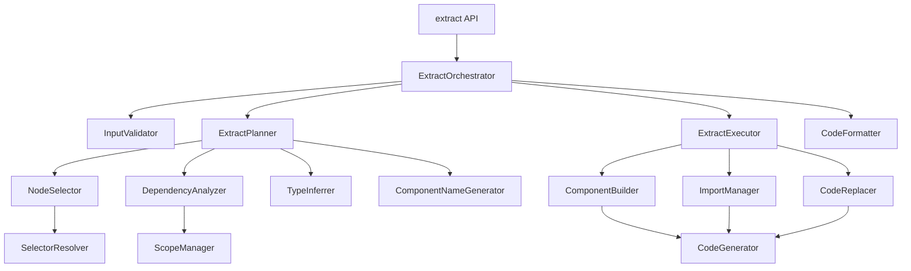

### 데이터 흐름 다이어그램

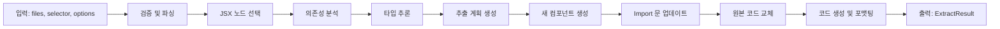

## 컴포넌트 설계

### ExtractOrchestrator

**책임:**
- Extract 작업 전체 흐름 조율
- 각 단계의 실행 순서 관리
- 에러 처리 및 롤백

**인터페이스:**
```typescript
interface ExtractOrchestrator {
  orchestrate(
    files: FileInput[],
    selector: Selector | RangeSelector,
    options: ExtractOptions
  ): Result<ExtractResult, RegraffError>;
}
```

**의존성:**
- InputValidator
- ExtractPlanner
- ExtractExecutor
- CodeFormatter

### InputValidator

**책임:**
- 입력 파라미터 검증
- Selector 유효성 확인
- 파일 존재 여부 확인

**인터페이스:**
```typescript
interface InputValidator {
  validate(
    files: FileInput[],
    selector: Selector | RangeSelector,
    options: ExtractOptions
  ): Result<void, RegraffError>;
}
```

**의존성:**
- SelectorResolver
- parseFile (파서)

### ExtractPlanner

**책임:**
- JSX 노드 선택 및 검증
- 의존성 분석 실행
- Props 타입 추론
- 컴포넌트 이름 생성
- 추출 계획 수립

**인터페이스:**
```typescript
interface ExtractPlanner {
  plan(
    files: FileInput[],
    selector: Selector | RangeSelector,
    options: ExtractOptions
  ): Result<ExtractPlan, RegraffError>;
}
```

**의존성:**
- NodeSelector
- DependencyAnalyzer
- TypeInferrer
- ComponentNameGenerator

### NodeSelector

**책임:**
- PositionSelector 또는 PathSelector로 JSX 노드 선택
- RangeSelector로 여러 연속된 노드 선택
- 선택된 노드의 유효성 검증

**인터페이스:**
```typescript
interface NodeSelector {
  selectNodes(
    ast: t.File,
    selector: Selector | RangeSelector
  ): Result<NodePath[], RegraffError>;

  validateExtractable(
    nodes: NodePath[]
  ): Result<void, RegraffError>;
}
```

**의존성:**
- SelectorResolver (기존)

### DependencyAnalyzer

**책임:**
- 선택된 JSX 노드의 의존성 식별
- 변수, 함수, Hook 참조 분석
- 상태 변수 및 setter 식별
- Props로 전달할 의존성 목록 생성

**인터페이스:**
```typescript
interface ExtractDependencyAnalyzer {
  analyze(
    nodes: NodePath[],
    sourceScope: ScopeInfo
  ): Result<ExtractDependencies, RegraffError>;
}
```

**의존성:**
- ScopeManager (기존)
- DependencyAnalyzer (기존 - 재사용)

### TypeInferrer

**책임:**
- 의존성의 TypeScript 타입 추론
- Props 인터페이스 생성
- 제네릭 타입 처리

**인터페이스:**
```typescript
interface TypeInferrer {
  inferPropTypes(
    dependencies: Dependency[]
  ): Result<PropType[], RegraffError>;

  buildPropsInterface(
    propTypes: PropType[],
    interfaceName: string
  ): t.TSInterfaceDeclaration;
}
```

**의존성:**
- @babel/types

### ComponentNameGenerator

**책임:**
- 기본 컴포넌트 이름 생성
- 이름 충돌 검사
- PascalCase 변환 및 검증

**인터페이스:**
```typescript
interface ComponentNameGenerator {
  generate(
    existingNames: Set<string>,
    suggestedName?: string
  ): string;

  ensureUnique(
    name: string,
    existingNames: Set<string>
  ): string;
}
```

**의존성:**
- 없음 (순수 함수)

### ExtractExecutor

**책임:**
- 추출 계획 실행
- 새 컴포넌트 생성
- Import 문 업데이트
- 원본 JSX 코드를 컴포넌트 호출로 교체

**인터페이스:**
```typescript
interface ExtractExecutor {
  execute(
    plan: ExtractPlan,
    asts: Map<string, t.File>
  ): Result<Map<string, t.File>, RegraffError>;
}
```

**의존성:**
- ComponentBuilder
- ImportManager
- CodeReplacer

### ComponentBuilder

**책임:**
- 새 컴포넌트의 AST 생성
- Props 인터페이스 추가
- 함수 컴포넌트 선언 생성
- JSX 본문 이동

**인터페이스:**
```typescript
interface ComponentBuilder {
  buildComponent(
    componentName: string,
    propsInterface: t.TSInterfaceDeclaration | null,
    jsxBody: t.Node[],
    hooks: HookDeclaration[]
  ): t.FunctionDeclaration;
}
```

**의존성:**
- @babel/types

### ImportManager

**책임:**
- Import 문 추가/제거
- Import 경로 해석
- 중복 Import 방지

**인터페이스:**
```typescript
interface ImportManager {
  addImport(
    ast: t.File,
    importName: string,
    sourcePath: string,
    isDefault?: boolean
  ): void;

  removeImport(
    ast: t.File,
    importName: string
  ): void;

  resolveRelativePath(
    fromFile: string,
    toFile: string
  ): string;
}
```

**의존성:**
- @babel/types
- path (Node.js)

### CodeReplacer

**책임:**
- 원본 위치의 JSX 코드를 새 컴포넌트 호출로 교체
- Props 전달 코드 생성

**인터페이스:**
```typescript
interface CodeReplacer {
  replace(
    sourcePath: NodePath,
    componentName: string,
    props: Map<string, t.Expression>
  ): void;
}
```

**의존성:**
- @babel/types

### CodeFormatter

**책임:**
- 코드 스타일 유지
- 들여쓰기 적용
- 주석 보존

**인터페이스:**
```typescript
interface CodeFormatter {
  format(
    ast: t.File,
    originalContent: string
  ): Result<string, RegraffError>;
}
```

**의존성:**
- CodeGenerator (기존)

## 데이터 모델

### 핵심 데이터 구조

```typescript
/**
 * Extract 함수 옵션
 */
interface ExtractOptions {
  /** 추출할 컴포넌트 이름 (미제공 시 자동 생성) */
  componentName?: string;

  /** 대상 파일 경로 (미제공 시 같은 파일 내 추출) */
  targetFile?: string;

  /** TypeScript 타입 생성 활성화 (기본: true) */
  generateTypes?: boolean;

  /** 주석 보존 여부 (기본: true) */
  preserveComments?: boolean;

  /** 코드 포맷팅 옵션 */
  formatting?: FormattingOptions;
}

/**
 * 범위 선택자 (여러 노드 선택)
 */
interface RangeSelector {
  /** 파일 경로 */
  file: string;

  /** 시작 위치 */
  start: {
    line: number;
    column: number;
  };

  /** 종료 위치 */
  end: {
    line: number;
    column: number;
  };
}

/**
 * Extract 결과
 */
interface ExtractResult {
  /** 변환된 파일들 */
  codes: Code[];

  /** 생성된 컴포넌트 정보 */
  component: ComponentInfo;

  /** 추출 통계 */
  stats: ExtractStats;
}

/**
 * 생성된 컴포넌트 정보
 */
interface ComponentInfo {
  /** 컴포넌트 이름 */
  name: string;

  /** 컴포넌트가 위치한 파일 */
  file: string;

  /** Props 인터페이스 이름 */
  propsInterface?: string;

  /** Props 목록 */
  props: PropInfo[];
}

/**
 * Prop 정보
 */
interface PropInfo {
  /** Prop 이름 */
  name: string;

  /** Prop 타입 */
  type: string;

  /** 선택적 여부 */
  optional: boolean;
}

/**
 * Extract 통계
 */
interface ExtractStats {
  /** 추출된 JSX 노드 수 */
  nodesExtracted: number;

  /** 식별된 의존성 수 */
  dependenciesFound: number;

  /** 생성된 Props 수 */
  propsGenerated: number;
}

/**
 * Extract 계획
 */
interface ExtractPlan {
  /** 선택된 JSX 노드들 */
  selectedNodes: NodePath[];

  /** 소스 파일 */
  sourceFile: string;

  /** 대상 파일 */
  targetFile: string;

  /** 생성할 컴포넌트 이름 */
  componentName: string;

  /** Props 인터페이스 이름 */
  propsInterfaceName: string;

  /** 의존성 정보 */
  dependencies: ExtractDependencies;

  /** Props 타입 정보 */
  propTypes: PropType[];

  /** 이동할 Hook 선언들 */
  hooksToMove: HookDeclaration[];

  /** 같은 파일 내 추출 여부 */
  isSameFile: boolean;
}

/**
 * Extract 의존성 정보
 */
interface ExtractDependencies {
  /** Props로 전달할 변수 */
  variables: VariableDependency[];

  /** Props로 전달할 함수 */
  functions: FunctionDependency[];

  /** Props로 전달할 상태 */
  states: StateDependency[];

  /** 새 컴포넌트로 이동할 Hook */
  hooks: HookDependency[];

  /** 필요한 Import */
  imports: ImportDependency[];
}

/**
 * 변수 의존성
 */
interface VariableDependency {
  /** 변수 이름 */
  name: string;

  /** 변수 타입 (TypeScript) */
  type?: t.TSType;

  /** 변수 선언 노드 */
  declaration: NodePath;
}

/**
 * 함수 의존성
 */
interface FunctionDependency {
  /** 함수 이름 */
  name: string;

  /** 함수 타입 (TypeScript) */
  type?: t.TSType;

  /** 함수 선언 노드 */
  declaration: NodePath;
}

/**
 * 상태 의존성
 */
interface StateDependency {
  /** 상태 변수 이름 */
  stateName: string;

  /** Setter 함수 이름 */
  setterName: string;

  /** 상태 타입 (TypeScript) */
  type?: t.TSType;

  /** useState 호출 노드 */
  declaration: NodePath;
}

/**
 * Hook 의존성
 */
interface HookDependency {
  /** Hook 이름 */
  name: string;

  /** Hook 호출 노드 */
  callNode: NodePath;

  /** 외부 의존성 목록 */
  externalDeps: string[];
}

/**
 * Import 의존성
 */
interface ImportDependency {
  /** Import 이름 */
  name: string;

  /** Import 소스 경로 */
  source: string;

  /** Default import 여부 */
  isDefault: boolean;
}

/**
 * Prop 타입 정보
 */
interface PropType {
  /** Prop 이름 */
  name: string;

  /** TypeScript 타입 AST */
  typeAnnotation: t.TSType;

  /** 선택적 여부 */
  optional: boolean;
}

/**
 * Hook 선언 정보
 */
interface HookDeclaration {
  /** Hook 이름 */
  hookName: string;

  /** Hook 호출 표현식 */
  callExpression: t.CallExpression;

  /** 변수 선언자 (const [x, setX] = ...) */
  declarator?: t.VariableDeclarator;
}

/**
 * 포맷팅 옵션
 */
interface FormattingOptions {
  /** 들여쓰기 크기 */
  indentSize?: number;

  /** Tab 사용 여부 */
  useTabs?: boolean;

  /** 따옴표 스타일 */
  quotes?: 'single' | 'double';

  /** 세미콜론 사용 여부 */
  semi?: boolean;
}
```

### 데이터 모델 다이어그램

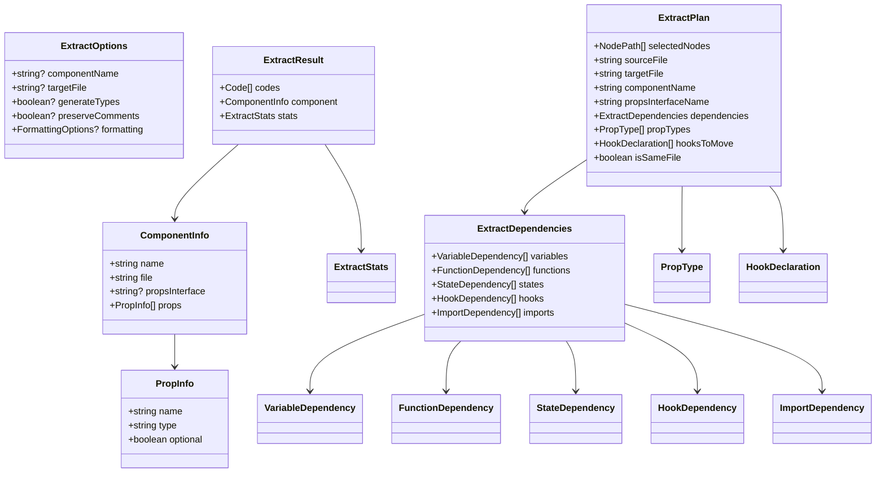

## 비즈니스 프로세스

### 프로세스 1: Extract 전체 흐름

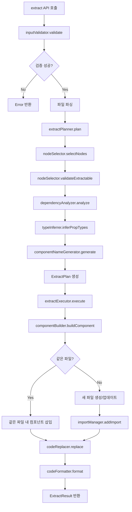

### 프로세스 2: JSX 노드 선택 및 검증

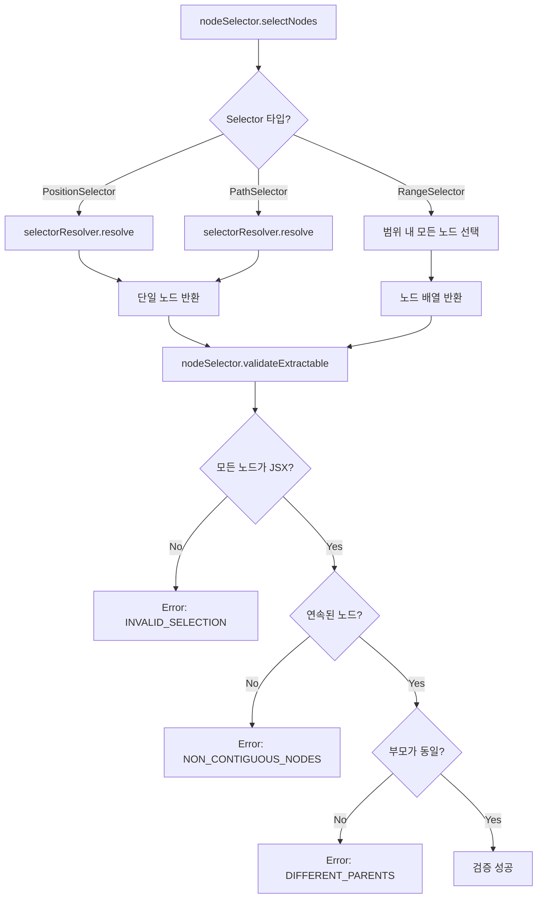

### 프로세스 3: 의존성 분석 및 타입 추론

```mermaid
flowchart TD
    A[dependencyAnalyzer.analyze] --> B[AST 순회 시작]
    B --> C{Identifier 발견?}
    C -->|Yes| D[scopeManager로 스코프 확인]
    C -->|No| E[다음 노드]

    D --> F{외부 스코프 참조?}
    F -->|No| E
    F -->|Yes| G{타입 분류}

    G -->|변수| H[variables 배열에 추가]
    G -->|함수| I[functions 배열에 추가]
    G -->|useState| J[states 배열에 추가]
    G -->|Hook| K[hooks 배열에 추가]

    H --> L[ExtractDependencies 생성]
    I --> L
    J --> L
    K --> L

    L --> M[typeInferrer.inferPropTypes]
    M --> N{TypeScript 파일?}
    N -->|No| O[타입 생략]
    N -->|Yes| P[타입 AST 추출]

    P --> Q{타입 추출 가능?}
    Q -->|No| R[any 타입 사용]
    Q -->|Yes| S[PropType 생성]

    O --> T[PropType[] 반환]
    R --> T
    S --> T
```

### 프로세스 4: 컴포넌트 생성 및 코드 교체

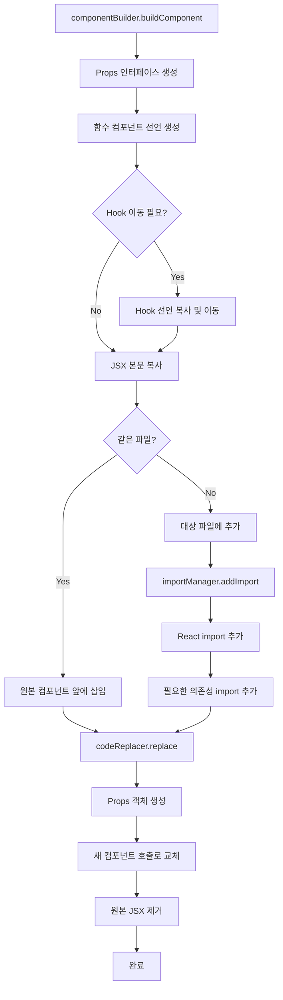

### 프로세스 5: Hook 처리

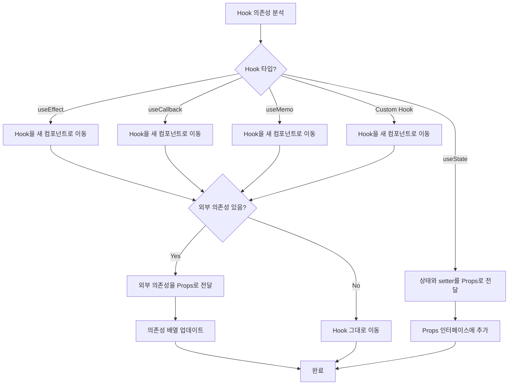

## 에러 처리 전략

### 에러 카테고리

```typescript
enum ExtractErrorCode {
  // 검증 에러
  EMPTY_INPUT = 'EMPTY_INPUT',
  INVALID_SELECTOR = 'INVALID_SELECTOR',
  FILE_NOT_FOUND = 'FILE_NOT_FOUND',

  // 선택 에러
  NODE_NOT_FOUND = 'NODE_NOT_FOUND',
  INVALID_SELECTION = 'INVALID_SELECTION',
  NON_CONTIGUOUS_NODES = 'NON_CONTIGUOUS_NODES',
  DIFFERENT_PARENTS = 'DIFFERENT_PARENTS',
  NOT_JSX_NODE = 'NOT_JSX_NODE',

  // 의존성 분석 에러
  CIRCULAR_DEPENDENCY = 'CIRCULAR_DEPENDENCY',
  UNRESOLVABLE_DEPENDENCY = 'UNRESOLVABLE_DEPENDENCY',
  HOOK_RULE_VIOLATION = 'HOOK_RULE_VIOLATION',

  // 타입 추론 에러
  TYPE_INFERENCE_FAILED = 'TYPE_INFERENCE_FAILED',
  COMPLEX_TYPE_UNSUPPORTED = 'COMPLEX_TYPE_UNSUPPORTED',

  // 이름 생성 에러
  INVALID_COMPONENT_NAME = 'INVALID_COMPONENT_NAME',
  NAME_CONFLICT = 'NAME_CONFLICT',

  // 코드 생성 에러
  COMPONENT_BUILD_FAILED = 'COMPONENT_BUILD_FAILED',
  CODE_GENERATION_FAILED = 'CODE_GENERATION_FAILED',
  INVALID_JSX_STRUCTURE = 'INVALID_JSX_STRUCTURE',

  // 파일 작업 에러
  FILE_WRITE_FAILED = 'FILE_WRITE_FAILED',
  FILE_READ_FAILED = 'FILE_READ_FAILED',
}
```

### 에러 복구 전략

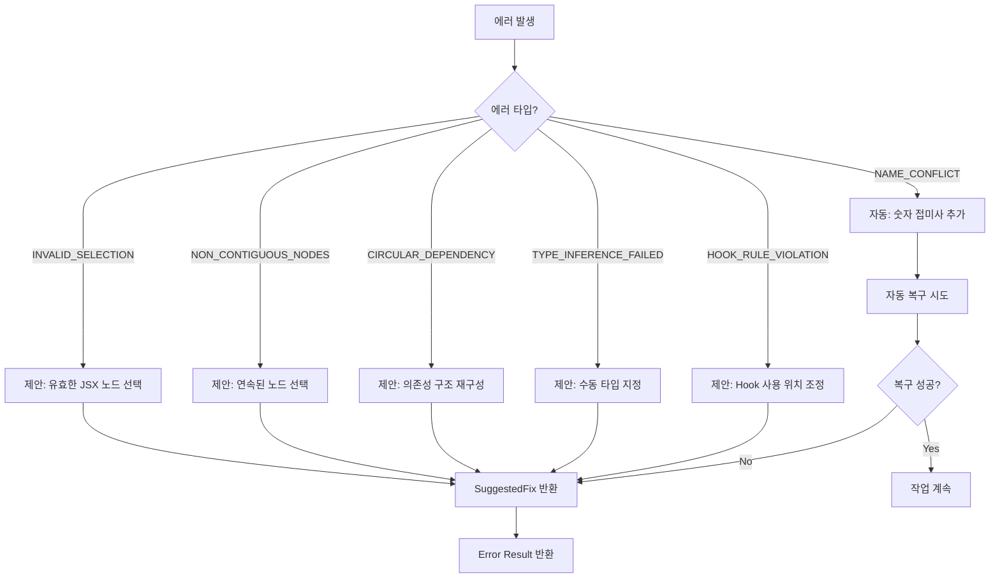

### 에러 메시지 예시

```typescript
const errorMessages: Record<ExtractErrorCode, string> = {
  EMPTY_INPUT: '파일 목록이 비어있습니다',
  INVALID_SELECTOR: '유효하지 않은 selector입니다',
  NODE_NOT_FOUND: '지정된 위치에서 노드를 찾을 수 없습니다',
  INVALID_SELECTION: '선택된 노드가 추출 가능한 JSX 노드가 아닙니다',
  NON_CONTIGUOUS_NODES: '선택된 노드들이 연속되어 있지 않습니다',
  DIFFERENT_PARENTS: '선택된 노드들의 부모가 서로 다릅니다',
  NOT_JSX_NODE: 'JSX 노드만 추출 가능합니다',
  CIRCULAR_DEPENDENCY: '순환 의존성이 감지되었습니다',
  UNRESOLVABLE_DEPENDENCY: '해결할 수 없는 의존성이 있습니다',
  HOOK_RULE_VIOLATION: 'React Hook 규칙 위반이 감지되었습니다',
  TYPE_INFERENCE_FAILED: '타입 추론에 실패했습니다',
  COMPLEX_TYPE_UNSUPPORTED: '지원하지 않는 복잡한 타입입니다',
  INVALID_COMPONENT_NAME: '유효하지 않은 컴포넌트 이름입니다',
  NAME_CONFLICT: '동일한 이름의 컴포넌트가 이미 존재합니다',
  COMPONENT_BUILD_FAILED: '컴포넌트 생성에 실패했습니다',
  CODE_GENERATION_FAILED: '코드 생성에 실패했습니다',
  INVALID_JSX_STRUCTURE: '유효하지 않은 JSX 구조입니다',
  FILE_WRITE_FAILED: '파일 쓰기에 실패했습니다',
  FILE_READ_FAILED: '파일 읽기에 실패했습니다',
};
```

## 테스트 전략

### 테스트 레이어

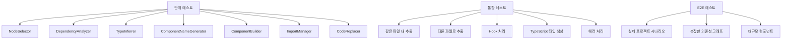

### 테스트 케이스

**1. NodeSelector 단위 테스트**
- PositionSelector로 단일 노드 선택
- PathSelector로 단일 노드 선택
- RangeSelector로 여러 노드 선택
- 비연속 노드 선택 시 에러
- 다른 부모의 노드 선택 시 에러

**2. DependencyAnalyzer 단위 테스트**
- 변수 의존성 식별
- 함수 의존성 식별
- useState 의존성 식별
- useEffect 의존성 식별
- Custom Hook 의존성 식별
- 외부 의존성 필터링

**3. TypeInferrer 단위 테스트**
- 기본 타입 추론 (string, number, boolean)
- 복잡한 타입 추론 (객체, 배열)
- 제네릭 타입 처리
- Union 타입 처리
- Optional 타입 처리

**4. ComponentBuilder 단위 테스트**
- 간단한 컴포넌트 생성
- Props 인터페이스 포함 컴포넌트 생성
- Hook 포함 컴포넌트 생성
- 주석 보존

**5. 통합 테스트**
- 같은 파일 내 간단한 추출
- 다른 파일로 간단한 추출
- useState가 있는 컴포넌트 추출
- useEffect가 있는 컴포넌트 추출
- 중첩된 의존성 처리
- Import 자동 생성

**6. E2E 테스트**
- 실제 React 프로젝트에서 추출
- 복잡한 컴포넌트 구조 추출
- 다중 파일 의존성 처리
- 성능 벤치마크

### TDD 워크플로우

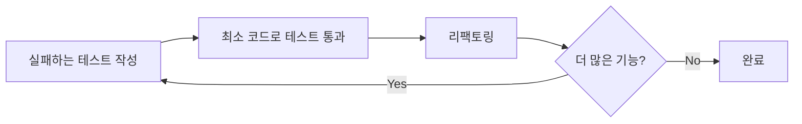

## 성능 고려사항

### 성능 목표

- 단일 파일 추출 (<1000줄): **< 200ms**
- 복잡한 의존성 분석: **< 100ms**
- 타입 추론: **< 50ms**
- 코드 생성: **< 50ms**
- 메모리 사용: **< 파일 크기의 15배**

### 최적화 전략

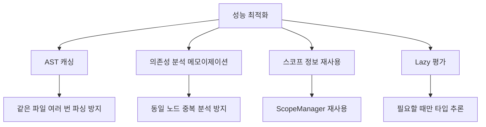

## 확장성 고려사항

### 향후 확장 가능성

1. **다중 컴포넌트 추출**: 한 번에 여러 컴포넌트 추출
2. **자동 최적화**: 추출 후 자동으로 sinking 적용
3. **스마트 이름 생성**: 컨텍스트 기반 의미 있는 이름 생성
4. **리팩토링 제안**: 추출 가능한 영역 자동 감지
5. **IDE 통합**: LSP를 통한 에디터 통합

### 플러그인 아키텍처

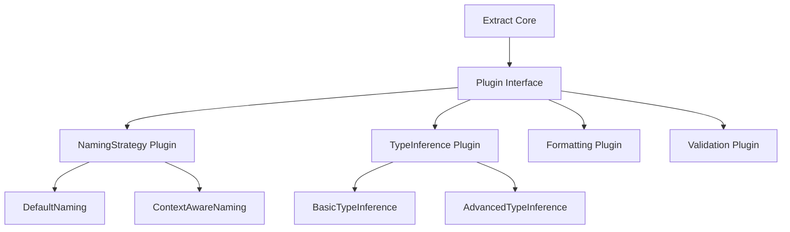

## API 설계

### Public API

```typescript
/**
 * JSX 노드를 새로운 컴포넌트로 추출
 *
 * @param files - 파일 입력 배열
 * @param selector - JSX 노드를 선택하는 Selector 또는 RangeSelector
 * @param options - 추출 옵션
 * @returns Result<ExtractResult, RegraffError>
 *
 * @example
 * // 같은 파일 내 추출
 * const result = extract(
 *   [{ path: 'App.tsx', content: sourceCode }],
 *   { file: 'App.tsx', line: 10, column: 5 },
 *   { componentName: 'UserProfile' }
 * );
 *
 * @example
 * // 다른 파일로 추출
 * const result = extract(
 *   files,
 *   { file: 'App.tsx', line: 10, column: 5 },
 *   {
 *     componentName: 'UserProfile',
 *     targetFile: 'components/UserProfile.tsx'
 *   }
 * );
 *
 * @example
 * // 범위 선택으로 여러 노드 추출
 * const result = extract(
 *   files,
 *   {
 *     file: 'App.tsx',
 *     start: { line: 10, column: 5 },
 *     end: { line: 15, column: 20 }
 *   },
 *   { componentName: 'FormSection' }
 * );
 */
export function extract(
  files: FileInput[],
  selector: Selector | RangeSelector,
  options?: ExtractOptions
): Result<ExtractResult, RegraffError>;

/**
 * 추출 가능 여부를 빠르게 확인 (dry-run)
 *
 * @param files - 파일 입력 배열
 * @param selector - JSX 노드를 선택하는 Selector 또는 RangeSelector
 * @returns boolean - 추출 가능 여부
 */
export function canExtract(
  files: FileInput[],
  selector: Selector | RangeSelector
): boolean;

/**
 * 추출 분석만 수행 (변환 없이)
 *
 * @param files - 파일 입력 배열
 * @param selector - JSX 노드를 선택하는 Selector 또는 RangeSelector
 * @returns Result<ExtractAnalysis, RegraffError>
 */
export function analyzeExtract(
  files: FileInput[],
  selector: Selector | RangeSelector
): Result<ExtractAnalysis, RegraffError>;
```

### 타입 가드

```typescript
/**
 * RangeSelector 타입 가드
 */
export function isRangeSelector(
  selector: Selector | RangeSelector
): selector is RangeSelector;

/**
 * ExtractResult 성공 여부 확인
 */
export function isExtractSuccess(
  result: Result<ExtractResult, RegraffError>
): result is Ok<ExtractResult>;
```

## 구현 우선순위

### Phase 1: 기본 기능 (MVP)
1. 단일 JSX 노드 선택 (PositionSelector)
2. 변수 의존성 분석
3. 같은 파일 내 추출
4. 간단한 Props 전달

### Phase 2: 고급 기능
1. 범위 선택 (RangeSelector)
2. Hook 의존성 처리
3. TypeScript 타입 생성
4. 다른 파일로 추출

### Phase 3: 최적화 및 확장
1. 성능 최적화
2. 에러 복구 전략
3. 코드 포맷팅 개선
4. 테스트 커버리지 100%

## 의존성 관리

### 기존 컴포넌트 재사용

- **SelectorResolver**: 노드 선택
- **DependencyAnalyzer**: 의존성 분석
- **ScopeManager**: 스코프 관리
- **CodeGenerator**: 코드 생성
- **parseFile**: AST 파싱
- **Result 모나드**: 에러 처리

### 새로운 컴포넌트

- **ExtractOrchestrator**: 전체 흐름 조율
- **ExtractPlanner**: 추출 계획 수립
- **NodeSelector**: JSX 노드 선택 및 검증
- **TypeInferrer**: 타입 추론
- **ComponentNameGenerator**: 컴포넌트 이름 생성
- **ComponentBuilder**: 컴포넌트 AST 생성
- **CodeReplacer**: 코드 교체

## 참고 자료

### 관련 문서
- [Requirements Document](./requirements.md)
- [Tech Steering](../../steering/tech.md)
- [Structure Steering](../../steering/structure.md)

### 외부 참고
- [Babel AST Explorer](https://astexplorer.net/)
- [TypeScript AST Viewer](https://ts-ast-viewer.com/)
- [React Hooks Rules](https://react.dev/reference/rules/rules-of-hooks)
