# Design Document - JSX Extract

## Overview

The Extract feature is a refactoring tool that extracts selected JSX nodes into a new React component. As the inverse operation of the inline() function, it separates a portion of code into an independent component to improve reusability and enhance component structure.

**Core Goals:**
- Select JSX nodes and extract them into a new component
- Automatic dependency analysis and Props interface generation
- Support extraction within the same file and to different files
- Automatic TypeScript type generation
- Compliance with React Hook rules

**Scope:**
- Extract single or consecutive JSX nodes
- Automatic analysis of variable, function, and Hook dependencies
- Automatic Props type inference and generation
- Automatic import statement generation and management
- Maintain code style

## Architecture Design

### System Architecture Diagram

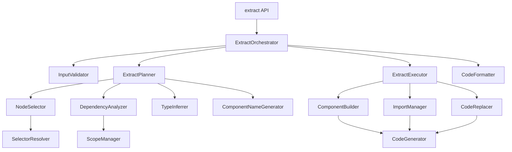

### Data Flow Diagram

```mermaid
graph LR
    A[Input: files, selector, options] --> B[Validation and Parsing]
    B --> C[JSX Node Selection]
    C --> D[Dependency Analysis]
    D --> E[Type Inference]
    E --> F[Extraction Plan Creation]
    F --> G[New Component Creation]
    G --> H[Import Statement Update]
    H --> I[Original Code Replacement]
    I --> J[Code Generation and Formatting]
    J --> K[Output: ExtractResult]
```

## Component Design

### ExtractOrchestrator

**Responsibilities:**
- Coordinate entire Extract workflow
- Manage execution order of each stage
- Error handling and rollback

**Interface:**
```typescript
interface ExtractOrchestrator {
  orchestrate(
    files: FileInput[],
    selector: Selector | RangeSelector,
    options: ExtractOptions
  ): Result<ExtractResult, RegraffError>;
}
```

**Dependencies:**
- InputValidator
- ExtractPlanner
- ExtractExecutor
- CodeFormatter

### InputValidator

**Responsibilities:**
- Validate input parameters
- Verify Selector validity
- Check file existence

**Interface:**
```typescript
interface InputValidator {
  validate(
    files: FileInput[],
    selector: Selector | RangeSelector,
    options: ExtractOptions
  ): Result<void, RegraffError>;
}
```

**Dependencies:**
- SelectorResolver
- parseFile (parser)

### ExtractPlanner

**Responsibilities:**
- Select and validate JSX nodes
- Execute dependency analysis
- Infer Props types
- Generate component name
- Establish extraction plan

**Interface:**
```typescript
interface ExtractPlanner {
  plan(
    files: FileInput[],
    selector: Selector | RangeSelector,
    options: ExtractOptions
  ): Result<ExtractPlan, RegraffError>;
}
```

**Dependencies:**
- NodeSelector
- DependencyAnalyzer
- TypeInferrer
- ComponentNameGenerator

### NodeSelector

**Responsibilities:**
- Select JSX nodes using PositionSelector or PathSelector
- Select multiple consecutive nodes using RangeSelector
- Validate selected nodes

**Interface:**
```typescript
interface NodeSelector {
  selectNodes(
    ast: t.File,
    selector: Selector | RangeSelector
  ): Result<NodePath[], RegraffError>;

  validateExtractable(
    nodes: NodePath[]
  ): Result<void, RegraffError>;
}
```

**Dependencies:**
- SelectorResolver (existing)

### DependencyAnalyzer

**Responsibilities:**
- Identify dependencies of selected JSX nodes
- Analyze variable, function, and Hook references
- Identify state variables and setters
- Generate list of dependencies to pass as Props

**Interface:**
```typescript
interface ExtractDependencyAnalyzer {
  analyze(
    nodes: NodePath[],
    sourceScope: ScopeInfo
  ): Result<ExtractDependencies, RegraffError>;
}
```

**Dependencies:**
- ScopeManager (existing)
- DependencyAnalyzer (existing - reused)

### TypeInferrer

**Responsibilities:**
- Infer TypeScript types of dependencies
- Generate Props interface
- Handle generic types

**Interface:**
```typescript
interface TypeInferrer {
  inferPropTypes(
    dependencies: Dependency[]
  ): Result<PropType[], RegraffError>;

  buildPropsInterface(
    propTypes: PropType[],
    interfaceName: string
  ): t.TSInterfaceDeclaration;
}
```

**Dependencies:**
- @babel/types

### ComponentNameGenerator

**Responsibilities:**
- Generate default component name
- Check for name conflicts
- Convert to PascalCase and validate

**Interface:**
```typescript
interface ComponentNameGenerator {
  generate(
    existingNames: Set<string>,
    suggestedName?: string
  ): string;

  ensureUnique(
    name: string,
    existingNames: Set<string>
  ): string;
}
```

**Dependencies:**
- None (pure functions)

### ExtractExecutor

**Responsibilities:**
- Execute extraction plan
- Create new component
- Update import statements
- Replace original JSX code with component call

**Interface:**
```typescript
interface ExtractExecutor {
  execute(
    plan: ExtractPlan,
    asts: Map<string, t.File>
  ): Result<Map<string, t.File>, RegraffError>;
}
```

**Dependencies:**
- ComponentBuilder
- ImportManager
- CodeReplacer

### ComponentBuilder

**Responsibilities:**
- Generate AST for new component
- Add Props interface
- Create function component declaration
- Move JSX body

**Interface:**
```typescript
interface ComponentBuilder {
  buildComponent(
    componentName: string,
    propsInterface: t.TSInterfaceDeclaration | null,
    jsxBody: t.Node[],
    hooks: HookDeclaration[]
  ): t.FunctionDeclaration;
}
```

**Dependencies:**
- @babel/types

### ImportManager

**Responsibilities:**
- Add/remove import statements
- Resolve import paths
- Prevent duplicate imports

**Interface:**
```typescript
interface ImportManager {
  addImport(
    ast: t.File,
    importName: string,
    sourcePath: string,
    isDefault?: boolean
  ): void;

  removeImport(
    ast: t.File,
    importName: string
  ): void;

  resolveRelativePath(
    fromFile: string,
    toFile: string
  ): string;
}
```

**Dependencies:**
- @babel/types
- path (Node.js)

### CodeReplacer

**Responsibilities:**
- Replace JSX code at original location with new component call
- Generate Props passing code

**Interface:**
```typescript
interface CodeReplacer {
  replace(
    sourcePath: NodePath,
    componentName: string,
    props: Map<string, t.Expression>
  ): void;
}
```

**Dependencies:**
- @babel/types

### CodeFormatter

**Responsibilities:**
- Maintain code style
- Apply indentation
- Preserve comments

**Interface:**
```typescript
interface CodeFormatter {
  format(
    ast: t.File,
    originalContent: string
  ): Result<string, RegraffError>;
}
```

**Dependencies:**
- CodeGenerator (existing)

## Data Model

### Core Data Structures

```typescript
/**
 * Extract function options
 */
interface ExtractOptions {
  /** Name of component to extract (auto-generated if not provided) */
  componentName?: string;

  /** Target file path (extracts within same file if not provided) */
  targetFile?: string;

  /** Enable TypeScript type generation (default: true) */
  generateTypes?: boolean;

  /** Preserve comments (default: true) */
  preserveComments?: boolean;

  /** Code formatting options */
  formatting?: FormattingOptions;
}

/**
 * Range selector (select multiple nodes)
 */
interface RangeSelector {
  /** File path */
  file: string;

  /** Start position */
  start: {
    line: number;
    column: number;
  };

  /** End position */
  end: {
    line: number;
    column: number;
  };
}

/**
 * Extract result
 */
interface ExtractResult {
  /** Transformed files */
  codes: Code[];

  /** Generated component information */
  component: ComponentInfo;

  /** Extraction statistics */
  stats: ExtractStats;
}

/**
 * Generated component information
 */
interface ComponentInfo {
  /** Component name */
  name: string;

  /** File where component is located */
  file: string;

  /** Props interface name */
  propsInterface?: string;

  /** Props list */
  props: PropInfo[];
}

/**
 * Prop information
 */
interface PropInfo {
  /** Prop name */
  name: string;

  /** Prop type */
  type: string;

  /** Whether optional */
  optional: boolean;
}

/**
 * Extract statistics
 */
interface ExtractStats {
  /** Number of JSX nodes extracted */
  nodesExtracted: number;

  /** Number of dependencies identified */
  dependenciesFound: number;

  /** Number of Props generated */
  propsGenerated: number;
}

/**
 * Extract plan
 */
interface ExtractPlan {
  /** Selected JSX nodes */
  selectedNodes: NodePath[];

  /** Source file */
  sourceFile: string;

  /** Target file */
  targetFile: string;

  /** Component name to generate */
  componentName: string;

  /** Props interface name */
  propsInterfaceName: string;

  /** Dependency information */
  dependencies: ExtractDependencies;

  /** Props type information */
  propTypes: PropType[];

  /** Hook declarations to move */
  hooksToMove: HookDeclaration[];

  /** Whether extracting within same file */
  isSameFile: boolean;
}

/**
 * Extract dependencies information
 */
interface ExtractDependencies {
  /** Variables to pass as Props */
  variables: VariableDependency[];

  /** Functions to pass as Props */
  functions: FunctionDependency[];

  /** State to pass as Props */
  states: StateDependency[];

  /** Hooks to move to new component */
  hooks: HookDependency[];

  /** Required imports */
  imports: ImportDependency[];
}

/**
 * Variable dependency
 */
interface VariableDependency {
  /** Variable name */
  name: string;

  /** Variable type (TypeScript) */
  type?: t.TSType;

  /** Variable declaration node */
  declaration: NodePath;
}

/**
 * Function dependency
 */
interface FunctionDependency {
  /** Function name */
  name: string;

  /** Function type (TypeScript) */
  type?: t.TSType;

  /** Function declaration node */
  declaration: NodePath;
}

/**
 * State dependency
 */
interface StateDependency {
  /** State variable name */
  stateName: string;

  /** Setter function name */
  setterName: string;

  /** State type (TypeScript) */
  type?: t.TSType;

  /** useState call node */
  declaration: NodePath;
}

/**
 * Hook dependency
 */
interface HookDependency {
  /** Hook name */
  name: string;

  /** Hook call node */
  callNode: NodePath;

  /** External dependency list */
  externalDeps: string[];
}

/**
 * Import dependency
 */
interface ImportDependency {
  /** Import name */
  name: string;

  /** Import source path */
  source: string;

  /** Whether default import */
  isDefault: boolean;
}

/**
 * Prop type information
 */
interface PropType {
  /** Prop name */
  name: string;

  /** TypeScript type AST */
  typeAnnotation: t.TSType;

  /** Whether optional */
  optional: boolean;
}

/**
 * Hook declaration information
 */
interface HookDeclaration {
  /** Hook name */
  hookName: string;

  /** Hook call expression */
  callExpression: t.CallExpression;

  /** Variable declarator (const [x, setX] = ...) */
  declarator?: t.VariableDeclarator;
}

/**
 * Formatting options
 */
interface FormattingOptions {
  /** Indentation size */
  indentSize?: number;

  /** Use tabs */
  useTabs?: boolean;

  /** Quote style */
  quotes?: 'single' | 'double';

  /** Use semicolons */
  semi?: boolean;
}
```

### Data Model Diagram

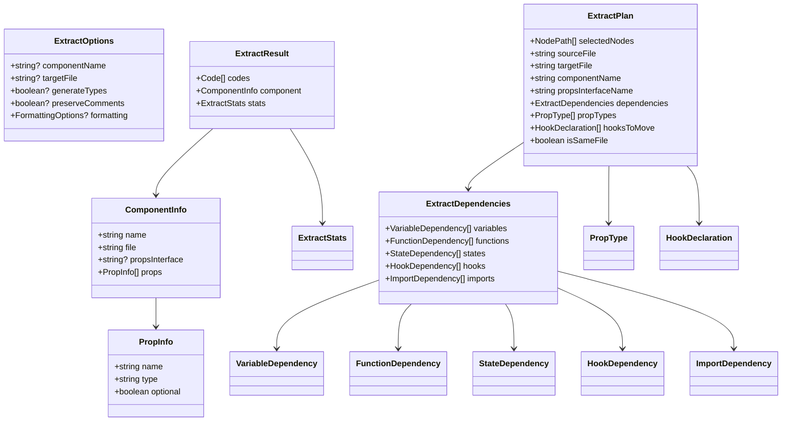

## Business Processes

### Process 1: Complete Extract Flow

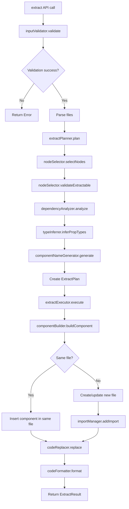

### Process 2: JSX Node Selection and Validation

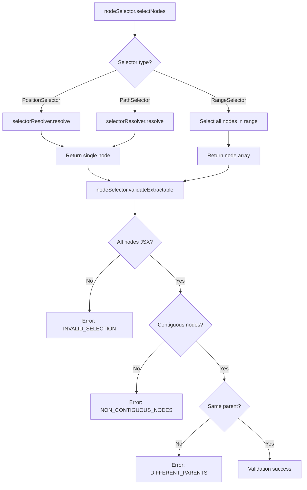

### Process 3: Dependency Analysis and Type Inference

```mermaid
flowchart TD
    A[dependencyAnalyzer.analyze] --> B[Start AST traversal]
    B --> C{Identifier found?}
    C -->|Yes| D[Check scope with scopeManager]
    C -->|No| E[Next node]

    D --> F{External scope reference?}
    F -->|No| E
    F -->|Yes| G{Type classification}

    G -->|Variable| H[Add to variables array]
    G -->|Function| I[Add to functions array]
    G -->|useState| J[Add to states array]
    G -->|Hook| K[Add to hooks array]

    H --> L[Create ExtractDependencies]
    I --> L
    J --> L
    K --> L

    L --> M[typeInferrer.inferPropTypes]
    M --> N{TypeScript file?}
    N -->|No| O[Omit types]
    N -->|Yes| P[Extract type AST]

    P --> Q{Type extraction possible?}
    Q -->|No| R[Use any type]
    Q -->|Yes| S[Create PropType]

    O --> T[Return PropType[]]
    R --> T
    S --> T
```

### Process 4: Component Creation and Code Replacement

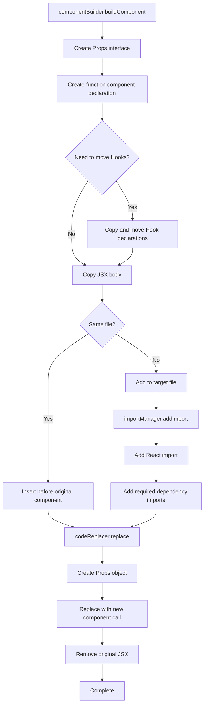

### Process 5: Hook Handling

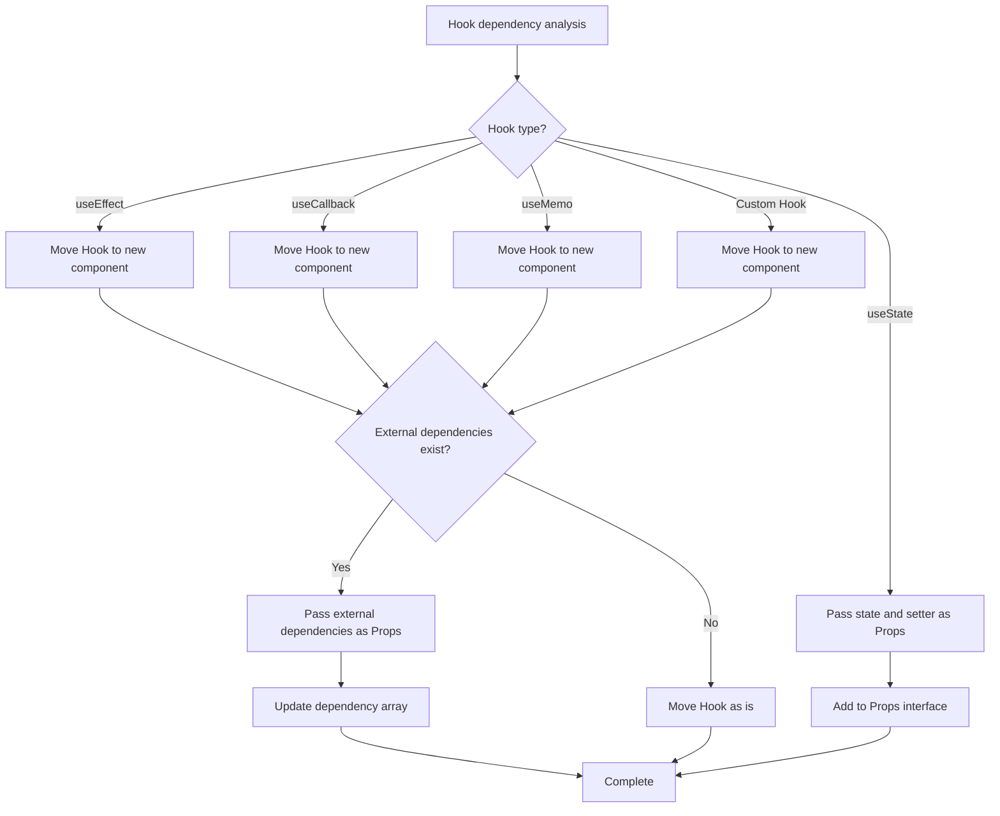

## Error Handling Strategy

### Error Categories

```typescript
enum ExtractErrorCode {
  // Validation errors
  EMPTY_INPUT = 'EMPTY_INPUT',
  INVALID_SELECTOR = 'INVALID_SELECTOR',
  FILE_NOT_FOUND = 'FILE_NOT_FOUND',

  // Selection errors
  NODE_NOT_FOUND = 'NODE_NOT_FOUND',
  INVALID_SELECTION = 'INVALID_SELECTION',
  NON_CONTIGUOUS_NODES = 'NON_CONTIGUOUS_NODES',
  DIFFERENT_PARENTS = 'DIFFERENT_PARENTS',
  NOT_JSX_NODE = 'NOT_JSX_NODE',

  // Dependency analysis errors
  CIRCULAR_DEPENDENCY = 'CIRCULAR_DEPENDENCY',
  UNRESOLVABLE_DEPENDENCY = 'UNRESOLVABLE_DEPENDENCY',
  HOOK_RULE_VIOLATION = 'HOOK_RULE_VIOLATION',

  // Type inference errors
  TYPE_INFERENCE_FAILED = 'TYPE_INFERENCE_FAILED',
  COMPLEX_TYPE_UNSUPPORTED = 'COMPLEX_TYPE_UNSUPPORTED',

  // Name generation errors
  INVALID_COMPONENT_NAME = 'INVALID_COMPONENT_NAME',
  NAME_CONFLICT = 'NAME_CONFLICT',

  // Code generation errors
  COMPONENT_BUILD_FAILED = 'COMPONENT_BUILD_FAILED',
  CODE_GENERATION_FAILED = 'CODE_GENERATION_FAILED',
  INVALID_JSX_STRUCTURE = 'INVALID_JSX_STRUCTURE',

  // File operation errors
  FILE_WRITE_FAILED = 'FILE_WRITE_FAILED',
  FILE_READ_FAILED = 'FILE_READ_FAILED',
}
```

### Error Recovery Strategy

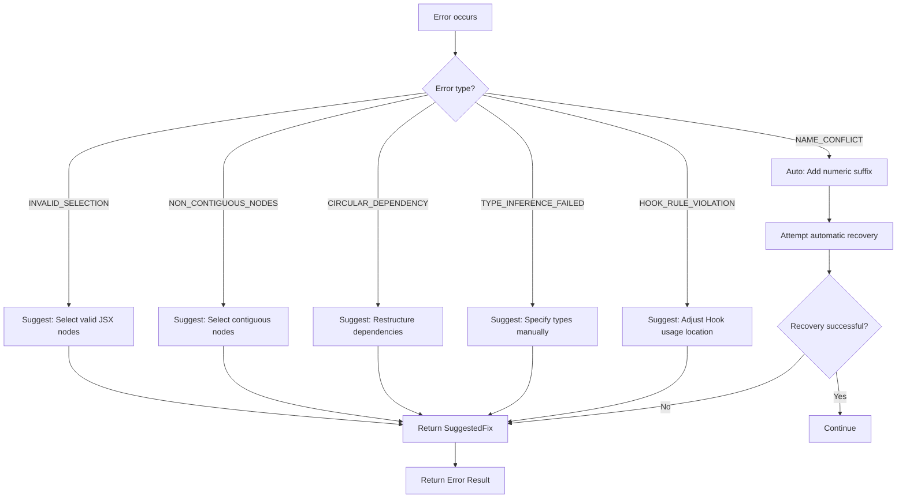

### Error Message Examples

```typescript
const errorMessages: Record<ExtractErrorCode, string> = {
  EMPTY_INPUT: 'File list is empty',
  INVALID_SELECTOR: 'Invalid selector',
  NODE_NOT_FOUND: 'Node not found at specified location',
  INVALID_SELECTION: 'Selected node is not an extractable JSX node',
  NON_CONTIGUOUS_NODES: 'Selected nodes are not contiguous',
  DIFFERENT_PARENTS: 'Selected nodes have different parents',
  NOT_JSX_NODE: 'Only JSX nodes can be extracted',
  CIRCULAR_DEPENDENCY: 'Circular dependency detected',
  UNRESOLVABLE_DEPENDENCY: 'Unresolvable dependency exists',
  HOOK_RULE_VIOLATION: 'React Hook rule violation detected',
  TYPE_INFERENCE_FAILED: 'Type inference failed',
  COMPLEX_TYPE_UNSUPPORTED: 'Unsupported complex type',
  INVALID_COMPONENT_NAME: 'Invalid component name',
  NAME_CONFLICT: 'Component with the same name already exists',
  COMPONENT_BUILD_FAILED: 'Component creation failed',
  CODE_GENERATION_FAILED: 'Code generation failed',
  INVALID_JSX_STRUCTURE: 'Invalid JSX structure',
  FILE_WRITE_FAILED: 'File write failed',
  FILE_READ_FAILED: 'File read failed',
};
```

## Testing Strategy

### Test Layers

```mermaid
graph TB
    A[Unit Tests] --> B[NodeSelector]
    A --> C[DependencyAnalyzer]
    A --> D[TypeInferrer]
    A --> E[ComponentNameGenerator]
    A --> F[ComponentBuilder]
    A --> G[ImportManager]
    A --> H[CodeReplacer]

    I[Integration Tests] --> J[Extract within same file]
    I --> K[Extract to different file]
    I --> L[Hook handling]
    I --> M[TypeScript type generation]
    I --> N[Error handling]

    O[E2E Tests] --> P[Real project scenarios]
    O --> Q[Complex dependency graphs]
    O --> R[Large-scale components]
```

### Test Cases

**1. NodeSelector Unit Tests**
- Select single node with PositionSelector
- Select single node with PathSelector
- Select multiple nodes with RangeSelector
- Error on non-contiguous node selection
- Error on nodes with different parents

**2. DependencyAnalyzer Unit Tests**
- Identify variable dependencies
- Identify function dependencies
- Identify useState dependencies
- Identify useEffect dependencies
- Identify Custom Hook dependencies
- Filter external dependencies

**3. TypeInferrer Unit Tests**
- Infer basic types (string, number, boolean)
- Infer complex types (objects, arrays)
- Handle generic types
- Handle Union types
- Handle Optional types

**4. ComponentBuilder Unit Tests**
- Create simple component
- Create component with Props interface
- Create component with Hooks
- Preserve comments

**5. Integration Tests**
- Simple extraction within same file
- Simple extraction to different file
- Extract component with useState
- Extract component with useEffect
- Handle nested dependencies
- Auto-generate imports

**6. E2E Tests**
- Extract from real React projects
- Extract complex component structures
- Handle multi-file dependencies
- Performance benchmarks

### TDD Workflow

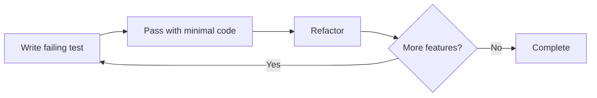

## Performance Considerations

### Performance Goals

- Single file extraction (<1000 lines): **< 200ms**
- Complex dependency analysis: **< 100ms**
- Type inference: **< 50ms**
- Code generation: **< 50ms**
- Memory usage: **< 15x file size**

### Optimization Strategies

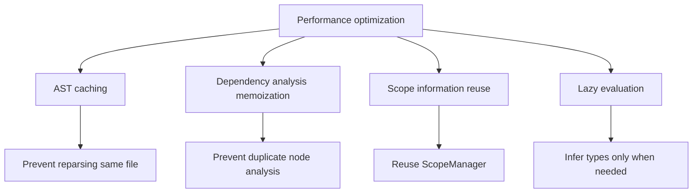

## Extensibility Considerations

### Future Extensibility

1. **Multiple component extraction**: Extract multiple components at once
2. **Automatic optimization**: Apply sinking automatically after extraction
3. **Smart name generation**: Generate meaningful names based on context
4. **Refactoring suggestions**: Auto-detect extractable regions
5. **IDE integration**: Editor integration via LSP

### Plugin Architecture

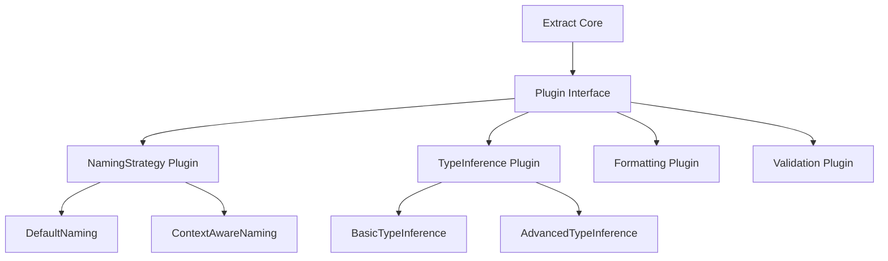

## API Design

### Public API

```typescript
/**
 * Extract JSX nodes into a new component
 *
 * @param files - Array of file inputs
 * @param selector - Selector or RangeSelector to select JSX nodes
 * @param options - Extraction options
 * @returns Result<ExtractResult, RegraffError>
 *
 * @example
 * // Extract within same file
 * const result = extract(
 *   [{ path: 'App.tsx', content: sourceCode }],
 *   { file: 'App.tsx', line: 10, column: 5 },
 *   { componentName: 'UserProfile' }
 * );
 *
 * @example
 * // Extract to different file
 * const result = extract(
 *   files,
 *   { file: 'App.tsx', line: 10, column: 5 },
 *   {
 *     componentName: 'UserProfile',
 *     targetFile: 'components/UserProfile.tsx'
 *   }
 * );
 *
 * @example
 * // Extract multiple nodes with range selection
 * const result = extract(
 *   files,
 *   {
 *     file: 'App.tsx',
 *     start: { line: 10, column: 5 },
 *     end: { line: 15, column: 20 }
 *   },
 *   { componentName: 'FormSection' }
 * );
 */
export function extract(
  files: FileInput[],
  selector: Selector | RangeSelector,
  options?: ExtractOptions
): Result<ExtractResult, RegraffError>;

/**
 * Quickly check if extraction is possible (dry-run)
 *
 * @param files - Array of file inputs
 * @param selector - Selector or RangeSelector to select JSX nodes
 * @returns boolean - Whether extraction is possible
 */
export function canExtract(
  files: FileInput[],
  selector: Selector | RangeSelector
): boolean;

/**
 * Perform extraction analysis only (no transformation)
 *
 * @param files - Array of file inputs
 * @param selector - Selector or RangeSelector to select JSX nodes
 * @returns Result<ExtractAnalysis, RegraffError>
 */
export function analyzeExtract(
  files: FileInput[],
  selector: Selector | RangeSelector
): Result<ExtractAnalysis, RegraffError>;
```

### Type Guards

```typescript
/**
 * RangeSelector type guard
 */
export function isRangeSelector(
  selector: Selector | RangeSelector
): selector is RangeSelector;

/**
 * Check if ExtractResult is successful
 */
export function isExtractSuccess(
  result: Result<ExtractResult, RegraffError>
): result is Ok<ExtractResult>;
```

## Implementation Priority

### Phase 1: Basic Features (MVP)
1. Single JSX node selection (PositionSelector)
2. Variable dependency analysis
3. Extract within same file
4. Simple Props passing

### Phase 2: Advanced Features
1. Range selection (RangeSelector)
2. Hook dependency handling
3. TypeScript type generation
4. Extract to different file

### Phase 3: Optimization and Extension
1. Performance optimization
2. Error recovery strategies
3. Code formatting improvements
4. 100% test coverage

## Dependency Management

### Reuse Existing Components

- **SelectorResolver**: Node selection
- **DependencyAnalyzer**: Dependency analysis
- **ScopeManager**: Scope management
- **CodeGenerator**: Code generation
- **parseFile**: AST parsing
- **Result monad**: Error handling

### New Components

- **ExtractOrchestrator**: Coordinate overall flow
- **ExtractPlanner**: Establish extraction plan
- **NodeSelector**: JSX node selection and validation
- **TypeInferrer**: Type inference
- **ComponentNameGenerator**: Component name generation
- **ComponentBuilder**: Component AST generation
- **CodeReplacer**: Code replacement

## References

### Related Documents
- [Requirements Document](./requirements.md)
- [Tech Steering](../../steering/tech.md)
- [Structure Steering](../../steering/structure.md)

### External References
- [Babel AST Explorer](https://astexplorer.net/)
- [TypeScript AST Viewer](https://ts-ast-viewer.com/)
- [React Hooks Rules](https://react.dev/reference/rules/rules-of-hooks)
