# Regrafter Design Document

## 1. Overview

### 1.1 Purpose

Regrafter is a programmatic AST transformation library for relocating React elements with automatic dependency management. It enables developers to safely move JSX elements within and across files while automatically handling dependency analysis, hoisting, and optimization.

### 1.2 Design Goals

| Goal | Description | Measure |
|------|-------------|---------|
| **Safety** | Transformed code must always compile and maintain semantic correctness | Zero broken builds after transformation |
| **Predictability** | Invalid moves are detectable before execution | canMove accuracy = 100% |
| **Automation** | Dependency resolution is handled automatically | No manual intervention required |
| **Optimization** | Hoisted dependencies can be sunk to optimal locations | Minimal props drilling |
| **Performance** | Sub-100ms response for typical operations | P95 latency < 100ms |

### 1.3 Mathematical Foundation

The core operation is defined as:

```
regraft: (Files, From, To, Mode) -> Code[] | Error

where:
  Files = Source file collection {f1, f2, ..., fn}
  From  = Selector identifying source element
  To    = Selector identifying target location
  Mode  = Inside | Before | After
```

**Key Invariant**: For any successful move operation:
```
forall d in deps(E): resolvable(d, scope(E'))
where E' = relocated position of E
```

### 1.4 Scope

This design covers:
- Core transformation engine architecture
- Dependency analysis and resolution algorithms
- Cross-file movement mechanisms
- Optimization pipeline (sinking)
- Public API design
- Error handling and recovery

---

## 2. Architecture

### 2.1 System Architecture Diagram

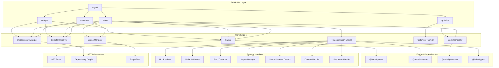

### 2.2 Data Flow Diagram

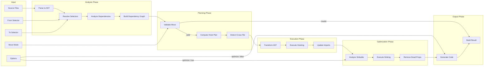

### 2.3 Component Interaction Sequence

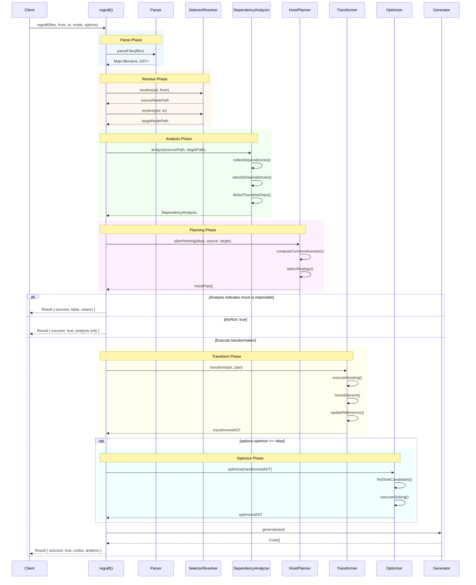

### 2.4 Layered Architecture

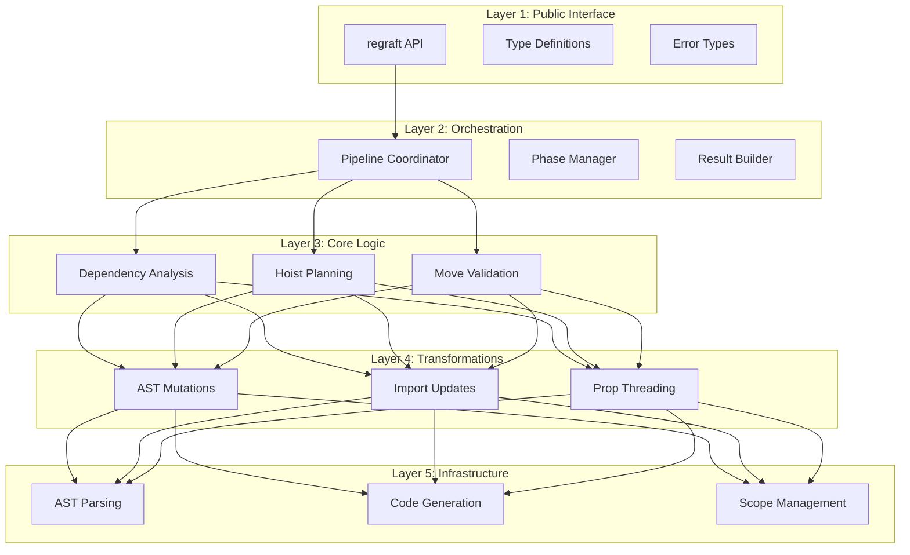

---

## 3. Component Design

### 3.1 Parser Component

**Responsibilities:**
- Parse source files into Babel AST format
- Preserve source locations for selector resolution
- Handle TypeScript/JSX/TSX syntax
- Cache parsed ASTs for reuse within session

**Interface:**
```typescript
interface Parser {
  parse(source: string, filename: string): ParseResult;
  parseFiles(files: FileInput[]): Map<string, ParseResult>;
  invalidateCache(filename: string): void;
}

interface ParseResult {
  ast: t.File;
  errors: ParseError[];
  sourceMap?: SourceMap;
}

interface FileInput {
  path: string;
  content: string;
}

interface ParseError {
  message: string;
  location: SourceLocation;
  code: string;
}
```

**Configuration:**
```typescript
const PARSER_OPTIONS: ParserOptions = {
  sourceType: 'module',
  plugins: [
    'jsx',
    'typescript',
    ['decorators', { decoratorsBeforeExport: true }],
    'classProperties',
    'classPrivateProperties',
    'classPrivateMethods',
    'exportDefaultFrom',
    'exportNamespaceFrom',
    'dynamicImport',
    'nullishCoalescingOperator',
    'optionalChaining',
    'topLevelAwait',
  ],
  errorRecovery: true,
};
```

### 3.2 Selector Resolver Component

**Responsibilities:**
- Convert line/column selectors to AST nodes
- Convert AST path selectors to AST nodes
- Find nearest JSX element for position-based selection
- Handle atomic unit detection (conditionals, maps)

**Interface:**
```typescript
interface SelectorResolver {
  resolve(ast: t.File, selector: Selector): ResolveResult;
  resolveAtomicUnit(path: NodePath): AtomicUnit;
}

interface ResolveResult {
  node: t.Node | null;
  path: NodePath | null;
  atomicUnit: AtomicUnit;
  error?: SelectorError;
}

interface AtomicUnit {
  type: AtomicUnitType;
  path: NodePath;
  nodes: t.Node[];
}

enum AtomicUnitType {
  Element = 'element',
  Conditional = 'conditional',     // {cond && <E />}
  Ternary = 'ternary',             // {cond ? <A /> : <B />}
  MapExpression = 'map',           // {items.map(...)}
  CompoundComponent = 'compound',  // <Tabs.Panel>
  SuspenseBoundary = 'suspense',   // <Suspense><Lazy /></Suspense>
}
```

**Algorithm: Position-based Resolution**
```
Algorithm: ResolveByPosition(ast, line, column)

Input: ast - Babel AST, line - target line, column - target column
Output: NodePath of innermost JSX element containing position

1. candidates = []
2. TRAVERSE ast:
   FOR EACH node WHERE node.type starts with 'JSX':
     IF nodeContainsPosition(node.loc, line, column):
       candidates.push({ node, area: computeArea(node.loc) })

3. IF candidates.empty:
   RETURN error("No JSX element at position")

4. SORT candidates BY area ASC  // Smallest first
5. targetNode = candidates[0].node

6. // Check for atomic unit
7. atomicUnit = resolveAtomicUnit(targetNode.path)
8. RETURN { node: targetNode, path: targetNode.path, atomicUnit }
```

**Algorithm: Atomic Unit Detection**
```
Algorithm: ResolveAtomicUnit(path)

1. parent = path.parentPath

2. // Check for conditional: {cond && <E />}
   IF parent.isLogicalExpression() AND parent.node.operator == '&&':
     RETURN { type: Conditional, path: parent, nodes: [parent.node] }

3. // Check for ternary: {cond ? <A /> : <B />}
   IF parent.isConditionalExpression():
     RETURN { type: Ternary, path: parent, nodes: [parent.node] }

4. // Check for map: {items.map(item => <E />)}
   IF isInsideMapCallback(path):
     mapExpr = findMapExpression(path)
     RETURN { type: MapExpression, path: mapExpr, nodes: [mapExpr.node] }

5. // Check for compound component: <Tabs.Panel>
   IF path.isJSXMemberExpression():
     compoundRoot = findCompoundRoot(path)
     RETURN { type: CompoundComponent, path: compoundRoot, nodes: collectCompoundNodes(compoundRoot) }

6. // Check for Suspense boundary
   IF isLazyComponent(path.node) AND isInsideSuspense(path):
     suspense = findParentSuspense(path)
     RETURN { type: SuspenseBoundary, path: suspense, nodes: [suspense.node] }

7. // Regular element
   RETURN { type: Element, path, nodes: [path.node] }
```

### 3.3 Dependency Analyzer Component

**Responsibilities:**
- Identify all dependencies of a JSX element
- Classify dependencies by type (Hook, Variable, Import, Prop)
- Build dependency graph for scope analysis
- Detect transitive dependencies
- Identify unanalyzable code (eval)

**Interface:**
```typescript
interface DependencyAnalyzer {
  analyze(sourcePath: NodePath, targetPath: NodePath): DependencyAnalysis;
  getDependencyGraph(ast: t.File): DependencyGraph;
  isAnalyzable(path: NodePath): AnalyzabilityResult;
}

interface DependencyAnalysis {
  dependencies: Dependency[];
  needsHoisting: Dependency[];
  needsImport: Dependency[];
  needsPropThreading: Dependency[];
  canResolve: boolean;
  unresolvedReason?: string;
}

interface Dependency {
  id: string;
  symbol: string;
  type: DependencyType;
  origin: DependencyOrigin;
  scope: ScopeInfo;
  isTransitive: boolean;
  consumers: string[];  // IDs of dependent symbols
}

interface DependencyOrigin {
  node: t.Node;
  file: string;
  location: SourceLocation;
}

enum DependencyType {
  Hook = 'Hook',
  Variable = 'Variable',
  Import = 'Import',
  Prop = 'Prop',
  Context = 'Context',
  Ref = 'Ref',
}

interface AnalyzabilityResult {
  analyzable: boolean;
  blockers?: UnanalyzableCode[];
}

interface UnanalyzableCode {
  type: 'eval' | 'dynamicCode';
  location: SourceLocation;
  description: string;
}
```

**Algorithm: Dependency Collection**
```
Algorithm: AnalyzeDependencies(elementPath)

Input: elementPath - NodePath of JSX element to analyze
Output: Set of dependencies

1. deps = new Set()
2. seen = new Set()  // Prevent infinite recursion

3. identifiers = collectAllIdentifiers(elementPath)

4. FOR EACH identifier IN identifiers:
   IF seen.has(identifier.name): CONTINUE
   seen.add(identifier.name)

   binding = elementPath.scope.getBinding(identifier.name)

   IF NOT binding:
     // External or unresolved - check if it's a global
     IF isKnownGlobal(identifier.name): CONTINUE
     deps.add(createUnresolvedDep(identifier))
     CONTINUE

   dep = {
     id: generateId(),
     symbol: identifier.name,
     type: classifyBinding(binding),
     origin: {
       node: binding.path.node,
       file: getCurrentFile(),
       location: binding.path.node.loc
     },
     scope: extractScopeInfo(binding.scope),
     isTransitive: false,
     consumers: []
   }

   deps.add(dep)

   // Collect transitive dependencies
   IF dep.type IN [Hook, Variable]:
     transitiveDeps = AnalyzeDependencies(binding.path)
     FOR EACH td IN transitiveDeps:
       td.isTransitive = true
       td.consumers.push(dep.id)
       deps.add(td)

5. RETURN deps
```

**Algorithm: Dependency Classification**
```
Algorithm: ClassifyBinding(binding)

1. node = binding.path.node
2. parent = binding.path.parent

3. // Check for Hook
   IF isCallExpression(parent):
     callee = parent.callee
     IF isHookCall(callee):
       RETURN DependencyType.Hook

4. // Check for Import
   IF binding.kind == 'module':
     RETURN DependencyType.Import

5. // Check for Prop (function parameter)
   IF binding.kind == 'param':
     IF isComponentOrFunction(binding.scope.path):
       RETURN DependencyType.Prop

6. // Check for Context
   IF isUseContextCall(binding.path):
     RETURN DependencyType.Context

7. // Check for Ref
   IF isUseRefCall(binding.path):
     RETURN DependencyType.Ref

8. // Default to Variable
   RETURN DependencyType.Variable
```

### 3.4 Scope Manager Component

**Responsibilities:**
- Track variable scopes throughout AST
- Determine scope accessibility after move
- Identify lowest common ancestor scopes
- Manage React component boundaries
- Detect conditional/loop contexts

**Interface:**
```typescript
interface ScopeManager {
  getScope(path: NodePath): ScopeInfo;
  isAccessible(dependency: Dependency, targetScope: ScopeInfo): boolean;
  findLowestCommonAncestor(scope1: ScopeInfo, scope2: ScopeInfo): ScopeInfo;
  getComponentScope(path: NodePath): ComponentScope | null;
  isValidHookLocation(scope: ScopeInfo): boolean;
}

interface ScopeInfo {
  id: string;
  type: ScopeType;
  path: NodePath;
  parent: ScopeInfo | null;
  bindings: Map<string, Binding>;
  depth: number;
}

enum ScopeType {
  Module = 'module',
  Function = 'function',
  Component = 'component',
  Block = 'block',
  Loop = 'loop',
  Conditional = 'conditional',
}

interface ComponentScope extends ScopeInfo {
  componentName: string;
  isConditionallyRendered: boolean;
  isInsideLoop: boolean;
  parentComponent: ComponentScope | null;
  hooks: HookUsage[];
}

interface HookUsage {
  name: string;
  path: NodePath;
  dependencies: string[];
}
```

**Algorithm: Find Lowest Common Ancestor**
```
Algorithm: FindLCA(scope1, scope2)

1. // Build ancestor chain for scope1
   ancestors1 = []
   current = scope1
   WHILE current != null:
     ancestors1.push(current)
     current = current.parent

2. // Build ancestor set for quick lookup
   ancestorSet = new Set(ancestors1.map(s => s.id))

3. // Walk up scope2's chain until we find common ancestor
   current = scope2
   WHILE current != null:
     IF ancestorSet.has(current.id):
       RETURN current
     current = current.parent

4. RETURN moduleScope  // Fallback to module level
```

**Algorithm: Validate Hook Location**
```
Algorithm: IsValidHookLocation(scope)

1. IF scope.type == Module:
   RETURN false  // Hooks can't be at module level

2. IF scope.type == Block:
   RETURN false  // Hooks can't be in blocks

3. IF scope.type IN [Loop, Conditional]:
   RETURN false  // Violates Rules of Hooks

4. IF scope.type == Component:
   // Must be at top level of component
   RETURN isTopLevelOfComponent(scope)

5. IF scope.type == Function:
   // Custom hooks are allowed
   IF isCustomHook(scope.path):
     RETURN true
   RETURN false

6. RETURN false
```

### 3.5 Transformation Engine Component

**Responsibilities:**
- Execute AST transformations for element movement
- Orchestrate hoisting strategies
- Handle move operations (Inside, Before, After)
- Coordinate prop threading

**Interface:**
```typescript
interface TransformationEngine {
  transform(context: TransformContext): TransformResult;
  planTransformation(analysis: DependencyAnalysis, target: NodePath): TransformPlan;
}

interface TransformContext {
  asts: Map<string, t.File>;
  sourcePath: NodePath;
  targetPath: NodePath;
  mode: Move;
  analysis: DependencyAnalysis;
  options: TransformOptions;
}

interface TransformPlan {
  moves: MoveOperation[];
  hoists: HoistOperation[];
  propThreads: PropThreadOperation[];
  imports: ImportOperation[];
  sharedModules: SharedModuleOperation[];
}

interface TransformResult {
  asts: Map<string, t.File>;
  newFiles: Map<string, t.File>;
  modifications: Modification[];
  stats: TransformStats;
}

interface TransformStats {
  elementsMovedtation: number;
  dependenciesHoisted: number;
  propsAdded: number;
  importsAdded: number;
  filesModified: number;
  filesCreated: number;
}
```

**Algorithm: Execute Transformation**
```
Algorithm: Transform(context)

Input: TransformContext with source, target, mode, and dependencies
Output: Transformed ASTs

1. plan = PlanTransformation(context.analysis, context.targetPath)

2. // Phase 1: Create shared modules if needed (cross-file)
   FOR EACH sharedModule IN plan.sharedModules:
     newAst = CreateSharedModule(sharedModule)
     context.asts.set(sharedModule.path, newAst)

3. // Phase 2: Execute hoisting operations
   FOR EACH hoist IN plan.hoists:
     CASE hoist.strategy:
       HoistStrategy.Hoist:
         HoistDeclaration(hoist.dependency, hoist.targetScope)
       HoistStrategy.WrapProvider:
         WrapWithProvider(hoist.dependency, hoist.targetPath)
       HoistStrategy.ExtractFromContext:
         ExtractContextToProps(hoist.dependency)

4. // Phase 3: Add prop threading
   FOR EACH thread IN plan.propThreads:
     AddPropToComponent(thread.component, thread.propName, thread.value)
     AddPropUsage(thread.consumer, thread.propName)

5. // Phase 4: Update imports
   FOR EACH importOp IN plan.imports:
     AddImport(importOp.file, importOp.source, importOp.specifiers)

6. // Phase 5: Execute move
   sourceNode = CloneNode(context.sourcePath.node)

   CASE context.mode:
     Move.Inside:
       AppendChild(context.targetPath, sourceNode)
     Move.Before:
       InsertBefore(context.targetPath, sourceNode)
     Move.After:
       InsertAfter(context.targetPath, sourceNode)

7. // Phase 6: Remove from original location
   RemoveNode(context.sourcePath)

8. // Phase 7: Update all references
   UpdateReferences(context.asts, plan)

9. RETURN { asts: context.asts, modifications, stats }
```

### 3.6 Strategy Handlers

#### 3.6.1 Hook Hoister

**Algorithm: Hoist Hook**
```
Algorithm: HoistHook(dependency, sourceScope, targetScope)

1. // Validate target is valid hook location
   IF NOT IsValidHookLocation(targetScope):
     // Find nearest valid ancestor
     targetScope = FindNearestValidHookScope(targetScope)

2. // Clone hook declaration
   hookDecl = CloneNode(dependency.origin.node)

3. // Insert at target scope's top level
   InsertAtTopOfScope(targetScope, hookDecl)

4. // Check if original location still needs the value
   IF HasOtherConsumers(dependency, sourceScope):
     // Add prop threading back to original
     AddPropThread(targetScope, sourceScope, dependency.symbol)

5. // Remove from original location
   RemoveNode(dependency.origin.node)
```

#### 3.6.2 Context Handler

**Algorithm: Handle Context Dependency**
```
Algorithm: HandleContextDependency(dependency, targetPath)

1. // Strategy A: Check if we can hoist the Provider
   provider = FindContextProvider(dependency)

   IF CanHoistProvider(provider, targetPath):
     HoistProvider(provider, FindLCA(provider.path, targetPath))
     RETURN

2. // Strategy B: Extract context value to props
   contextValue = dependency.symbol

   // Find the component that can access the context
   contextAccessor = FindNearestContextAccessor(dependency)

   // Add useContext call there if not exists
   IF NOT HasContextAccess(contextAccessor, dependency.context):
     AddUseContextCall(contextAccessor, dependency.context)

   // Thread the value as props to target
   AddPropThread(contextAccessor, targetPath, contextValue)
```

#### 3.6.3 Suspense Handler

**Algorithm: Handle Suspense Boundary**
```
Algorithm: HandleSuspenseDependency(lazyComponent, targetPath)

1. // Check if target is inside a Suspense boundary
   IF IsInsideSuspense(targetPath):
     // Can move directly
     RETURN

2. // Check if original Suspense can be moved together
   originalSuspense = FindParentSuspense(lazyComponent)

   IF CanMoveAtomically(originalSuspense, targetPath):
     // Move entire Suspense boundary
     MoveNode(originalSuspense, targetPath)
     RETURN

3. // Create new Suspense boundary at target
   fallback = originalSuspense.props.fallback OR CreateDefaultFallback()
   newSuspense = CreateSuspenseWrapper(fallback)

   WrapWithNode(targetPath, newSuspense)
```

### 3.7 Optimizer (Sinker) Component

**Responsibilities:**
- Analyze dependency usage patterns post-transformation
- Sink over-hoisted dependencies to optimal locations
- Remove unnecessary prop threading
- Maintain Hook rules compliance

**Interface:**
```typescript
interface Optimizer {
  optimize(asts: Map<string, t.File>): OptimizeResult;
  analyzeSinkCandidates(ast: t.File): SinkCandidate[];
  executeSinking(candidates: SinkCandidate[]): void;
}

interface SinkCandidate {
  dependency: Dependency;
  currentScope: ScopeInfo;
  optimalScope: ScopeInfo;
  consumers: ConsumerInfo[];
  sinkable: boolean;
  reason?: string;
}

interface ConsumerInfo {
  path: NodePath;
  scope: ScopeInfo;
  usageType: 'direct' | 'prop' | 'closure';
}

interface OptimizeResult {
  asts: Map<string, t.File>;
  sunkDependencies: SinkCandidate[];
  removedProps: PropRemoval[];
  deadCodeRemoved: string[];
}
```

**Algorithm: Sink Dependencies**
```
Algorithm: SinkDependencies(ast)

Input: AST with potentially over-hoisted dependencies
Output: Optimized AST with dependencies at optimal locations

1. candidates = []

2. // Scan all declarations at component/function top level
   FOR EACH scope IN getAllScopes(ast):
     FOR EACH binding IN scope.bindings:
       candidate = AnalyzeSinkCandidate(binding)
       IF candidate.sinkable:
         candidates.push(candidate)

3. // Sort by depth (deepest first to avoid conflicts)
   SORT candidates BY candidate.optimalScope.depth DESC

4. // Execute sinking
   FOR EACH candidate IN candidates:
     ExecuteSink(candidate)

5. // Clean up orphaned props
   RemoveOrphanedProps(ast)

6. RETURN { ast, candidates }
```

**Algorithm: Analyze Sink Candidate**
```
Algorithm: AnalyzeSinkCandidate(binding)

1. dependency = bindingToDependency(binding)
2. consumers = FindAllConsumers(binding)

3. IF consumers.length == 0:
   RETURN { sinkable: true, reason: 'dead_code', optimalScope: null }

4. // Compute lowest common ancestor of all consumers
   lca = consumers[0].scope
   FOR i = 1 TO consumers.length - 1:
     lca = FindLCA(lca, consumers[i].scope)

5. // Check if LCA is different from current scope
   IF lca.id == binding.scope.id:
     RETURN { sinkable: false, reason: 'already_optimal' }

6. // Check Hook constraints
   IF dependency.type == Hook:
     IF NOT IsValidHookLocation(lca):
       RETURN { sinkable: false, reason: 'invalid_hook_location' }

7. // Check if all consumers are in single subtree
   IF NOT AllConsumersInSubtree(consumers, lca):
     RETURN { sinkable: false, reason: 'consumers_not_in_subtree' }

8. RETURN {
     sinkable: true,
     currentScope: binding.scope,
     optimalScope: lca,
     consumers
   }
```

### 3.8 Code Generator Component

**Responsibilities:**
- Generate code from transformed AST
- Preserve comments and formatting when possible
- Adjust indentation for moved elements
- Handle import statement formatting and deduplication

**Interface:**
```typescript
interface CodeGenerator {
  generate(ast: t.File, options: GeneratorOptions): GenerateResult;
  generateMultiple(asts: Map<string, t.File>, options: GeneratorOptions): Map<string, GenerateResult>;
}

interface GeneratorOptions {
  preserveComments: boolean;   // default: true
  formatOutput: boolean;       // default: false
  indentSize: number;          // default: 2
  useTabs: boolean;            // default: false
  printWidth: number;          // default: 80
  singleQuote: boolean;        // default: true
  trailingComma: 'none' | 'es5' | 'all';  // default: 'es5'
}

interface GenerateResult {
  code: string;
  map?: SourceMap;
  errors: GeneratorError[];
}
```

---

## 4. Data Models

### 4.1 Public API Types

```typescript
// ═══════════════════════════════════════════════
// Move Mode Enum
// ═══════════════════════════════════════════════

enum Move {
  Inside = 'inside',   // Insert as child of target
  Before = 'before',   // Insert as previous sibling
  After = 'after',     // Insert as next sibling
}

// ═══════════════════════════════════════════════
// Selector Types
// ═══════════════════════════════════════════════

type Selector = PositionSelector | PathSelector;

interface PositionSelector {
  file: string;
  line: number;
  column: number;
}

interface PathSelector {
  file: string;
  path: string;  // AST path like "Program.body[0].declaration.body"
}

// ═══════════════════════════════════════════════
// Options
// ═══════════════════════════════════════════════

interface Options {
  optimize?: boolean;         // default: true - Run sinking optimization
  dryRun?: boolean;           // default: false - Analysis only, no transformation
  preserveComments?: boolean; // default: true - Keep comments in output
  formatOutput?: boolean;     // default: false - Apply formatter to output
}

// ═══════════════════════════════════════════════
// Result Types
// ═══════════════════════════════════════════════

interface Result {
  success: boolean;
  codes: Code[];
  analysis: MoveAnalysis;
}

interface Code {
  file: string;
  content: string;
  changed: boolean;
  isNew?: boolean;      // True for newly created shared modules
  original?: string;    // Original content if changed
}

interface MoveAnalysis {
  canMove: boolean;
  reason?: string;
  dependencies: Dependency[];
  hoistedDeps: Dependency[];
  sunkDeps?: Dependency[];       // Present after optimization
  suggestedFixes?: SuggestedFix[];
  stats?: AnalysisStats;
}

interface AnalysisStats {
  totalDependencies: number;
  hookDependencies: number;
  variableDependencies: number;
  importDependencies: number;
  propDependencies: number;
  transitiveDependencies: number;
}

// ═══════════════════════════════════════════════
// Dependency Types
// ═══════════════════════════════════════════════

interface Dependency {
  symbol: string;
  type: DependencyType;
  origin: string;           // File path
  scope: string;            // Component/function name
  isTransitive: boolean;
  resolution?: ResolutionStrategy;
}

enum DependencyType {
  Hook = 'Hook',
  Variable = 'Variable',
  Import = 'Import',
  Prop = 'Prop',
  Context = 'Context',
  Ref = 'Ref',
}

interface SuggestedFix {
  description: string;
  action: string;
  automatic: boolean;       // Can be applied automatically
}

enum ResolutionStrategy {
  Hoist = 'hoist',
  PropThread = 'prop_thread',
  Import = 'import',
  SharedModule = 'shared_module',
  ProviderHoist = 'provider_hoist',
  ContextToProps = 'context_to_props',
}
```

### 4.2 Internal Data Structures

```typescript
// ═══════════════════════════════════════════════
// Dependency Graph
// ═══════════════════════════════════════════════

interface DependencyGraph {
  nodes: Map<string, DependencyNode>;
  edges: Map<string, Set<string>>;      // from -> to[]
  reverseEdges: Map<string, Set<string>>; // to -> from[] (consumers)
}

interface DependencyNode {
  id: string;
  type: 'symbol' | 'element' | 'scope';
  name: string;
  path: NodePath;
  scope: ScopeInfo;
  metadata: NodeMetadata;
}

interface NodeMetadata {
  isHook: boolean;
  isPure: boolean;
  hasSideEffects: boolean;
  isExported: boolean;
}

// ═══════════════════════════════════════════════
// AST Store
// ═══════════════════════════════════════════════

interface ASTStore {
  files: Map<string, ASTEntry>;
  scopeMap: WeakMap<t.Node, ScopeInfo>;
  bindingCache: WeakMap<t.Identifier, Binding>;
  dependencyGraphCache: WeakMap<t.File, DependencyGraph>;
}

interface ASTEntry {
  path: string;
  ast: t.File;
  dirty: boolean;
  hash: string;              // Content hash for change detection
  dependencies: Set<string>; // Files this depends on
  dependents: Set<string>;   // Files that depend on this
}

// ═══════════════════════════════════════════════
// Transformation Plan
// ═══════════════════════════════════════════════

interface TransformPlan {
  id: string;
  moves: MoveOperation[];
  hoists: HoistOperation[];
  propThreads: PropThreadOperation[];
  imports: ImportOperation[];
  sharedModules: SharedModuleOperation[];
  validation: ValidationResult;
}

interface MoveOperation {
  id: string;
  sourceFile: string;
  sourcePath: string;
  targetFile: string;
  targetPath: string;
  mode: Move;
  atomicUnit: AtomicUnitType;
}

interface HoistOperation {
  id: string;
  dependencyId: string;
  symbol: string;
  fromFile: string;
  fromScope: string;
  toFile: string;
  toScope: string;
  strategy: HoistStrategy;
}

enum HoistStrategy {
  Hoist = 'hoist',
  PassAsProp = 'prop',
  CreateShared = 'shared',
  WrapProvider = 'provider',
  ExtractContext = 'extract_context',
}

interface PropThreadOperation {
  id: string;
  propName: string;
  valueExpression: string;
  fromComponent: string;
  toComponent: string;
  path: string[];            // Component path from source to target
}

interface ImportOperation {
  id: string;
  file: string;
  importSource: string;
  specifiers: ImportSpecifier[];
  position: 'start' | 'end' | 'grouped';
}

interface ImportSpecifier {
  type: 'default' | 'named' | 'namespace';
  imported: string;
  local: string;
}

interface SharedModuleOperation {
  id: string;
  newFilePath: string;
  exports: ExportDeclaration[];
  importers: string[];
}

interface ExportDeclaration {
  name: string;
  type: 'named' | 'default';
  node: t.Node;
}
```

### 4.3 Data Model Diagram

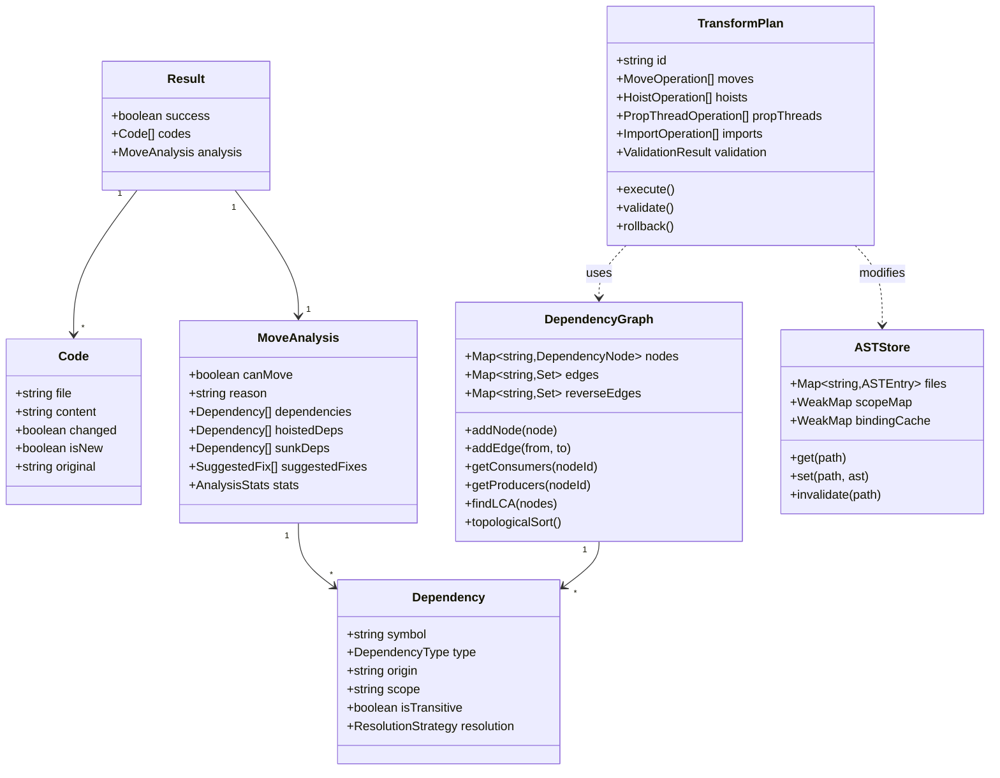

### 4.4 State Machine: Move Operation

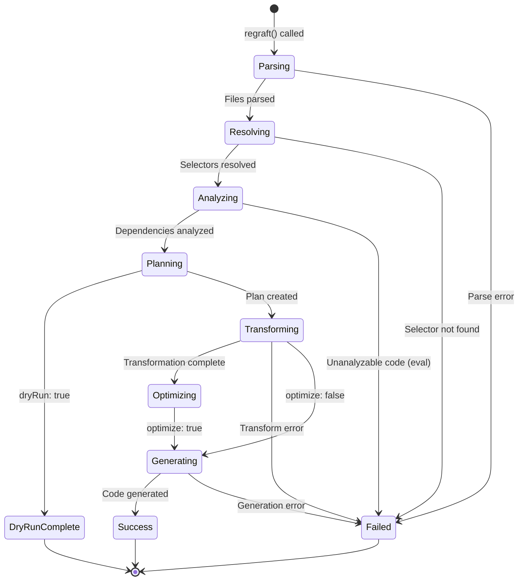

---

## 5. Business Processes

### 5.1 Process 1: Unified regraft() API Flow

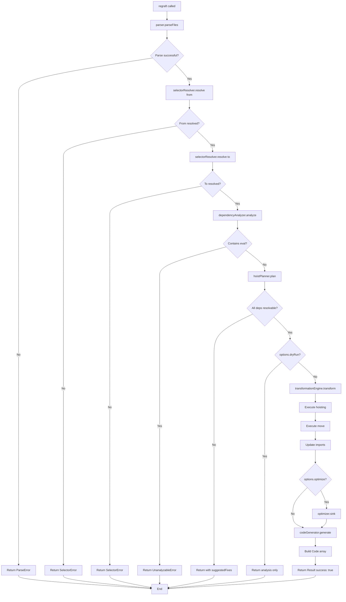

### 5.2 Process 2: Dependency Resolution Strategy Selection

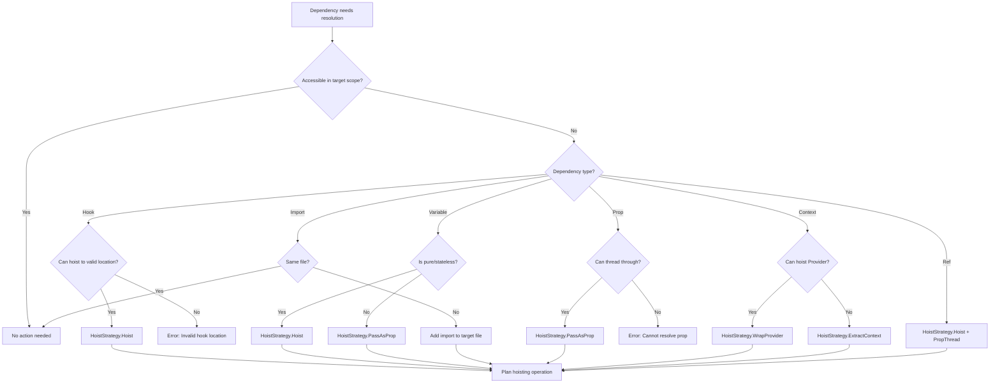

### 5.3 Process 3: Cross-File Movement

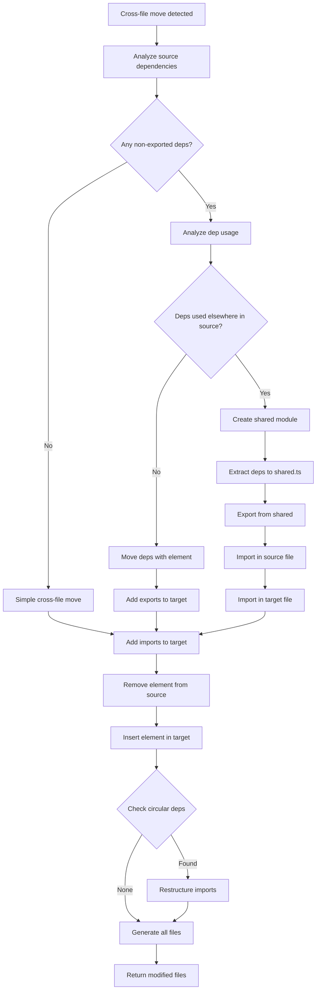

### 5.4 Process 4: Hook Hoisting with Rules Compliance

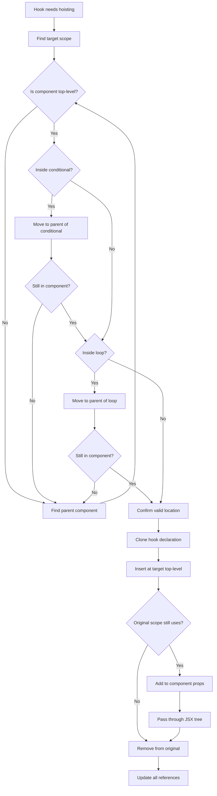

### 5.5 Process 5: Optimization (Sinking) Flow

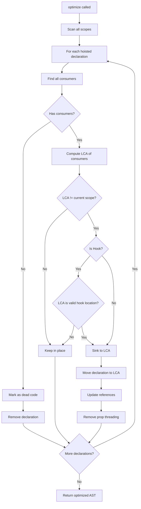

### 5.6 Process 6: Atomic Unit Detection and Handling

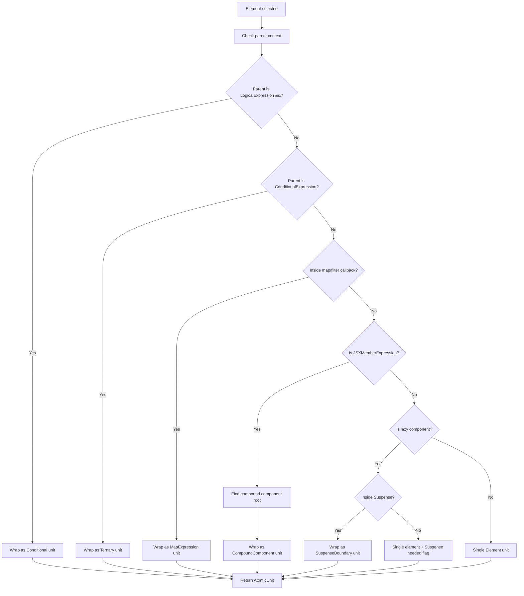

---

## 6. Error Handling Strategy

### 6.1 Error Taxonomy

```typescript
// Error category enumeration
enum ErrorCategory {
  Parse = 'PARSE',
  Selector = 'SELECTOR',
  Dependency = 'DEPENDENCY',
  Validation = 'VALIDATION',
  Transform = 'TRANSFORM',
  Circular = 'CIRCULAR',
  Internal = 'INTERNAL',
}

// Base error interface
interface RegraffError {
  category: ErrorCategory;
  code: string;
  message: string;
  file?: string;
  location?: SourceLocation;
  suggestions?: SuggestedFix[];
  stack?: string;
}

// Specific error types
interface ParseError extends RegraffError {
  category: ErrorCategory.Parse;
  syntaxError: string;
  recoveryHint?: string;
}

interface SelectorError extends RegraffError {
  category: ErrorCategory.Selector;
  selector: Selector;
  nearestMatch?: t.Node;
}

interface DependencyError extends RegraffError {
  category: ErrorCategory.Dependency;
  dependency: Dependency;
  unresolvableReason: string;
}

interface ValidationError extends RegraffError {
  category: ErrorCategory.Validation;
  constraint: string;
  details: string;
}

interface CircularError extends RegraffError {
  category: ErrorCategory.Circular;
  cycle: string[];
}
```

### 6.2 Error Code Reference

| Code | Category | Message Template | Recoverable |
|------|----------|-----------------|-------------|
| E001 | Parse | Failed to parse {file}: {message} at line {line} | No |
| E002 | Parse | Unexpected token at {file}:{line}:{column} | No |
| E010 | Selector | No JSX element found at {file}:{line}:{column} | No |
| E011 | Selector | Invalid AST path: {path} | No |
| E012 | Selector | File not in input: {file} | No |
| E013 | Selector | Element at position is not movable: {reason} | No |
| E020 | Dependency | Cannot analyze: eval() detected at {location} | No |
| E021 | Dependency | Cannot analyze: dynamic code at {location} | No |
| E022 | Dependency | Unresolvable external reference: {symbol} | Sometimes |
| E030 | Validation | Cannot hoist Hook to conditional scope | No |
| E031 | Validation | Cannot hoist Hook to loop scope | No |
| E032 | Validation | Move would break Hook rules | No |
| E040 | Circular | Circular dependency detected: {cycle} | Yes |
| E041 | Circular | Cross-file circular import: {cycle} | Yes |
| E050 | Transform | Failed to insert at target: {reason} | No |
| E051 | Transform | Failed to update references: {reason} | No |
| E099 | Internal | Internal error: {message} | No |

### 6.3 Error Handling Flow

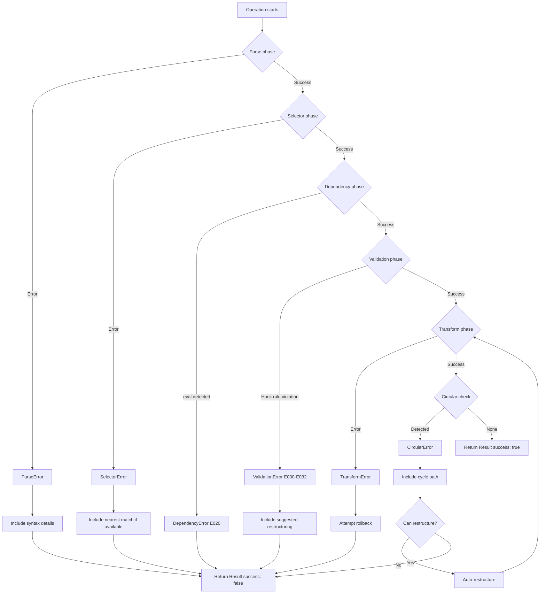

### 6.4 Recovery Strategies

```typescript
interface RecoveryStrategy {
  code: string;
  canRecover: boolean;
  automatic: boolean;
  action?: () => Promise<void>;
  userAction?: string;
}

const recoveryStrategies: Map<string, RecoveryStrategy> = new Map([
  ['E001', {
    code: 'E001',
    canRecover: false,
    automatic: false,
    userAction: 'Fix syntax error in source file before retrying'
  }],

  ['E020', {
    code: 'E020',
    canRecover: false,
    automatic: false,
    userAction: 'Remove eval() or refactor to static code'
  }],

  ['E030', {
    code: 'E030',
    canRecover: true,
    automatic: true,
    action: async () => {
      // Find valid parent scope and retry
      await hoistToValidAncestor();
    }
  }],

  ['E040', {
    code: 'E040',
    canRecover: true,
    automatic: true,
    action: async () => {
      // Break cycle by extracting to shared module
      await breakCycleWithSharedModule();
    }
  }],

  ['E041', {
    code: 'E041',
    canRecover: true,
    automatic: true,
    action: async () => {
      // Restructure imports to break cycle
      await restructureImports();
    }
  }],
]);
```

### 6.5 Error Response Format

```typescript
// Error response structure
interface ErrorResult extends Result {
  success: false;
  codes: [];  // Empty on failure
  analysis: {
    canMove: false;
    reason: string;
    dependencies: Dependency[];
    hoistedDeps: [];
    suggestedFixes: SuggestedFix[];
    error: {
      category: ErrorCategory;
      code: string;
      message: string;
      location?: SourceLocation;
      recoverable: boolean;
      recovery?: RecoveryStrategy;
    };
  };
}
```

---

## 7. Testing Strategy

### 7.1 Test Architecture

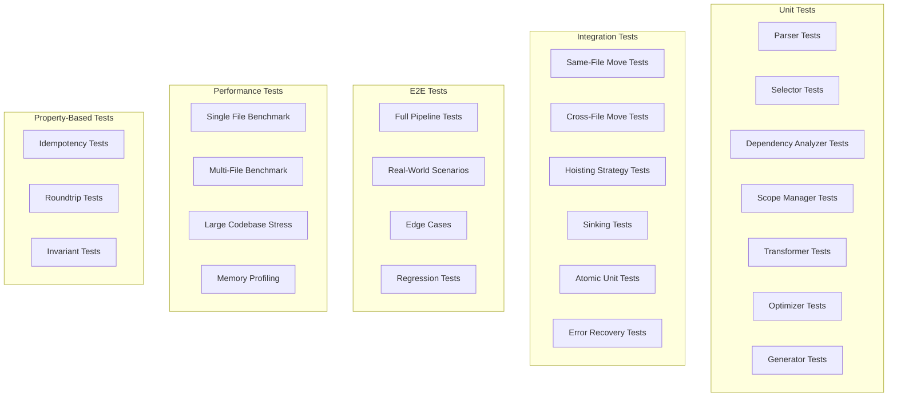

### 7.2 Unit Test Coverage Targets

| Component | Coverage Target | Critical Paths |
|-----------|-----------------|----------------|
| Parser | 95% | JSX/TSX parsing, error recovery |
| Selector Resolver | 95% | Position resolution, atomic unit detection |
| Dependency Analyzer | 90% | All 6 dependency types, transitives |
| Scope Manager | 90% | LCA computation, hook validation |
| Transformation Engine | 90% | All move modes, all hoist strategies |
| Optimizer | 85% | Sink logic, constraint checking |
| Code Generator | 85% | Comment preservation, formatting |

### 7.3 Integration Test Scenarios

```typescript
const integrationTestSuites = {
  sameFileMove: [
    'move_sibling_before',
    'move_sibling_after',
    'move_child_to_parent_sibling',
    'move_into_child_as_first',
    'move_into_child_as_last',
    'move_deeply_nested_element',
    'move_with_hook_dependency',
    'move_with_variable_dependency',
    'move_with_multiple_dependencies',
  ],

  crossFileMove: [
    'move_to_different_file_simple',
    'move_with_shared_dependency',
    'move_with_new_shared_module',
    'move_with_import_updates',
    'move_prevent_circular_import',
  ],

  atomicUnits: [
    'move_conditional_expression',
    'move_ternary_expression',
    'move_map_expression',
    'move_compound_component',
    'move_suspense_boundary',
  ],

  hoistingStrategies: [
    'hoist_useState_hook',
    'hoist_useEffect_hook',
    'hoist_useContext_to_props',
    'hoist_useRef_with_forwarding',
    'hoist_variable_pure',
    'hoist_variable_with_closure',
    'thread_props_through_tree',
  ],

  optimization: [
    'sink_unused_dependency',
    'sink_single_consumer_hook',
    'preserve_shared_dependency',
    'remove_orphaned_props',
    'keep_hook_at_valid_location',
  ],

  errorCases: [
    'error_on_eval_code',
    'error_on_invalid_selector',
    'error_suggest_fix_for_hook',
    'recover_from_circular_dep',
  ],
};
```

### 7.4 Property-Based Test Invariants

```typescript
// Invariant 1: Idempotency
// Moving an element and moving it back should restore original code
property('idempotency', (files, from, to, mode) => {
  const result1 = regraft(files, from, to, mode);
  if (!result1.success) return true;

  const result2 = regraft(result1.codes.map(c => c.content), to, from, reverseMode(mode));
  return deepEqual(files, result2.codes.map(c => c.content));
});

// Invariant 2: Parse validity
// Output code must always parse without errors
property('parseValidity', (files, from, to, mode) => {
  const result = regraft(files, from, to, mode);
  if (!result.success) return true;

  return result.codes.every(code => {
    try {
      parse(code.content);
      return true;
    } catch {
      return false;
    }
  });
});

// Invariant 3: Dependency preservation
// All dependencies of moved element must be accessible at new location
property('dependencyPreservation', (files, from, to, mode) => {
  const beforeAnalysis = regraft.analyze(files, from, to, mode);
  const result = regraft(files, from, to, mode);
  if (!result.success) return true;

  const afterDeps = analyzeDependenciesAtLocation(result.codes, to);
  return beforeAnalysis.dependencies.every(dep =>
    afterDeps.some(ad => ad.symbol === dep.symbol && ad.accessible)
  );
});

// Invariant 4: canMove accuracy
// If canMove returns true, move must succeed
property('canMoveAccuracy', (files, from, to, mode) => {
  const canMove = regraft.canMove(files, from, to, mode);
  if (!canMove) return true;

  const result = regraft(files, from, to, mode);
  return result.success;
});
```

### 7.5 Performance Test Criteria

| Scenario | Max Latency | Max Memory | Notes |
|----------|-------------|------------|-------|
| Single file < 500 lines | 50ms | 30MB | P95 |
| Single file < 1000 lines | 100ms | 50MB | P95 |
| Multi-file (5 files, 500 lines each) | 200ms | 100MB | P95 |
| Multi-file (10 files, 1000 lines each) | 500ms | 200MB | P95 |
| canMove only | 20% of full | 50% of full | Relative to full operation |
| analyze only | 30% of full | 60% of full | Relative to full operation |
| Large codebase (100 files) | 5000ms | 1GB | P99, stress test |

### 7.6 Test Data Structure

```typescript
interface TestCase {
  name: string;
  description: string;
  tags: string[];  // e.g., ['unit', 'hook', 'hoisting']

  input: {
    files: { path: string; content: string }[];
    from: Selector;
    to: Selector;
    mode: Move;
    options?: Options;
  };

  expected: {
    success: boolean;
    files?: { path: string; content: string }[];
    analysis?: Partial<MoveAnalysis>;
    error?: { code: string; category?: ErrorCategory };
  };

  setup?: () => Promise<void>;
  teardown?: () => Promise<void>;
}

// Test case generator for common patterns
function generateTestCase(pattern: TestPattern): TestCase {
  // Generate test case from pattern template
}
```

---

## 8. Implementation Phases

### 8.1 Phase Breakdown

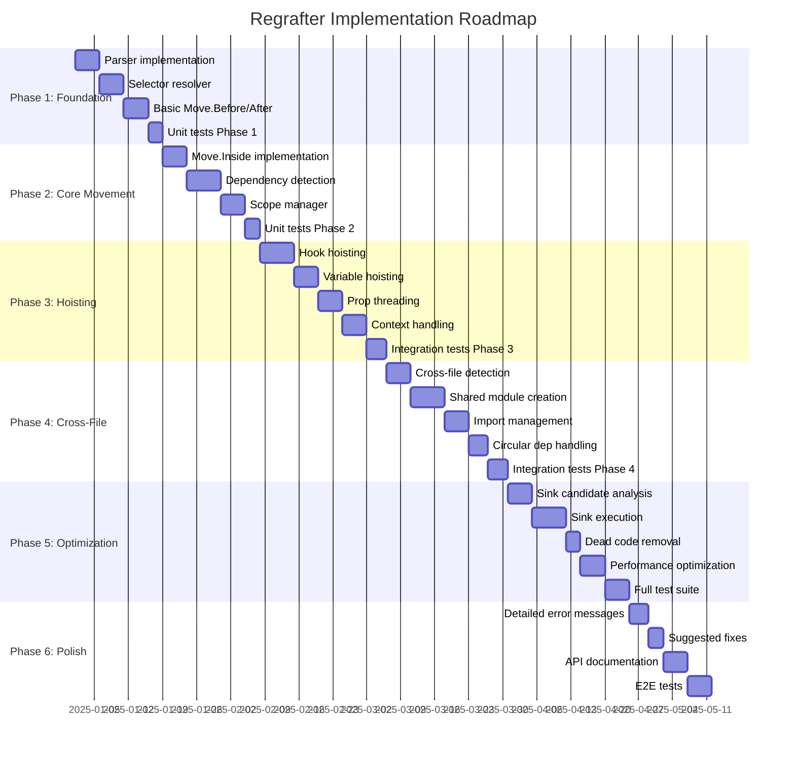

### 8.2 Phase Deliverables

| Phase | Focus | Key Deliverables | Exit Criteria |
|-------|-------|-----------------|---------------|
| 1 | Foundation | Parser, Selector, Basic Move | Move.Before/After works for simple cases |
| 2 | Core Movement | Move.Inside, Dependency Detection | All move modes work without hoisting |
| 3 | Hoisting | All hoist strategies | Hooks and variables auto-hoist correctly |
| 4 | Cross-File | Shared modules, Import management | Cross-file moves work without cycles |
| 5 | Optimization | Sinking, Performance | Sinking works, meets performance targets |
| 6 | Polish | Errors, Docs, E2E | Production-ready with full docs |

### 8.3 Risk Mitigation

| Risk | Probability | Impact | Mitigation |
|------|-------------|--------|------------|
| Babel API changes | Low | High | Pin versions, abstract Babel usage |
| Performance bottlenecks | Medium | Medium | Early benchmarking, profiling in Phase 5 |
| Edge case explosion | High | Medium | Property-based testing, extensive scenarios |
| Hook rules complexity | Medium | High | Thorough Rules of Hooks validation |
| Circular dependency handling | Medium | Medium | Graph algorithms in Phase 4 |

---

## 9. Non-Functional Requirements

### 9.1 Performance Requirements

| Metric | Target | Measurement |
|--------|--------|-------------|
| Single file latency (P95) | < 100ms | Benchmark suite |
| Multi-file latency (P95) | < 500ms | Benchmark suite |
| Memory usage | < 10x file size | Heap profiling |
| canMove relative cost | < 20% of full | Comparative benchmark |
| Startup time | < 50ms | Cold start measurement |

### 9.2 Reliability Requirements

- **Zero false positives**: If canMove returns true, move MUST succeed
- **Parse validity**: All output code MUST parse without errors
- **Semantic correctness**: Transformed code MUST maintain behavior
- **Determinism**: Same inputs MUST produce same outputs
- **Graceful degradation**: Partial failures should not corrupt state

### 9.3 Maintainability Requirements

- **Modular architecture**: Clear component boundaries
- **Test coverage**: > 90% for core components
- **TypeScript strict mode**: Full type safety
- **Documentation**: JSDoc for all public APIs
- **Change isolation**: Component changes should not cascade

### 9.4 Extensibility Requirements

- Plugin architecture for custom dependency handlers
- Configurable hoisting strategy selection
- Extensible error handling
- Custom atomic unit detection
- Formatter integration points

---

## 10. Appendix

### 10.1 React Hook Classification

```typescript
const REACT_HOOKS = new Set([
  // State hooks
  'useState',
  'useReducer',

  // Effect hooks
  'useEffect',
  'useLayoutEffect',
  'useInsertionEffect',

  // Context hooks
  'useContext',

  // Ref hooks
  'useRef',
  'useImperativeHandle',

  // Performance hooks
  'useCallback',
  'useMemo',

  // Other hooks
  'useDebugValue',
  'useDeferredValue',
  'useTransition',
  'useId',
  'useSyncExternalStore',
]);

const CUSTOM_HOOK_PATTERN = /^use[A-Z]/;

function isHook(name: string): boolean {
  return REACT_HOOKS.has(name) || CUSTOM_HOOK_PATTERN.test(name);
}

function isHookCallExpression(node: t.CallExpression): boolean {
  if (t.isIdentifier(node.callee)) {
    return isHook(node.callee.name);
  }
  if (t.isMemberExpression(node.callee)) {
    // Handle React.useState style
    if (t.isIdentifier(node.callee.property)) {
      return isHook(node.callee.property.name);
    }
  }
  return false;
}
```

### 10.2 Supported JSX Patterns

| Pattern | Support Level | Example |
|---------|--------------|---------|
| Self-closing elements | Full | `<Component />` |
| Elements with children | Full | `<Parent><Child /></Parent>` |
| Fragment shorthand | Full | `<><Child /></>` |
| Fragment explicit | Full | `<Fragment><Child /></Fragment>` |
| Conditional (&&) | Full (atomic) | `{show && <Modal />}` |
| Ternary | Full (atomic) | `{cond ? <A /> : <B />}` |
| Map expressions | Full (atomic) | `{items.map(i => <Item key={i} />)}` |
| Filter expressions | Full (atomic) | `{items.filter(f).map(...)}` |
| Spread props | Full | `<El {...props} />` |
| Compound components | Full (atomic) | `<Tabs.Panel>` |
| Lazy components | Full | `<Suspense><LazyComp /></Suspense>` |
| Render props | Partial | `<Provider>{(val) => <Child val={val} />}</Provider>` |
| HOCs | Limited | Depends on structure |

### 10.3 Dependency Resolution Decision Tree

```
                    ┌─────────────────────┐
                    │  Dependency Found   │
                    └──────────┬──────────┘
                               │
                    ┌──────────▼──────────┐
                    │  Accessible in      │
                    │  target scope?      │
                    └──────────┬──────────┘
                               │
              ┌────────────────┼────────────────┐
              │ Yes            │ No             │
              ▼                ▼                │
         No action       ┌─────────────┐       │
                         │ What type?  │       │
                         └──────┬──────┘       │
                                │              │
    ┌───────────┬───────────┬───┴───┬──────────┼──────────┐
    │           │           │       │          │          │
    ▼           ▼           ▼       ▼          ▼          ▼
  Hook      Variable     Import   Prop      Context     Ref
    │           │           │       │          │          │
    ▼           ▼           ▼       ▼          ▼          ▼
 Hoist to   Pure? Yes   Add to   Thread    Provider   Hoist +
 valid      → Hoist     target   through   hoist OR   forward
 ancestor   No → Prop   imports  props     extract    ref
```

### 10.4 Complexity Analysis

| Operation | Time Complexity | Space Complexity |
|-----------|-----------------|------------------|
| Parse single file | O(n) | O(n) |
| Resolve selector | O(n) | O(1) |
| Dependency analysis | O(n + e) | O(n + e) |
| Find LCA | O(d) | O(d) |
| Transform AST | O(n) | O(n) |
| Sink optimization | O(n * d) | O(n) |
| Code generation | O(n) | O(n) |
| **Total (single file)** | **O(n + e)** | **O(n + e)** |

Where:
- n = number of AST nodes
- e = number of dependency edges
- d = maximum scope depth

---

*Document Version: 11.0*
*Created: 2025-12-15*
*Based on: requirements.md v2.0, mathematical-analysis.md v3.0*
*Changes from v10:*
- *Enhanced atomic unit detection and handling*
- *Added detailed algorithm pseudocode*
- *Expanded strategy handler specifications*
- *Added state machine for move operations*
- *Enhanced error taxonomy and recovery strategies*
- *Added property-based testing invariants*
- *Expanded dependency resolution decision tree*
- *Added complexity analysis section*
