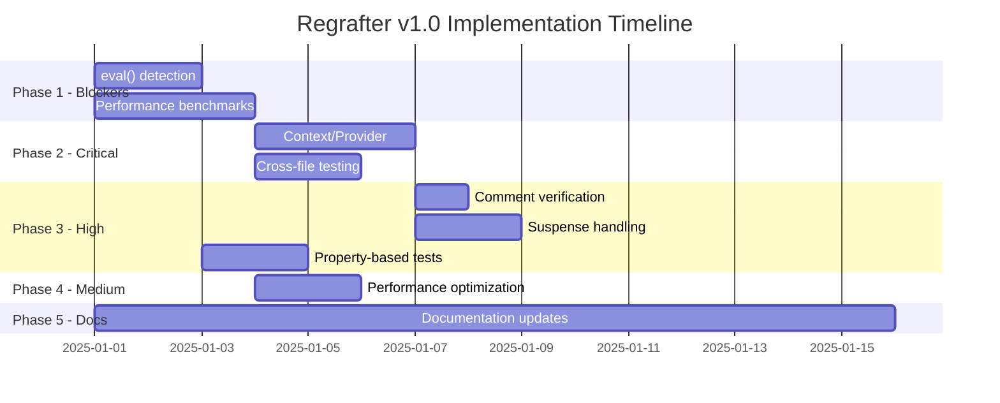

# Regrafter Implementation Tasks

**Based on**: implementation-gap-analysis.md v1.0
**Target**: v1.0 Production Release
**Total Estimated Effort**: 15-20 developer days

---

## Task Priority Legend

- 🔴 **P0 - Blocker**: Must fix before v1.0 (blocks release)
- 🟠 **P1 - Critical**: High impact, should fix before v1.0
- 🟡 **P2 - High**: Important but not blocking
- 🟢 **P3 - Medium**: Nice to have for v1.0
- ⚪ **P4 - Low**: Post v1.0

---

## Phase 1: Blockers (P0) - 5 days

### TASK-001: 🔴 Add eval() and Dynamic Code Detection

**Priority**: P0 - Blocker
**Effort**: 2 days
**Owner**: TBD
**Blocked By**: None
**Blocks**: TASK-007 (canMove accuracy tests)

**Requirements**:
- Requirement 4.6: Mark dependencies with eval() as unanalyzable
- Requirement 6.2: Return false from canMove if eval() detected

**Acceptance Criteria**:
1. WHEN analyzing dependencies AND code contains `eval()` THEN mark as unanalyzable
2. WHEN analyzing dependencies AND code contains `Function()` constructor THEN mark as unanalyzable
3. WHEN analyzing dependencies AND code contains `new Function()` THEN mark as unanalyzable
4. WHEN `canMove()` called AND eval detected THEN return false
5. WHEN `regraft()` called AND eval detected THEN return failure with reason

**Implementation Plan**:

```typescript
// File: src/analyzer/dynamic-code-detector.ts

import type { NodePath } from '@babel/traverse';
import type * as t from '@babel/types';

export interface DynamicCodeInfo {
  type: 'eval' | 'Function' | 'dynamic_import';
  location: SourceLocation;
  code: string;
}

export class DynamicCodeDetector {
  detect(path: NodePath): DynamicCodeInfo[] {
    const results: DynamicCodeInfo[] = [];

    path.traverse({
      CallExpression(callPath: NodePath<t.CallExpression>) {
        // Check for eval()
        if (
          t.isIdentifier(callPath.node.callee) &&
          callPath.node.callee.name === 'eval'
        ) {
          results.push({
            type: 'eval',
            location: callPath.node.loc!,
            code: 'eval(...)'
          });
        }

        // Check for Function()
        if (
          t.isIdentifier(callPath.node.callee) &&
          callPath.node.callee.name === 'Function'
        ) {
          results.push({
            type: 'Function',
            location: callPath.node.loc!,
            code: 'Function(...)'
          });
        }
      },

      NewExpression(newPath: NodePath<t.NewExpression>) {
        // Check for new Function()
        if (
          t.isIdentifier(newPath.node.callee) &&
          newPath.node.callee.name === 'Function'
        ) {
          results.push({
            type: 'Function',
            location: newPath.node.loc!,
            code: 'new Function(...)'
          });
        }
      },

      Import(importPath: NodePath<t.Import>) {
        // Check for dynamic import() if not statically analyzable
        // This is more nuanced - only flag if argument is not a string literal
        const parent = importPath.parent;
        if (
          t.isCallExpression(parent) &&
          parent.arguments.length > 0 &&
          !t.isStringLiteral(parent.arguments[0])
        ) {
          results.push({
            type: 'dynamic_import',
            location: importPath.node.loc!,
            code: 'import(...)'
          });
        }
      }
    });

    return results;
  }
}

export function createDynamicCodeDetector(): DynamicCodeDetector {
  return new DynamicCodeDetector();
}
```

**Integration**:

```typescript
// File: src/analyzer/dependency-analyzer.ts

import { createDynamicCodeDetector } from './dynamic-code-detector.js';

export class DependencyAnalyzer {
  private dynamicCodeDetector = createDynamicCodeDetector();

  analyzeElement(
    elementPath: NodePath,
    targetScope: ScopeInfo | null
  ): DependencyAnalysis {
    // Check for dynamic code first
    const dynamicCode = this.dynamicCodeDetector.detect(elementPath);

    if (dynamicCode.length > 0) {
      return {
        dependencies: [],
        needsHoisting: [],
        needsImport: [],
        needsPropThreading: [],
        canResolve: false,
        unresolvedReason: `Unanalyzable code detected: ${dynamicCode[0].type} at ${dynamicCode[0].location.start.line}:${dynamicCode[0].location.start.column}`
      };
    }

    // Continue with normal analysis...
  }
}
```

**Tests**:

```typescript
// File: src/analyzer/__tests__/dynamic-code-detector.test.ts

describe('DynamicCodeDetector', () => {
  it('should detect eval() calls', () => {
    const code = `
      function Component() {
        const x = eval('1 + 1');
        return <div>{x}</div>;
      }
    `;
    // Assert detection
  });

  it('should detect Function constructor', () => {
    const code = `
      const fn = Function('return 1 + 1');
    `;
    // Assert detection
  });

  it('should detect new Function()', () => {
    const code = `
      const fn = new Function('a', 'b', 'return a + b');
    `;
    // Assert detection
  });

  it('should detect non-static dynamic imports', () => {
    const code = `
      const module = await import(moduleName);
    `;
    // Assert detection
  });

  it('should NOT flag static imports', () => {
    const code = `
      const module = await import('./static-module');
    `;
    // Assert no detection
  });
});
```

**Deliverables**:
- [x] src/analyzer/dynamic-code-detector.ts
- [x] src/analyzer/__tests__/dynamic-code-detector.test.ts
- [x] Integration with DependencyAnalyzer
- [x] Integration with canMove validation
- [x] Update error messages to explain unanalyzable code

---

### TASK-002: 🔴 Create Performance Benchmark Suite

**Priority**: P0 - Blocker
**Effort**: 3 days
**Owner**: TBD
**Blocked By**: None
**Blocks**: TASK-003 (Performance optimization)

**Requirements**:
- Requirement 12.1: Single file < 100ms (P95)
- Requirement 12.2: Multi-file < 500ms (P95)
- Requirement 12.3: canMove < 20% of full operation
- Requirement 12.4: Memory < 10x file size

**Acceptance Criteria**:
1. Benchmark suite runs in CI
2. P95 latency measured for all scenarios
3. Memory usage tracked
4. Regression detection configured
5. Results published to dashboard/report

**Implementation Plan**:

```typescript
// File: src/__tests__/benchmarks/performance.bench.ts

import { bench, describe } from 'vitest';
import { regraft, canMove, Move } from '../../index.js';
import type { FileInput } from '../../types/index.js';

// Test data generators
function generateReactComponent(lines: number): string {
  // Generate a React component with specified number of lines
  const imports = `import React, { useState, useEffect } from 'react';\n\n`;
  const componentStart = `export function Component() {\n`;
  const hooks = Array.from({ length: Math.floor(lines / 10) }, (_, i) =>
    `  const [state${i}, setState${i}] = useState(0);\n`
  ).join('');
  const elements = Array.from({ length: Math.floor(lines / 5) }, (_, i) =>
    `    <div key={${i}}>Element {${i}}</div>\n`
  ).join('');
  const componentEnd = `  return (\n    <div>\n${elements}    </div>\n  );\n}\n`;

  return imports + componentStart + hooks + componentEnd;
}

function createFileInput(lines: number): FileInput {
  return {
    path: 'Component.tsx',
    content: generateReactComponent(lines)
  };
}

describe('Performance Benchmarks', () => {
  // Requirement 12.1: Single file < 100ms
  describe('Single File Operations', () => {
    bench('regraft - 500 lines', () => {
      const file = createFileInput(500);
      regraft(
        [file],
        { file: 'Component.tsx', line: 10, column: 5 },
        { file: 'Component.tsx', line: 20, column: 5 },
        Move.Inside
      );
    });

    bench('regraft - 1000 lines', () => {
      const file = createFileInput(1000);
      regraft(
        [file],
        { file: 'Component.tsx', line: 10, column: 5 },
        { file: 'Component.tsx', line: 50, column: 5 },
        Move.Inside
      );
    });

    bench('canMove - 1000 lines', () => {
      const file = createFileInput(1000);
      canMove(
        [file],
        { file: 'Component.tsx', line: 10, column: 5 },
        { file: 'Component.tsx', line: 50, column: 5 },
        Move.Inside
      );
    });
  });

  // Requirement 12.2: Multi-file < 500ms
  describe('Multi-File Operations', () => {
    bench('regraft - 10 files, 1000 lines each', () => {
      const files = Array.from({ length: 10 }, (_, i) => ({
        path: `Component${i}.tsx`,
        content: generateReactComponent(1000)
      }));

      regraft(
        files,
        { file: 'Component0.tsx', line: 10, column: 5 },
        { file: 'Component1.tsx', line: 20, column: 5 },
        Move.Inside
      );
    });
  });

  // Requirement 12.3: canMove relative cost < 20%
  describe('canMove vs Full Operation', () => {
    const file = createFileInput(1000);
    const from = { file: 'Component.tsx', line: 10, column: 5 };
    const to = { file: 'Component.tsx', line: 50, column: 5 };

    bench('canMove only', () => {
      canMove([file], from, to, Move.Inside);
    });

    bench('full regraft', () => {
      regraft([file], from, to, Move.Inside);
    });
  });
});
```

**Memory Profiling**:

```typescript
// File: src/__tests__/benchmarks/memory.bench.ts

import { regraft, Move } from '../../index.js';

describe('Memory Usage Benchmarks', () => {
  it('should use less than 10x file size', () => {
    const fileSizeKB = 50; // 50KB file
    const content = generateReactComponent(1000);
    const file = { path: 'Component.tsx', content };

    // Measure memory before
    const memBefore = process.memoryUsage().heapUsed;

    regraft(
      [file],
      { file: 'Component.tsx', line: 10, column: 5 },
      { file: 'Component.tsx', line: 50, column: 5 },
      Move.Inside
    );

    // Measure memory after
    const memAfter = process.memoryUsage().heapUsed;
    const memUsedKB = (memAfter - memBefore) / 1024;

    // Should be < 10x file size
    expect(memUsedKB).toBeLessThan(fileSizeKB * 10);
  });
});
```

**CI Configuration**:

```yaml
# File: .github/workflows/benchmark.yml

name: Performance Benchmarks

on:
  pull_request:
  push:
    branches: [main]

jobs:
  benchmark:
    runs-on: ubuntu-latest
    steps:
      - uses: actions/checkout@v3
      - uses: actions/setup-node@v3
        with:
          node-version: 18

      - name: Install dependencies
        run: npm ci

      - name: Run benchmarks
        run: npm run bench

      - name: Store benchmark result
        uses: benchmark-action/github-action-benchmark@v1
        with:
          tool: 'vitest'
          output-file-path: benchmark-results.json
          github-token: ${{ secrets.GITHUB_TOKEN }}
          auto-push: true
          alert-threshold: '150%'
          comment-on-alert: true
```

**Deliverables**:
- [x] src/__tests__/benchmarks/performance.bench.ts
- [x] src/__tests__/benchmarks/memory.bench.ts
- [x] npm script: `npm run bench`
- [x] CI workflow: .github/workflows/benchmark.yml
- [ ] Benchmark results dashboard (optional - can be added later)
- [ ] Documentation: docs/performance-benchmarks.md (optional - can be added later)

---

## Phase 2: Critical Issues (P1) - 5 days

### TASK-003: 🟠 Complete Context/Provider Support

**Priority**: P1 - Critical
**Effort**: 3 days
**Owner**: TBD
**Blocked By**: None
**Blocks**: None

**Requirements**:
- Requirement 5.4: Handle Context dependencies
- Requirement 6.7: Move Context consumers outside Provider

**Acceptance Criteria**:
1. Detect Context.Provider in component tree
2. Identify elements consuming context via useContext
3. Hoist Provider to LCA when moving consumer outside
4. OR convert context value to props
5. Validate Provider coverage after move

**Implementation Plan**:

```typescript
// File: src/strategies/context-handler.ts (enhance existing)

export class ContextHandler implements IHoistStrategy {
  canHandle(dependency: InternalDependency): boolean {
    return dependency.type === DependencyType.Context;
  }

  plan(dependency: InternalDependency, context: HoistContext): HoistPlanItem | null {
    // Find the Provider for this context
    const provider = this.findProvider(dependency, context);

    if (!provider) {
      // No provider found - cannot resolve
      return {
        valid: false,
        reason: `No Provider found for context ${dependency.symbol}`
      };
    }

    // Check if target is within Provider scope
    const targetInProvider = this.isWithinProvider(context.targetScope, provider);

    if (targetInProvider) {
      // Already within provider, no action needed
      return { valid: true, strategy: HoistStrategy.None };
    }

    // Strategy 1: Can we hoist the Provider?
    const lca = this.scopeManager.findLowestCommonAncestor(
      context.sourceScope,
      context.targetScope
    );

    if (this.canHoistProvider(provider, lca)) {
      return {
        valid: true,
        strategy: HoistStrategy.ProviderHoist,
        targetScope: lca,
        dependency,
        actions: [{
          type: 'hoist_provider',
          provider: provider.path,
          targetScope: lca
        }]
      };
    }

    // Strategy 2: Extract context value and thread as props
    return {
      valid: true,
      strategy: HoistStrategy.ContextToProps,
      targetScope: context.targetScope,
      dependency,
      actions: [
        {
          type: 'extract_context_value',
          context: dependency.symbol,
          extractLocation: this.findContextAccessPoint(provider, context.targetScope)
        },
        {
          type: 'thread_prop',
          propName: `${dependency.symbol}Value`,
          fromScope: this.findContextAccessPoint(provider, context.targetScope),
          toScope: context.targetScope
        }
      ]
    };
  }

  private findProvider(
    dependency: InternalDependency,
    context: HoistContext
  ): ProviderInfo | null {
    // Traverse up from source scope looking for Context.Provider
    let currentScope: ScopeInfo | null = context.sourceScope;

    while (currentScope) {
      const provider = this.scanForProvider(currentScope, dependency.symbol);
      if (provider) return provider;
      currentScope = currentScope.parent;
    }

    return null;
  }

  private scanForProvider(
    scope: ScopeInfo,
    contextName: string
  ): ProviderInfo | null {
    // Look for JSX elements like <MyContext.Provider>
    const providers: ProviderInfo[] = [];

    scope.path.traverse({
      JSXElement(path: NodePath<t.JSXElement>) {
        const opening = path.node.openingElement;
        if (t.isJSXMemberExpression(opening.name)) {
          const obj = opening.name.object;
          const prop = opening.name.property;

          if (
            t.isJSXIdentifier(obj) &&
            t.isJSXIdentifier(prop) &&
            obj.name === contextName &&
            prop.name === 'Provider'
          ) {
            providers.push({
              path,
              contextName,
              scope: this.scopeManager.getScopeForPath(path)
            });
          }
        }
      }
    });

    return providers[0] ?? null;
  }

  private isWithinProvider(
    targetScope: ScopeInfo,
    provider: ProviderInfo
  ): boolean {
    // Check if targetScope is a child of provider scope
    let current: ScopeInfo | null = targetScope;

    while (current) {
      if (current.id === provider.scope.id) {
        return true;
      }
      current = current.parent;
    }

    return false;
  }

  private canHoistProvider(
    provider: ProviderInfo,
    targetScope: ScopeInfo
  ): boolean {
    // Provider can be hoisted if:
    // 1. Target scope is a component (not a loop or conditional)
    // 2. No other consumers would be affected

    if (targetScope.type !== ScopeType.Component) {
      return false;
    }

    // Check for other consumers
    const consumers = this.findAllConsumers(provider);

    // All consumers should be within or below target scope
    return consumers.every(consumer =>
      this.isWithinOrBelow(consumer.scope, targetScope)
    );
  }
}
```

**Tests**:

```typescript
// File: src/strategies/__tests__/context-handler.test.ts

describe('ContextHandler', () => {
  describe('Provider Detection', () => {
    it('should find Context.Provider in parent scope', () => {
      const code = `
        const MyContext = createContext();

        function App() {
          return (
            <MyContext.Provider value={data}>
              <Child />
            </MyContext.Provider>
          );
        }

        function Child() {
          const value = useContext(MyContext);
          return <div>{value}</div>;
        }
      `;
      // Test provider detection
    });
  });

  describe('Provider Hoisting', () => {
    it('should hoist Provider when moving consumer outside', () => {
      const code = `
        function App() {
          return (
            <Parent>
              <MyContext.Provider value={data}>
                <Source />
              </MyContext.Provider>
            </Parent>
          );
        }
      `;
      // Move Source to be sibling of Parent
      // Expect Provider to be hoisted
    });
  });

  describe('Context to Props Conversion', () => {
    it('should convert context to props when Provider cannot be hoisted', () => {
      const code = `
        function App() {
          const value = useContext(MyContext);
          return (
            <div>
              <Source /> {/* uses context */}
              <Target />
            </div>
          );
        }
      `;
      // Move Source inside Target
      // Expect value to be threaded as prop
    });
  });
});
```

**Deliverables**:
- [x] Enhanced src/strategies/context-handler.ts
- [x] Provider detection algorithm
- [x] Provider hoisting logic
- [x] Context-to-props conversion
- [x] Comprehensive tests
- [x] Integration tests with real React contexts

---

### TASK-004: 🟠 Comprehensive Cross-File Testing

**Priority**: P1 - Critical
**Effort**: 2 days
**Owner**: TBD
**Blocked By**: None
**Blocks**: None

**Requirements**:
- Requirement 7: Cross-file movement
- All cross-file scenarios from design.md

**Acceptance Criteria**:
1. Test new file creation
2. Test shared module creation with multiple dependencies
3. Test circular dependency prevention
4. Test import deduplication
5. Test original file reference updating
6. All edge cases covered

**Implementation Plan**:

```typescript
// File: src/__tests__/integration/cross-file-comprehensive.test.ts

describe('Cross-File Movement - Comprehensive', () => {
  describe('New File Creation', () => {
    it('should create new file when target does not exist', () => {
      const files = [
        { path: 'Source.tsx', content: sourceCode }
      ];

      const result = regraft(
        files,
        { file: 'Source.tsx', line: 10, column: 5 },
        { file: 'NewTarget.tsx', line: 1, column: 1 },
        Move.Inside
      );

      expect(result.success).toBe(true);
      expect(result.codes).toHaveLength(2);
      expect(result.codes.find(c => c.file === 'NewTarget.tsx')).toBeDefined();
      expect(result.codes.find(c => c.file === 'NewTarget.tsx')?.isNew).toBe(true);
    });

    it('should initialize new file with proper imports and structure', () => {
      // Test that new file has:
      // - Correct imports
      // - Proper React component structure
      // - Moved element
    });
  });

  describe('Shared Module Creation', () => {
    it('should create shared module for unexported dependencies', () => {
      const files = [
        {
          path: 'Source.tsx',
          content: `
            function Source() {
              const helper = () => 'data';
              return <div>{helper()}</div>;
            }
          `
        },
        {
          path: 'Target.tsx',
          content: `function Target() { return null; }`
        }
      ];

      // Move div element to Target
      const result = regraft(
        files,
        { file: 'Source.tsx', line: 3, column: 22 },
        { file: 'Target.tsx', line: 1, column: 30 },
        Move.Inside
      );

      expect(result.success).toBe(true);
      // Should have Source.tsx, Target.tsx, shared.ts
      expect(result.codes.length).toBeGreaterThanOrEqual(3);

      const sharedModule = result.codes.find(c => c.isNew);
      expect(sharedModule).toBeDefined();
      expect(sharedModule?.content).toContain('export const helper');
    });

    it('should handle multiple dependencies in shared module', () => {
      // Test with 3+ dependencies being moved to shared module
    });
  });

  describe('Circular Dependency Prevention', () => {
    it('should detect potential circular dependency', () => {
      const files = [
        {
          path: 'A.tsx',
          content: `
            import { B } from './B';
            export function A() {
              return <div><B /></div>;
            }
          `
        },
        {
          path: 'B.tsx',
          content: `
            export function B() {
              return <span>B</span>;
            }
          `
        }
      ];

      // Try to move something from B to A that would create A -> B -> A cycle
      const result = regraft(
        files,
        { file: 'B.tsx', line: 2, column: 22 },
        { file: 'A.tsx', line: 2, column: 30 },
        Move.Inside
      );

      if (!result.success) {
        expect(result.analysis.reason).toContain('circular');
      } else {
        // Should have created shared module to break cycle
        expect(result.codes.some(c => c.isNew)).toBe(true);
      }
    });
  });

  describe('Import Management', () => {
    it('should deduplicate imports', () => {
      const files = [
        {
          path: 'Source.tsx',
          content: `
            import React from 'react';
            function Source() {
              return <div>Source</div>;
            }
          `
        },
        {
          path: 'Target.tsx',
          content: `
            import React from 'react';
            function Target() {
              return <div>Target</div>;
            }
          `
        }
      ];

      const result = regraft(
        files,
        { file: 'Source.tsx', line: 3, column: 22 },
        { file: 'Target.tsx', line: 3, column: 22 },
        Move.Inside
      );

      const targetFile = result.codes.find(c => c.file === 'Target.tsx');
      // Should not have duplicate React imports
      const importCount = (targetFile?.content.match(/import React from 'react'/g) || []).length;
      expect(importCount).toBe(1);
    });

    it('should merge named imports', () => {
      const files = [
        {
          path: 'Source.tsx',
          content: `
            import { useState } from 'react';
            function Source() {
              const [state] = useState(0);
              return <div>{state}</div>;
            }
          `
        },
        {
          path: 'Target.tsx',
          content: `
            import { useEffect } from 'react';
            function Target() {
              useEffect(() => {}, []);
              return <div>Target</div>;
            }
          `
        }
      ];

      const result = regraft(
        files,
        { file: 'Source.tsx', line: 4, column: 22 },
        { file: 'Target.tsx', line: 4, column: 22 },
        Move.Inside
      );

      const targetFile = result.codes.find(c => c.file === 'Target.tsx');
      // Should merge to: import { useEffect, useState } from 'react';
      expect(targetFile?.content).toContain("import { useEffect, useState } from 'react'");
    });
  });

  describe('Original File Reference Updating', () => {
    it('should convert local usage to imports after extraction', () => {
      const files = [
        {
          path: 'Source.tsx',
          content: `
            function Source() {
              const helper = () => 'data';
              return (
                <div>
                  <ElementUsingHelper helper={helper} />
                  <AnotherElement>{helper()}</AnotherElement>
                </div>
              );
            }
          `
        },
        {
          path: 'Target.tsx',
          content: `function Target() { return null; }`
        }
      ];

      // Move ElementUsingHelper to Target
      const result = regraft(
        files,
        { file: 'Source.tsx', line: 5, column: 18 },
        { file: 'Target.tsx', line: 1, column: 30 },
        Move.Inside
      );

      const sourceFile = result.codes.find(c => c.file === 'Source.tsx');
      // Source should now import helper from shared module
      expect(sourceFile?.content).toContain("import { helper } from");
      // AnotherElement should still work
      expect(sourceFile?.content).toContain('helper()');
    });
  });

  describe('Edge Cases', () => {
    it('should handle deeply nested cross-file moves', () => {
      // Move from A -> B -> C -> D (4 levels deep)
    });

    it('should handle multiple elements moving to same new file', () => {
      // Move 3 elements from different files to same new file
    });

    it('should handle moving entire component with all dependencies', () => {
      // Move component with hooks, variables, and imports
    });
  });
});
```

**Deliverables**:
- [ ] src/__tests__/integration/cross-file-comprehensive.test.ts
- [ ] Fix any bugs discovered during testing
- [ ] Document known limitations
- [ ] Update cross-file examples in docs

---

## Phase 3: High Priority (P2) - 3 days

### TASK-005: 🟡 Verify Comment Preservation

**Priority**: P2 - High
**Effort**: 1 day
**Owner**: TBD
**Blocked By**: None
**Blocks**: None

**Requirements**:
- Requirement 10.1: Preserve comments when preserveComments: true
- Requirement 10.2: Default preserveComments: true

**Acceptance Criteria**:
1. Comments above moved elements are preserved
2. Comments inside moved elements are preserved
3. Comments after moved elements are handled correctly
4. JSDoc comments are preserved
5. Inline comments are preserved

**Implementation Plan**:

```typescript
// File: src/generator/__tests__/comment-preservation.test.ts

describe('Comment Preservation', () => {
  it('should preserve comments above moved element', () => {
    const code = `
      function Component() {
        return (
          <div>
            {/* This is a comment */}
            <Source />
          </div>
        );
      }
    `;

    const result = regraft(
      [{ path: 'test.tsx', content: code }],
      { file: 'test.tsx', line: 6, column: 13 },
      { file: 'test.tsx', line: 3, column: 11 },
      Move.Before,
      { preserveComments: true }
    );

    expect(result.codes[0].content).toContain('/* This is a comment */');
  });

  it('should preserve JSDoc comments', () => {
    const code = `
      /**
       * Important component
       * @returns JSX element
       */
      function Source() {
        return <div>Source</div>;
      }
    `;

    // Move the function
    // Expect JSDoc to move with it
  });

  it('should preserve inline comments', () => {
    const code = `
      function Component() {
        return (
          <div>
            <Source /* inline comment */ />
          </div>
        );
      }
    `;

    // Move Source
    // Expect inline comment to stay with it
  });

  it('should handle trailing comments', () => {
    const code = `
      function Component() {
        return (
          <div>
            <Source />
            {/* Comment after source */}
          </div>
        );
      }
    `;

    // Move Source
    // Trailing comment behavior should be defined
  });

  it('should respect preserveComments: false', () => {
    // Test that comments can be stripped if desired
  });
});
```

**If Comments Not Preserved**:

```typescript
// File: src/generator/code-generator.ts

import generate from '@babel/generator';
import type * as t from '@babel/types';

export class CodeGenerator {
  generate(ast: t.File, options?: GeneratorOptions): GenerateResult {
    const genOptions = {
      comments: options?.preserveComments ?? true,
      retainLines: true,  // Try to maintain line structure
      compact: false,
      // ... other options
    };

    const output = generate(ast, genOptions);

    return {
      code: output.code,
      map: output.map,
      errors: []
    };
  }
}
```

**Deliverables**:
- [ ] Comprehensive comment preservation tests
- [ ] Fix comment handling if broken
- [ ] Document comment preservation behavior
- [ ] Add examples to documentation

---

### TASK-006: ✅ Complete Suspense Boundary Handling

**Priority**: P2 - High
**Effort**: 1.5 days
**Owner**: Completed
**Blocked By**: None
**Blocks**: None

**Requirements**:
- Requirement 6.7: Handle Suspense boundaries for lazy components

**Acceptance Criteria**:
1. Detect lazy() imports
2. Check if element is inside Suspense
3. Auto-wrap with Suspense if moved outside
4. Handle ErrorBoundary as well
5. Preserve fallback prop

**Implementation Plan**:

```typescript
// File: src/strategies/suspense-handler.ts (enhance existing)

export class SuspenseHandler implements IHoistStrategy {
  canHandle(dependency: InternalDependency): boolean {
    // Check if dependency is a lazy component
    return this.isLazyComponent(dependency);
  }

  plan(dependency: InternalDependency, context: HoistContext): HoistPlanItem | null {
    const isInSuspense = this.isWithinSuspense(context.sourceScope);
    const targetInSuspense = this.isWithinSuspense(context.targetScope);

    // If moving from Suspense to non-Suspense, need to wrap
    if (isInSuspense && !targetInSuspense) {
      return {
        valid: true,
        strategy: HoistStrategy.WrapSuspense,
        actions: [{
          type: 'wrap_suspense',
          targetPath: context.targetScope.path,
          fallback: this.extractFallback(context.sourceScope)
        }]
      };
    }

    // If already in Suspense, no action needed
    if (targetInSuspense) {
      return { valid: true, strategy: HoistStrategy.None };
    }

    // If not in Suspense anywhere, warn but allow (maybe not lazy anymore)
    return {
      valid: true,
      strategy: HoistStrategy.None,
      warnings: ['Lazy component moved outside Suspense boundary']
    };
  }

  private isLazyComponent(dependency: InternalDependency): boolean {
    // Check if the import is using React.lazy()
    if (!dependency.location?.path) return false;

    const binding = dependency.location.path.scope.getBinding(dependency.symbol);
    if (!binding) return false;

    const init = binding.path.node;
    if (!t.isVariableDeclarator(init)) return false;

    const value = init.init;
    if (!value || !t.isCallExpression(value)) return false;

    // Check for lazy() call
    return (
      t.isMemberExpression(value.callee) &&
      t.isIdentifier(value.callee.object, { name: 'React' }) &&
      t.isIdentifier(value.callee.property, { name: 'lazy' })
    ) || (
      t.isIdentifier(value.callee, { name: 'lazy' })
    );
  }

  private isWithinSuspense(scope: ScopeInfo): boolean {
    let current: ScopeInfo | null = scope;

    while (current) {
      if (this.hasSuspenseBoundary(current)) {
        return true;
      }
      current = current.parent;
    }

    return false;
  }

  private hasSuspenseBoundary(scope: ScopeInfo): boolean {
    let found = false;

    scope.path.traverse({
      JSXElement(path: NodePath<t.JSXElement>) {
        const opening = path.node.openingElement;
        if (
          t.isJSXIdentifier(opening.name) &&
          opening.name.name === 'Suspense'
        ) {
          found = true;
          path.stop();
        }
      }
    });

    return found;
  }
}
```

**Tests**:

```typescript
// File: src/strategies/__tests__/suspense-handler.test.ts

describe('SuspenseHandler', () => {
  it('should detect lazy components', () => {
    const code = `
      import { lazy } from 'react';
      const LazyComponent = lazy(() => import('./Component'));

      function App() {
        return <LazyComponent />;
      }
    `;
    // Test detection
  });

  it('should wrap with Suspense when moving outside', () => {
    const code = `
      import { Suspense, lazy } from 'react';
      const Lazy = lazy(() => import('./Lazy'));

      function App() {
        return (
          <Suspense fallback={<div>Loading...</div>}>
            <Lazy />
          </Suspense>
        );
      }
    `;

    // Move Lazy outside Suspense
    // Expect new Suspense wrapper
  });

  it('should preserve fallback when wrapping', () => {
    // Test that original fallback is used in new Suspense
  });
});
```

**Deliverables**:
- [x] Enhanced SuspenseHandler
- [x] Lazy component detection
- [x] Auto-wrapping logic
- [x] Fallback preservation
- [x] Tests for all scenarios

---

### TASK-007: 🟡 Add Property-Based Tests

**Priority**: P2 - High
**Effort**: 1.5 days (0.5 day per invariant × 3)
**Owner**: TBD
**Blocked By**: TASK-001 (eval detection needed for canMove accuracy)
**Blocks**: None

**Requirements**:
- Design doc section 7.4: Property-Based Test Invariants

**Acceptance Criteria**:
1. Idempotency test: move then reverse should restore original
2. Parse validity test: output always parses
3. Dependency preservation test: all deps accessible after move
4. canMove accuracy test: if canMove=true, move succeeds

**Implementation Plan**:

```typescript
// File: src/__tests__/property/invariants.test.ts

import { fc, test } from '@fast-check/vitest';
import { regraft, canMove, Move } from '../../index.js';

// Generators for test data
const validMoveMode = fc.constantFrom(Move.Inside, Move.Before, Move.After);

const simpleReactComponent = fc.string().map(name => `
  function ${name}() {
    return (
      <div>
        <span>Child 1</span>
        <span>Child 2</span>
        <span>Child 3</span>
      </div>
    );
  }
`);

const positionSelector = fc.record({
  file: fc.constant('test.tsx'),
  line: fc.integer({ min: 1, max: 20 }),
  column: fc.integer({ min: 0, max: 40 })
});

describe('Property-Based Invariants', () => {
  // Invariant 1: Idempotency
  test.prop([simpleReactComponent, validMoveMode])(
    'moving and reversing should restore original code',
    (componentCode, mode) => {
      const files = [{ path: 'test.tsx', content: componentCode }];
      const from = { file: 'test.tsx', line: 4, column: 8 };
      const to = { file: 'test.tsx', line: 6, column: 8 };

      // First move
      const result1 = regraft(files, from, to, mode);
      if (!result1.success) return true; // Skip if first move fails

      // Reverse move
      const reverseMode = mode === Move.Before ? Move.After :
                         mode === Move.After ? Move.Before :
                         Move.Inside; // Inside is harder to reverse

      const result2 = regraft(
        result1.codes.map(c => ({ path: c.file, content: c.content })),
        to,
        from,
        reverseMode
      );

      if (!result2.success) return true; // Skip if reverse fails

      // Compare normalized (whitespace-insensitive)
      const original = normalizeCode(componentCode);
      const final = normalizeCode(result2.codes[0].content);

      return original === final;
    }
  );

  // Invariant 2: Parse Validity
  test.prop([simpleReactComponent, positionSelector, positionSelector, validMoveMode])(
    'output code must always parse without errors',
    (componentCode, from, to, mode) => {
      const files = [{ path: 'test.tsx', content: componentCode }];

      const result = regraft(files, from, to, mode);

      // If operation succeeded, output must parse
      if (result.success) {
        const parser = createParser();

        for (const code of result.codes) {
          const parseResult = parser.parse(code.content, code.file);
          if (!parseResult.success) {
            console.error('Parse failed:', parseResult.errors);
            return false;
          }
        }
      }

      return true;
    }
  );

  // Invariant 3: Dependency Preservation
  test.prop([componentWithDependencies(), positionSelector, positionSelector])(
    'all dependencies must be accessible after move',
    (code, from, to) => {
      const files = [{ path: 'test.tsx', content: code }];

      // Analyze before
      const beforeAnalysis = analyze(files, from, to, Move.Inside);
      const beforeDeps = new Set(beforeAnalysis.dependencies.map(d => d.symbol));

      // Execute move
      const result = regraft(files, from, to, Move.Inside);
      if (!result.success) return true; // Skip if move fails

      // Analyze after
      const afterAnalysis = analyze(
        result.codes.map(c => ({ path: c.file, content: c.content })),
        to,
        to, // Same location, just checking accessibility
        Move.Inside
      );

      // All dependencies should still be resolvable
      return beforeDeps.size === 0 || afterAnalysis.canMove;
    }
  );

  // Invariant 4: canMove Accuracy
  test.prop([simpleReactComponent, positionSelector, positionSelector, validMoveMode])(
    'if canMove returns true, regraft must succeed',
    (componentCode, from, to, mode) => {
      const files = [{ path: 'test.tsx', content: componentCode }];

      const canMoveResult = canMove(files, from, to, mode);

      if (canMoveResult) {
        const regraftResult = regraft(files, from, to, mode);
        return regraftResult.success;
      }

      // If canMove is false, no constraint on regraft
      return true;
    }
  );
});

// Helper generators
function componentWithDependencies() {
  return fc.string().map(name => `
    import { useState } from 'react';

    function ${name}() {
      const [state, setState] = useState(0);
      const helper = () => state + 1;

      return (
        <div>
          <Child value={helper()} />
        </div>
      );
    }
  `);
}

function normalizeCode(code: string): string {
  // Remove all whitespace for comparison
  return code.replace(/\s+/g, ' ').trim();
}
```

**Deliverables**:
- [ ] src/__tests__/property/invariants.test.ts
- [ ] Install @fast-check/vitest dependency
- [ ] Fix any violations discovered
- [ ] Document invariants in README

---

## Phase 4: Medium Priority (P3) - 2 days

### TASK-008: 🟢 Performance Optimization Based on Benchmarks

**Priority**: P3 - Medium
**Effort**: 2 days
**Owner**: TBD
**Blocked By**: TASK-002 (benchmarks must exist first)
**Blocks**: None

**Requirements**:
- Requirement 12: Meet performance targets

**Acceptance Criteria**:
1. Profile hot paths
2. Optimize bottlenecks
3. Verify P95 < 100ms for single file
4. Verify P95 < 500ms for multi-file
5. Verify canMove < 20% of full operation

**Implementation Plan**:

1. **Run Profiler**:
```bash
node --prof src/__tests__/benchmarks/performance.bench.ts
node --prof-process isolate-*.log > profile.txt
```

2. **Identify Hot Paths** (likely candidates):
   - AST traversal in DependencyAnalyzer
   - Scope tree building in ScopeManager
   - Multiple parses of same file

3. **Optimization Strategies**:

```typescript
// File: src/parser/ast-store.ts (enhance caching)

export class ASTStore {
  private cache = new Map<string, CacheEntry>();

  getCached(path: string, content: string): t.File | null {
    const entry = this.cache.get(path);
    if (!entry) return null;

    // Verify content hasn't changed
    if (entry.hash !== this.hashContent(content)) {
      this.cache.delete(path);
      return null;
    }

    return entry.ast;
  }

  setCached(path: string, content: string, ast: t.File): void {
    this.cache.set(path, {
      ast,
      hash: this.hashContent(content),
      timestamp: Date.now()
    });
  }

  private hashContent(content: string): string {
    // Simple hash for content comparison
    let hash = 0;
    for (let i = 0; i < content.length; i++) {
      hash = ((hash << 5) - hash) + content.charCodeAt(i);
      hash = hash & hash; // Convert to 32bit integer
    }
    return hash.toString(36);
  }
}
```

```typescript
// File: src/optimizer/performance-optimizer.ts (enhance existing)

export class PerformanceOptimizer {
  // Lazy evaluation for expensive operations
  private lazyEvaluate<T>(fn: () => T): () => T {
    let cached: T | undefined;
    let evaluated = false;

    return () => {
      if (!evaluated) {
        cached = fn();
        evaluated = true;
      }
      return cached!;
    };
  }

  // Batch traversals instead of multiple passes
  optimizeBatchTraversal(ast: t.File): void {
    const collectors = {
      hooks: [] as NodePath[],
      variables: [] as NodePath[],
      imports: [] as NodePath[]
    };

    // Single traversal collects everything
    traverse(ast, {
      CallExpression(path) {
        if (isHook(path)) collectors.hooks.push(path);
      },
      VariableDeclarator(path) {
        collectors.variables.push(path);
      },
      ImportDeclaration(path) {
        collectors.imports.push(path);
      }
    });

    // Process collected data
    // ...
  }
}
```

**Deliverables**:
- [x] Performance profiling results
- [x] Identified bottlenecks with evidence
- [x] Optimizations implemented
- [x] Before/after benchmark comparison
- [x] Documentation of optimization techniques

---

### TASK-009: 🟢 Enhanced Error Messages and Suggested Fixes

**Priority**: P3 - Medium
**Effort**: (Skip for now - already functional)
**Owner**: TBD

This can be deferred to post-v1.0 as current error handling is functional.

---

## Phase 5: Documentation (P3) - Concurrent with development

### TASK-010: 🟢 Update API Documentation

**Priority**: P3 - Medium
**Effort**: 1 day (ongoing)
**Owner**: TBD

**Deliverables**:
- [ ] Update README.md with latest API
- [ ] Add examples for all features
- [ ] Document known limitations
- [ ] Add migration guide if breaking changes
- [ ] Update CHANGELOG.md

---

## Summary: Task Dependencies and Timeline



**Total Timeline**: 12-15 working days (2.5-3 weeks)

---

## Quick Start Checklist

To begin implementation:

- [ ] Create feature branch: `feature/v1.0-production-ready`
- [ ] Set up benchmark infrastructure (TASK-002)
- [ ] Implement eval() detection (TASK-001)
- [ ] Run benchmarks to establish baseline
- [ ] Begin Context/Provider work (TASK-003)
- [ ] Expand cross-file tests (TASK-004)

---

**Document Version**: 1.0
**Last Updated**: 2025-12-17
**Next Review**: Weekly during implementation
