# Regrafter Implementation Plan v4

## Overview

This document outlines the implementation tasks for Regrafter, a programmatic AST transformation library for relocating React elements with automatic dependency management. Tasks are organized into phases with clear dependencies, acceptance criteria, complexity estimates, and risk assessments.

### Complexity Legend
- **S (Small)**: 1-2 hours, straightforward implementation
- **M (Medium)**: 2-8 hours, moderate complexity
- **L (Large)**: 1-3 days, significant complexity
- **XL (Extra Large)**: 3+ days, high complexity with multiple subsystems

### Priority Legend
- **P0**: Critical path, blocks other work
- **P1**: High priority, core functionality
- **P2**: Medium priority, important features
- **P3**: Low priority, enhancements

---

## Phase 1: Foundation (Infrastructure & Basic Operations)

**Milestone**: Basic parsing, selector resolution, and simple Move.Before/After operations working

### 1.1 Project Setup and Core Types

- [x] 1.1.1 Initialize TypeScript project with strict configuration
  - Set up package.json with dependencies (@babel/parser, @babel/traverse, @babel/generator, @babel/types)
  - Configure tsconfig.json with strict mode, ES2022 target
  - Set up ESLint, Prettier, and Vitest for testing
  - Create src/ directory structure matching design architecture
  - **Complexity**: S | **Priority**: P0
  - **Acceptance Criteria**: `npm run build` succeeds, `npm test` runs empty test suite
  - _Requirements: 13.1, 13.2_

- [x] 1.1.2 Define core public API types
  - Implement `Move` enum (Inside, Before, After) with string values
  - Implement `Selector` type (PositionSelector | PathSelector union)
  - Implement `Options` interface with all optional fields and defaults
  - Implement `Result`, `Code`, `MoveAnalysis`, `Dependency`, `SuggestedFix` interfaces
  - Implement `DependencyType` enum (Hook, Variable, Import, Prop, Context, Ref)
  - Write unit tests for type guards and validators
  - **Complexity**: M | **Priority**: P0
  - **Acceptance Criteria**: All types compile, type guards pass tests, exports are correct
  - _Requirements: 1.1-1.6, 2.1-2.5, 3.1-3.4, 13.1-13.4_

- [x] 1.1.3 Define internal data structures
  - Implement `DependencyGraph` interface with nodes, edges, reverseEdges
  - Implement `ASTStore` interface for caching parsed ASTs
  - Implement `TransformPlan` and operation interfaces (Move, Hoist, PropThread, Import)
  - Implement `ScopeInfo` and `ComponentScope` interfaces
  - Write factory functions for creating internal structures
  - **Complexity**: M | **Priority**: P0
  - **Acceptance Criteria**: Internal types compile, factory functions create valid structures
  - _Requirements: 4.1-4.6, 5.1-5.6_

### 1.2 Parser Component

- [x] 1.2.1 Implement Parser interface and core parsing logic
  - Create `Parser` class with `parse(source, filename)` method
  - Configure Babel parser with JSX, TypeScript, and modern JavaScript plugins
  - Implement `parseFiles(files)` method for batch parsing
  - Handle TypeScript (.ts, .tsx) and JavaScript (.js, .jsx) files
  - **Complexity**: M | **Priority**: P0
  - **Acceptance Criteria**: Parses valid JSX/TSX files, returns Babel AST
  - _Requirements: 11.1_

- [x] 1.2.2 Implement parser error handling
  - Create `ParseError` type with location, message, and code fields
  - Implement error recovery mode to continue parsing after errors
  - Return meaningful error messages with source locations
  - Write tests for various syntax errors (missing brackets, invalid JSX, etc.)
  - **Complexity**: M | **Priority**: P1
  - **Acceptance Criteria**: Parser returns structured errors for invalid files, recovery works
  - **Risk**: Medium - Error recovery may miss edge cases
  - _Requirements: 11.1, 11.4_

- [x] 1.2.3 Implement parser caching mechanism
  - Add `ASTStore` for caching parsed ASTs
  - Implement `invalidateCache(filename)` method
  - Add content hash-based cache validation
  - Write tests for cache hit/miss scenarios
  - **Complexity**: S | **Priority**: P2
  - **Acceptance Criteria**: Cache reduces repeated parsing time by >90%
  - _Requirements: 12.1-12.4_

### 1.3 Selector Resolver Component

- [x] 1.3.1 Implement position-based selector resolution
  - Create `SelectorResolver` class with `resolve(ast, selector)` method
  - Implement algorithm to find JSX element containing line/column position
  - Handle edge cases: position between elements, whitespace, comments
  - Return the innermost JSX element at the position
  - **Complexity**: L | **Priority**: P0
  - **Acceptance Criteria**: Correctly identifies JSX elements by position in test cases
  - _Requirements: 3.1_

- [x] 1.3.2 Implement path-based selector resolution
  - Parse AST path strings (e.g., "Program.body[0].declaration")
  - Traverse AST using path segments
  - Handle array indices and property names in paths
  - Return error for invalid or non-existent paths
  - **Complexity**: M | **Priority**: P0
  - **Acceptance Criteria**: Path selectors resolve to correct nodes
  - _Requirements: 3.2_

- [x] 1.3.3 Implement selector error handling
  - Create `SelectorError` type with selector info and nearest match
  - Detect when selector points to non-JSX element
  - Validate file path exists in files array
  - Write tests for all selector error cases
  - **Complexity**: S | **Priority**: P1
  - **Acceptance Criteria**: All invalid selectors return clear error messages
  - _Requirements: 3.3, 3.4, 11.2_

### 1.4 Basic Move Operations

- [x] 1.4.1 Implement Move.Before operation
  - Create `TransformationEngine` class skeleton
  - Implement `insertBefore(targetPath, sourceNode)` function
  - Clone source node before insertion to preserve original
  - Remove source node from original location after insertion
  - Update parent's children array correctly
  - **Complexity**: M | **Priority**: P0
  - **Acceptance Criteria**: Elements move to correct position before target
  - _Requirements: 2.2, 2.4_

- [x] 1.4.2 Implement Move.After operation
  - Implement `insertAfter(targetPath, sourceNode)` function
  - Handle edge case when target is last child
  - Preserve JSX text/whitespace between siblings
  - Write comprehensive tests for various parent types
  - **Complexity**: M | **Priority**: P0
  - **Acceptance Criteria**: Elements move to correct position after target
  - _Requirements: 2.3, 2.4_

- [x] 1.4.3 Implement source-target identity detection
  - Detect when from and to selectors point to same element
  - Return success with unchanged code when positions are identical
  - Write tests for edge cases (same position, already at target)
  - **Complexity**: S | **Priority**: P1
  - **Acceptance Criteria**: No-op for identical source/target returns success
  - _Requirements: 2.5_

### 1.5 Code Generator Component

- [x] 1.5.1 Implement basic code generation
  - Create `CodeGenerator` class wrapping @babel/generator
  - Implement `generate(ast, options)` method
  - Configure generator for JSX output
  - Write tests comparing input/output for simple transformations
  - **Complexity**: M | **Priority**: P0
  - **Acceptance Criteria**: Generated code parses correctly, preserves semantics
  - _Requirements: 10.5_

- [x] 1.5.2 Implement comment preservation
  - Configure Babel generator to preserve comments
  - Implement logic to attach comments to correct nodes after move
  - Handle leading, trailing, and inner comments
  - Write tests with various comment positions
  - **Complexity**: L | **Priority**: P1
  - **Acceptance Criteria**: Comments remain attached to correct elements
  - _Requirements: 10.1, 10.2_

- [x] 1.5.3 Implement indentation adjustment
  - Detect indentation style of target location
  - Adjust moved element's indentation to match new context
  - Preserve relative indentation within moved subtree
  - Write tests for various indentation scenarios
  - **Complexity**: M | **Priority**: P2
  - **Acceptance Criteria**: Moved elements have correct indentation
  - _Requirements: 10.5_

### 1.6 Phase 1 Integration

- [x] 1.6.1 Implement basic `move()` API
  - Create main entry point that orchestrates Parser, Resolver, Engine, Generator
  - Implement `move(files, from, to, mode)` returning `Code[]`
  - Handle file array with path and content
  - Write integration tests for simple move scenarios
  - **Complexity**: M | **Priority**: P0
  - **Acceptance Criteria**: Simple moves work end-to-end without dependency analysis
  - _Requirements: 9.2_

- [x] 1.6.2 Write Phase 1 integration tests
  - Test simple sibling moves (before/after)
  - Test moves within same parent
  - Test error cases (invalid selector, parse errors)
  - Create test fixture files for each scenario
  - **Complexity**: M | **Priority**: P0
  - **Acceptance Criteria**: All Phase 1 integration tests pass
  - _Requirements: All Phase 1 requirements_

---

## Phase 2: Dependency Analysis (Core Movement & Detection)

**Milestone**: Move.Inside works, dependency detection identifies all dependency types

### 2.1 Move.Inside Operation

- [x] 2.1.1 Implement Move.Inside operation
  - Implement `appendChild(targetPath, sourceNode)` function
  - Handle various target types (JSXElement, JSXFragment, component)
  - Determine correct insertion position within children
  - Update JSX children array correctly
  - **Complexity**: M | **Priority**: P0
  - **Acceptance Criteria**: Elements insert as children of target element
  - _Requirements: 2.1, 2.4_

- [x] 2.1.2 Handle fragment and nested structure edge cases
  - Support moving into React.Fragment and shorthand fragments
  - Handle deeply nested JSX structures
  - Preserve existing children ordering
  - Write tests for complex nesting scenarios
  - **Complexity**: M | **Priority**: P1
  - **Acceptance Criteria**: Fragments and nested structures handled correctly
  - _Requirements: 2.1_

### 2.2 Scope Manager Component

- [x] 2.2.1 Implement scope tracking infrastructure
  - Create `ScopeManager` class with scope tree data structure
  - Implement `getScope(path)` method using Babel scope
  - Build scope tree during AST traversal
  - Store bindings and their scopes
  - **Complexity**: L | **Priority**: P0
  - **Acceptance Criteria**: Accurate scope information for all nodes
  - _Requirements: 4.1-4.6, 5.1-5.6_

- [x] 2.2.2 Implement component scope detection
  - Detect function components and class components
  - Identify component boundaries vs regular functions
  - Track parent-child component relationships
  - Implement `getComponentScope(path)` method
  - **Complexity**: M | **Priority**: P0
  - **Acceptance Criteria**: Correctly identifies React component scopes
  - _Requirements: 5.1, 5.5_

- [x] 2.2.3 Implement scope accessibility checking
  - Implement `isAccessible(dependency, targetScope)` method
  - Check variable accessibility across scope boundaries
  - Handle closure scopes correctly
  - Write tests for various scope accessibility scenarios
  - **Complexity**: M | **Priority**: P0
  - **Acceptance Criteria**: Correctly determines dependency accessibility
  - _Requirements: 5.1-5.4_

- [x] 2.2.4 Implement lowest common ancestor algorithm
  - Implement `findLowestCommonAncestor(scope1, scope2)` method
  - Build ancestor chains for both scopes
  - Find intersection point efficiently
  - Write tests with various tree structures
  - **Complexity**: M | **Priority**: P0
  - **Acceptance Criteria**: LCA computation is correct and efficient
  - _Requirements: 5.1, 8.2_

### 2.3 Dependency Analyzer Component

- [x] 2.3.1 Implement identifier collection from JSX elements
  - Create `DependencyAnalyzer` class with `analyze(sourcePath, targetPath)` method
  - Traverse JSX element subtree to collect all identifiers
  - Handle JSX expressions, attribute values, spread attributes
  - Ignore JSX element names (they're component references, not dependencies)
  - **Complexity**: M | **Priority**: P0
  - **Acceptance Criteria**: Collects all identifiers used in JSX subtree
  - _Requirements: 4.1-4.5_

- [x] 2.3.2 Implement Hook dependency detection
  - Detect useState, useEffect, useReducer, useContext, useRef, etc.
  - Detect custom hooks (use* pattern)
  - Classify binding as Hook type when initialized by hook call
  - Track hook return values (state, dispatch, ref.current)
  - **Complexity**: L | **Priority**: P0
  - **Risk**: High - Hook classification affects hoisting correctness
  - **Acceptance Criteria**: All React hooks and custom hooks identified
  - _Requirements: 4.1_

- [x] 2.3.3 Implement Variable dependency detection
  - Detect const, let, var declarations
  - Distinguish pure (computed) vs impure (stateful) variables
  - Handle destructuring patterns
  - Track variable mutation (let reassignments)
  - **Complexity**: M | **Priority**: P0
  - **Acceptance Criteria**: Variable dependencies identified with purity info
  - _Requirements: 4.2_

- [x] 2.3.4 Implement Import dependency detection
  - Detect named imports, default imports, namespace imports
  - Track import source module
  - Handle re-exports
  - Check if import exists in target file
  - **Complexity**: M | **Priority**: P0
  - **Acceptance Criteria**: Import dependencies identified with source info
  - _Requirements: 4.3_

- [x] 2.3.5 Implement Prop dependency detection
  - Detect function parameters marked as props
  - Handle destructured props
  - Track prop usage in JSX
  - Identify implicit props (children, key)
  - **Complexity**: M | **Priority**: P0
  - **Acceptance Criteria**: Prop dependencies identified correctly
  - _Requirements: 4.4_

- [x] 2.3.6 Implement Context dependency detection
  - Detect useContext calls and their context references
  - Track Context.Consumer render prop pattern
  - Identify context provider boundaries
  - **Complexity**: M | **Priority**: P1
  - **Acceptance Criteria**: Context dependencies detected with provider info
  - _Requirements: 6.6_

- [x] 2.3.7 Implement Ref dependency detection
  - Detect useRef calls and ref attribute usage
  - Track forwardRef wrapped components
  - Identify ref.current accesses
  - **Complexity**: M | **Priority**: P1
  - **Acceptance Criteria**: Ref dependencies detected correctly
  - _Requirements: 6.9_

### 2.4 Transitive Dependency Analysis

- [x] 2.4.1 Implement transitive dependency detection
  - Follow dependency chain (A uses B, B uses C)
  - Build dependency graph with edges
  - Detect transitive closure for each dependency
  - Mark dependencies as transitive vs direct
  - **Complexity**: L | **Priority**: P1
  - **Acceptance Criteria**: Transitive dependencies identified with chain info
  - _Requirements: 4.5_

- [x] 2.4.2 Implement unanalyzable code detection
  - Detect eval() calls in dependency chain
  - Detect dynamic code execution (new Function, etc.)
  - Mark dependencies as unanalyzable when detected
  - Return clear error for unanalyzable code
  - **Complexity**: M | **Priority**: P0
  - **Acceptance Criteria**: eval() and dynamic code detected, returns error
  - _Requirements: 4.6, 6.2_

### 2.5 MoveAnalysis Builder

- [x] 2.5.1 Implement MoveAnalysis construction
  - Create `MoveAnalysis` object from dependency analysis
  - Populate dependencies array with all detected dependencies
  - Calculate which dependencies need hoisting
  - Compute statistics (counts by type)
  - **Complexity**: M | **Priority**: P0
  - **Acceptance Criteria**: MoveAnalysis contains complete dependency info
  - _Requirements: 4.5_

- [x] 2.5.2 Implement `analyze()` API
  - Create `analyze(files, from, to, mode)` function
  - Return MoveAnalysis without performing transformation
  - Write integration tests for analysis-only mode
  - **Complexity**: S | **Priority**: P0
  - **Acceptance Criteria**: analyze() returns correct dependency analysis
  - _Requirements: 9.3_

### 2.6 Phase 2 Integration

- [x] 2.6.1 Integrate dependency analysis into move pipeline
  - Call dependency analyzer before transformation
  - Pass analysis results to transformation engine
  - Include analysis in Result object
  - **Complexity**: M | **Priority**: P0
  - **Acceptance Criteria**: Move operations include dependency analysis
  - _Requirements: 1.2, 1.6_

- [x] 2.6.2 Write Phase 2 integration tests
  - Test Move.Inside with various targets
  - Test dependency detection for all types
  - Test transitive dependency chains
  - Test unanalyzable code detection
  - **Complexity**: M | **Priority**: P0
  - **Acceptance Criteria**: All Phase 2 integration tests pass
  - _Requirements: All Phase 2 requirements_

---

## Phase 3: Dependency Hoisting

**Milestone**: Automatic dependency hoisting works for all dependency types

### 3.1 Hoist Planning

- [x] 3.1.1 Implement hoist planning logic
  - Create `HoistPlanner` class
  - Determine which dependencies need hoisting based on target scope
  - Select appropriate hoisting strategy per dependency type
  - Build `HoistOperation[]` plan
  - **Complexity**: L | **Priority**: P0
  - **Acceptance Criteria**: Hoist plans are correct for all dependency types
  - _Requirements: 5.1-5.6_

- [x] 3.1.2 Implement Hook rules validation
  - Validate target scope is valid for hooks (component top-level)
  - Detect conditional and loop scopes
  - Implement `isValidHookLocation(scope)` method
  - Find nearest valid ancestor when needed
  - **Complexity**: L | **Priority**: P0
  - **Risk**: High - Rules of Hooks violations break React apps
  - **Acceptance Criteria**: Hook hoisting always follows Rules of Hooks
  - _Requirements: 5.5, 6.3_

### 3.2 Hook Hoister Strategy

- [x] 3.2.1 Implement useState/useReducer hoisting
  - Clone hook declaration to target scope top-level
  - Update all references to use hoisted binding
  - Handle destructured return values [state, setState]
  - **Complexity**: L | **Priority**: P0
  - **Risk**: High - State management is critical
  - **Acceptance Criteria**: State hooks hoist correctly, references update
  - _Requirements: 5.1_

- [x] 3.2.2 Implement useEffect/useLayoutEffect hoisting
  - Hoist effect hook to target scope
  - Preserve dependency array references
  - Handle cleanup function references
  - **Complexity**: M | **Priority**: P0
  - **Acceptance Criteria**: Effect hooks hoist with correct dependencies
  - _Requirements: 5.1_

- [x] 3.2.3 Implement useRef hoisting
  - Hoist ref to target scope
  - Handle ref.current references in moved element
  - Support forwardRef scenarios
  - **Complexity**: M | **Priority**: P1
  - **Acceptance Criteria**: Refs hoist and work correctly in new scope
  - _Requirements: 5.1, 6.9_

- [x] 3.2.4 Implement useCallback/useMemo hoisting
  - Hoist memoization hooks to target scope
  - Update dependency arrays with new scope references
  - Preserve function/value references
  - **Complexity**: M | **Priority**: P1
  - **Acceptance Criteria**: Memoization hooks hoist with correct deps
  - _Requirements: 5.1_

- [x] 3.2.5 Implement custom hook hoisting
  - Detect custom hooks by use* pattern
  - Hoist entire custom hook call
  - Handle custom hook return values
  - **Complexity**: M | **Priority**: P1
  - **Acceptance Criteria**: Custom hooks hoist like built-in hooks
  - _Requirements: 5.1_

### 3.3 Variable Hoister Strategy

- [x] 3.3.1 Implement pure variable hoisting
  - Detect stateless computed variables
  - Hoist to common ancestor scope
  - Update all references
  - **Complexity**: M | **Priority**: P0
  - **Acceptance Criteria**: Pure variables hoist to correct scope
  - _Requirements: 5.2_

- [x] 3.3.2 Implement impure variable handling via props
  - Detect variables with side effects or state
  - Convert to prop threading instead of hoisting
  - Generate prop passing through component tree
  - **Complexity**: L | **Priority**: P0
  - **Acceptance Criteria**: Impure variables become props correctly
  - _Requirements: 5.2_

### 3.4 Prop Threader Strategy

- [x] 3.4.1 Implement prop threading through component tree
  - Calculate component path from source to target
  - Add prop to each intermediate component's interface
  - Pass prop value through JSX attributes
  - **Complexity**: XL | **Priority**: P0
  - **Risk**: High - Complex prop chains are error-prone
  - **Acceptance Criteria**: Props thread through entire component tree
  - _Requirements: 5.4, 5.6_

- [x] 3.4.2 Implement prop naming and conflict resolution
  - Generate unique prop names to avoid conflicts
  - Handle existing prop names in components
  - Support prop renaming at boundaries
  - **Complexity**: M | **Priority**: P1
  - **Acceptance Criteria**: No prop name conflicts after threading
  - _Requirements: 5.4_

### 3.5 Import Manager Strategy

- [x] 3.5.1 Implement import detection for target file
  - Check if import already exists in target file
  - Compare import specifiers
  - Handle default vs named imports
  - **Complexity**: M | **Priority**: P0
  - **Acceptance Criteria**: Correctly detects existing imports
  - _Requirements: 5.3_

- [x] 3.5.2 Implement import addition to target file
  - Add missing imports to target file
  - Group imports by source module
  - Maintain import ordering conventions
  - Handle duplicate import merging
  - **Complexity**: M | **Priority**: P0
  - **Acceptance Criteria**: Imports added correctly to target file
  - _Requirements: 5.3_

### 3.6 Context Handler Strategy

- [x] 3.6.1 Implement Context Provider detection
  - Find Context.Provider in component tree
  - Track provider boundaries
  - Detect if target is within provider scope
  - **Complexity**: M | **Priority**: P1
  - **Acceptance Criteria**: Provider boundaries detected correctly
  - _Requirements: 6.6_

- [x] 3.6.2 Implement Provider hoisting strategy
  - Hoist Provider to common ancestor when possible
  - Preserve provider value prop
  - Update component tree structure
  - **Complexity**: L | **Priority**: P1
  - **Acceptance Criteria**: Provider hoists maintaining context access
  - _Requirements: 6.6_

- [x] 3.6.3 Implement context-to-props extraction
  - Extract context value via useContext
  - Convert to prop threading
  - Add useContext to accessing component
  - Pass value as props to target
  - **Complexity**: L | **Priority**: P1
  - **Acceptance Criteria**: Context converted to props correctly
  - _Requirements: 6.6_

### 3.7 Suspense Handler Strategy

- [x] 3.7.1 Implement Suspense boundary detection
  - Detect Suspense components in tree
  - Identify lazy-loaded components
  - Track Suspense-Lazy relationships
  - **Complexity**: M | **Priority**: P2
  - **Acceptance Criteria**: Suspense boundaries detected correctly
  - _Requirements: 6.7_

- [x] 3.7.2 Implement Suspense boundary creation
  - Wrap lazy components in Suspense when moved outside
  - Generate default fallback or copy existing
  - Handle nested Suspense boundaries
  - **Complexity**: M | **Priority**: P2
  - **Acceptance Criteria**: Lazy components wrapped in Suspense after move
  - _Requirements: 6.7_

### 3.8 Phase 3 Integration

- [x] 3.8.1 Integrate hoisting into transformation pipeline
  - Execute hoist plan before element move
  - Update references after hoisting
  - Track hoisted dependencies in analysis
  - **Complexity**: L | **Priority**: P0
  - **Acceptance Criteria**: Hoisting integrates seamlessly with moves
  - _Requirements: 5.1-5.6_

- [x] 3.8.2 Write Phase 3 integration tests
  - Test hook hoisting for all React hooks
  - Test variable hoisting (pure and impure)
  - Test prop threading through deep trees
  - Test context handling scenarios
  - Test Suspense boundary scenarios
  - **Complexity**: L | **Priority**: P0
  - **Acceptance Criteria**: All Phase 3 integration tests pass
  - _Requirements: All Phase 3 requirements_

---

## Phase 4: Cross-File Movement

**Milestone**: Elements can move between files with automatic import/export management

### 4.1 Cross-File Detection

- [x] 4.1.1 Implement cross-file move detection
  - Compare from.file and to.file
  - Detect when source and target are different files
  - Flag cross-file mode in transformation context
  - **Complexity**: S | **Priority**: P0
  - **Acceptance Criteria**: Cross-file moves detected correctly
  - _Requirements: 7.1_

- [x] 4.1.2 Implement dependency export analysis
  - Identify dependencies defined in source file
  - Check if dependencies are already exported
  - Determine which dependencies need export
  - **Complexity**: M | **Priority**: P0
  - **Acceptance Criteria**: Unexported dependencies identified
  - _Requirements: 7.2_

### 4.2 Shared Module Creator

- [x] 4.2.1 Implement shared module generation
  - Create new file for shared dependencies
  - Generate export declarations
  - Use sensible file naming convention
  - **Complexity**: L | **Priority**: P0
  - **Acceptance Criteria**: Shared modules created with correct exports
  - _Requirements: 7.2, 7.3_

- [x] 4.2.2 Implement reference update in source file
  - Replace local references with imports
  - Handle multiple consumers of same dependency
  - Preserve source file functionality
  - **Complexity**: L | **Priority**: P0
  - **Acceptance Criteria**: Source file imports from shared module
  - _Requirements: 7.4_

- [x] 4.2.3 Implement imports in target file
  - Add imports from shared module
  - Add imports from source file for exported items
  - Handle import grouping and ordering
  - **Complexity**: M | **Priority**: P0
  - **Acceptance Criteria**: Target file has all necessary imports
  - _Requirements: 7.3, 7.5_

### 4.3 Circular Dependency Prevention

- [x] 4.3.1 Implement circular dependency detection
  - Build import graph after transformation
  - Detect cycles in import graph
  - Return cycle path in error
  - **Complexity**: L | **Priority**: P0
  - **Risk**: High - Circular imports break module loading
  - **Acceptance Criteria**: Circular dependencies detected before completion
  - _Requirements: 11.5_

- [x] 4.3.2 Implement circular dependency resolution
  - Extract shared dependencies to break cycle
  - Restructure imports to remove cycles
  - Validate cycle-free after resolution
  - **Complexity**: XL | **Priority**: P1
  - **Risk**: High - Complex restructuring may have edge cases
  - **Acceptance Criteria**: Cycles automatically resolved when possible
  - _Requirements: 11.5_

### 4.4 New File Handling

- [x] 4.4.1 Implement new file creation detection
  - Detect when target file doesn't exist in files array
  - Mark new files in Code[] result
  - Generate valid empty component file structure
  - **Complexity**: M | **Priority**: P1
  - **Acceptance Criteria**: New files created with correct structure
  - _Requirements: 7.6_

### 4.5 Phase 4 Integration

- [x] 4.5.1 Integrate cross-file movement into pipeline
  - Coordinate multi-file AST transformations
  - Generate all modified files in result
  - Track file dependencies for ordering
  - **Complexity**: L | **Priority**: P0
  - **Acceptance Criteria**: Cross-file moves work end-to-end
  - _Requirements: 7.1-7.6_

- [x] 4.5.2 Write Phase 4 integration tests
  - Test simple cross-file moves
  - Test moves with shared dependencies
  - Test circular dependency prevention
  - Test new file creation
  - Test multi-file coordination
  - **Complexity**: L | **Priority**: P0
  - **Acceptance Criteria**: All Phase 4 integration tests pass
  - _Requirements: All Phase 4 requirements_

---

## Phase 5: Optimization & Performance

**Milestone**: Dependency sinking works, performance targets met

### 5.1 Sink Candidate Analysis

- [x] 5.1.1 Implement sink candidate detection
  - Scan all hoisted declarations in transformed code
  - Find all consumers of each declaration
  - Compute LCA of consumer scopes
  - **Complexity**: L | **Priority**: P1
  - **Acceptance Criteria**: Sink candidates identified correctly
  - _Requirements: 8.1, 8.2_

- [x] 5.1.2 Implement sinkability validation
  - Check if LCA differs from current scope
  - Validate hook sinking respects Rules of Hooks
  - Check for shared consumers (siblings, parent-child)
  - **Complexity**: L | **Priority**: P1
  - **Acceptance Criteria**: Only valid candidates marked sinkable
  - _Requirements: 8.3, 8.4, 8.6_

### 5.2 Sink Execution

- [x] 5.2.1 Implement dependency sinking operation
  - Move declaration to optimal scope
  - Update all references
  - Preserve ordering within scope
  - **Complexity**: L | **Priority**: P1
  - **Acceptance Criteria**: Dependencies sink to correct locations
  - _Requirements: 8.2_

- [x] 5.2.2 Implement orphaned prop removal
  - Detect props no longer needed after sinking
  - Remove prop declarations and usages
  - Clean up empty prop spreads
  - **Complexity**: M | **Priority**: P1
  - **Acceptance Criteria**: Unnecessary props removed after sinking
  - _Requirements: 8.5_

- [x] 5.2.3 Implement dead code detection and removal
  - Detect declarations with no consumers
  - Remove unused declarations
  - Log removed dead code in analysis
  - **Complexity**: M | **Priority**: P2
  - **Acceptance Criteria**: Dead code identified and optionally removed
  - _Requirements: 8.1_

### 5.3 Optimizer API

- [x] 5.3.1 Implement `optimize()` standalone API
  - Create `optimize(files)` function
  - Run sinking analysis and execution
  - Return optimized Code[] array
  - **Complexity**: M | **Priority**: P0
  - **Acceptance Criteria**: optimize() works as standalone function
  - _Requirements: 9.4_

- [x] 5.3.2 Integrate optimization into unified API
  - Call optimizer after transformation when options.optimize !== false
  - Default optimize to true
  - Skip optimization when dryRun is true
  - **Complexity**: M | **Priority**: P0
  - **Acceptance Criteria**: regraft() includes optimization by default
  - _Requirements: 1.4, 1.5, 8.7_

### 5.4 Performance Optimization

- [x] 5.4.1 Implement AST traversal optimization
  - Use efficient traversal patterns
  - Avoid redundant traversals
  - Cache scope lookups
  - **Complexity**: M | **Priority**: P1
  - **Acceptance Criteria**: Single-file operations under 100ms
  - _Requirements: 12.1_

- [x] 5.4.2 Implement memory optimization
  - Release unused AST nodes
  - Use WeakMaps for caching
  - Limit cache sizes
  - **Complexity**: M | **Priority**: P1
  - **Acceptance Criteria**: Memory usage under 10x file size
  - _Requirements: 12.4_

- [x] 5.4.3 Implement parallel file processing
  - Process multiple files concurrently where independent
  - Serialize operations with dependencies
  - Use Promise.all for parallel parsing
  - **Complexity**: M | **Priority**: P2
  - **Acceptance Criteria**: Multi-file operations scale efficiently
  - _Requirements: 12.2_

### 5.5 canMove Optimization

- [x] 5.5.1 Implement fast canMove path
  - Run analysis without transformation planning
  - Return early on first blocking issue
  - Cache intermediate results
  - **Complexity**: M | **Priority**: P1
  - **Acceptance Criteria**: canMove runs in <20% of full operation time
  - _Requirements: 12.3_

### 5.6 Phase 5 Integration

- [x] 5.6.1 Implement performance benchmarks
  - Create benchmark suite for all operations
  - Measure P95 latencies
  - Track memory usage
  - Compare against targets
  - **Complexity**: M | **Priority**: P1
  - **Acceptance Criteria**: Benchmarks run in CI, results tracked
  - _Requirements: 12.1-12.4_

- [x] 5.6.2 Write Phase 5 integration tests
  - Test sinking for various dependency patterns
  - Test shared dependency preservation
  - Test performance targets
  - Test memory limits
  - **Complexity**: L | **Priority**: P0
  - **Acceptance Criteria**: All Phase 5 integration tests pass
  - _Requirements: All Phase 5 requirements_

---

## Phase 6: Atomic Units & canMove API

**Milestone**: Atomic unit handling complete, canMove API production-ready

### 6.1 Atomic Unit Detection

- [x] 6.1.1 Implement conditional expression detection
  - Detect `{condition && <Element />}` pattern
  - Wrap condition and element as atomic unit
  - Move entire expression together
  - **Complexity**: M | **Priority**: P0
  - **Acceptance Criteria**: Conditional expressions move atomically
  - _Requirements: 6.4_

- [x] 6.1.2 Implement ternary expression detection
  - Detect `{condition ? <A /> : <B />}` pattern
  - Wrap entire ternary as atomic unit
  - Handle nested ternaries
  - **Complexity**: M | **Priority**: P0
  - **Acceptance Criteria**: Ternary expressions move atomically
  - _Requirements: 6.5_

- [x] 6.1.3 Implement map expression detection
  - Detect `{items.map(item => <Element />)}` pattern
  - Include filter/reduce chains
  - Wrap entire mapping as atomic unit
  - **Complexity**: M | **Priority**: P0
  - **Acceptance Criteria**: Map expressions move atomically
  - _Requirements: 6.5_

- [x] 6.1.4 Implement compound component detection
  - Detect member expressions like `<Tabs.Panel>`
  - Find compound component root
  - Include all related compound parts
  - **Complexity**: L | **Priority**: P1
  - **Acceptance Criteria**: Compound components move together
  - _Requirements: 6.8_

### 6.2 canMove API

- [x] 6.2.1 Implement `canMove()` function
  - Create `canMove(files, from, to, mode)` returning boolean
  - Run validation without transformation
  - Return false for any blocking condition
  - **Complexity**: M | **Priority**: P0
  - **Acceptance Criteria**: canMove returns accurate boolean
  - _Requirements: 6.1, 9.1_

- [x] 6.2.2 Implement move validation rules
  - Validate selector resolution
  - Validate dependency resolution
  - Validate hook rules compliance
  - Validate no unanalyzable code
  - **Complexity**: L | **Priority**: P0
  - **Acceptance Criteria**: All blocking conditions detected
  - _Requirements: 6.2-6.9_

- [x] 6.2.3 Implement validation reason reporting
  - Populate MoveAnalysis.reason on failure
  - Provide specific failure reasons
  - Include location information
  - **Complexity**: M | **Priority**: P1
  - **Acceptance Criteria**: Clear failure reasons in analysis
  - _Requirements: 6.3_

### 6.3 Unified API Completion

- [x] 6.3.1 Implement full `regraft()` function
  - Orchestrate canMove, move, analyze, optimize
  - Support all options (dryRun, optimize, preserveComments, formatOutput)
  - Return complete Result object
  - **Complexity**: L | **Priority**: P0
  - **Acceptance Criteria**: regraft() works for all scenarios
  - _Requirements: 1.1-1.6_

- [x] 6.3.2 Implement dryRun mode
  - Return analysis without transformation when dryRun: true
  - Include all validation and dependency info
  - Return empty codes array
  - **Complexity**: S | **Priority**: P0
  - **Acceptance Criteria**: dryRun returns analysis only
  - _Requirements: 1.3_

- [x] 6.3.3 Implement formatOutput option
  - Integrate with Prettier when formatOutput: true
  - Default to false (preserve original format)
  - Handle formatting errors gracefully
  - **Complexity**: M | **Priority**: P2
  - **Acceptance Criteria**: Output formatted when requested
  - _Requirements: 10.3, 10.4_

### 6.4 Phase 6 Integration

- [x] 6.4.1 Write atomic unit integration tests
  - Test conditional, ternary, map patterns
  - Test compound components
  - Test Suspense boundaries
  - **Complexity**: M | **Priority**: P0
  - **Acceptance Criteria**: All atomic unit tests pass
  - _Requirements: 6.4-6.8_

- [x] 6.4.2 Write canMove integration tests
  - Test all valid move scenarios return true
  - Test all invalid scenarios return false
  - Test reason reporting accuracy
  - **Complexity**: M | **Priority**: P0
  - **Acceptance Criteria**: canMove tests comprehensive and passing
  - _Requirements: 6.1-6.9_

---

## Phase 7: Error Handling & Polish

**Milestone**: Production-ready with comprehensive error handling and suggested fixes

### 7.1 Error Handling

- [x] 7.1.1 Implement error category taxonomy
  - Create error classes for all categories (Parse, Selector, Dependency, Validation, Transform, Circular)
  - Implement error codes (E001-E099)
  - Add location information to all errors
  - **Complexity**: M | **Priority**: P0
  - **Acceptance Criteria**: All errors follow taxonomy
  - _Requirements: 11.1-11.5_

- [x] 7.1.2 Implement suggested fixes generation
  - Generate SuggestedFix[] for recoverable errors
  - Include description and action for each fix
  - Mark automatic vs manual fixes
  - **Complexity**: L | **Priority**: P1
  - **Acceptance Criteria**: Helpful suggested fixes provided
  - _Requirements: 11.3_

- [x] 7.1.3 Implement error recovery strategies
  - Implement automatic recovery for circular dependencies
  - Implement automatic hook location adjustment
  - Handle partial failures gracefully
  - **Complexity**: L | **Priority**: P2
  - **Acceptance Criteria**: Recoverable errors auto-resolved when possible
  - _Requirements: 11.3_

### 7.2 TypeScript Type Safety

- [x] 7.2.1 Export comprehensive type definitions
  - Create index.d.ts with all public types
  - Ensure strict type inference
  - Add JSDoc comments to all exports
  - **Complexity**: M | **Priority**: P0
  - **Acceptance Criteria**: Full TypeScript support for consumers
  - _Requirements: 13.1_

- [x] 7.2.2 Implement runtime type validation
  - Validate input parameters at runtime
  - Provide helpful type error messages
  - Handle edge cases in union types
  - **Complexity**: M | **Priority**: P1
  - **Acceptance Criteria**: Invalid inputs caught at runtime
  - _Requirements: 13.2-13.4_

### 7.3 Documentation

- [x] 7.3.1 Write API documentation
  - Document all public functions with examples
  - Document all types and interfaces
  - Create usage guide with common patterns
  - **Complexity**: L | **Priority**: P0
  - **Acceptance Criteria**: Complete API docs in README
  - _Requirements: All functional requirements_

- [x] 7.3.2 Write error code reference
  - Document all error codes
  - Include recovery suggestions
  - Provide examples for each error
  - **Complexity**: M | **Priority**: P1
  - **Acceptance Criteria**: Error reference complete
  - _Requirements: 11.1-11.5_

### 7.4 Final Testing

- [x] 7.4.1 Write end-to-end test suite
  - Cover all major use cases
  - Include real-world scenarios
  - Test edge cases and error paths
  - **Complexity**: L | **Priority**: P0
  - **Acceptance Criteria**: E2E suite comprehensive
  - _Requirements: All requirements_

- [x] 7.4.2 Implement property-based tests
  - Test idempotency (move + reverse = original)
  - Test parse validity (output always parses)
  - Test dependency preservation
  - Test canMove accuracy
  - **Complexity**: L | **Priority**: P1
  - **Acceptance Criteria**: Property tests pass for random inputs
  - _Requirements: All invariant requirements_

- [x] 7.4.3 Implement regression test suite
  - Create fixtures from bug reports
  - Automate regression detection
  - Track test coverage
  - **Complexity**: M | **Priority**: P1
  - **Acceptance Criteria**: Regression suite prevents repeat bugs
  - _Requirements: All requirements_

### 7.5 Package Publishing

- [x] 7.5.1 Prepare npm package
  - Configure package.json for publishing
  - Set up bundling (ESM and CJS)
  - Configure exports map
  - Test installation in sample project
  - **Complexity**: M | **Priority**: P0
  - **Acceptance Criteria**: Package installs and works correctly
  - _Requirements: 13.1_

- [x] 7.5.2 Set up CI/CD pipeline
  - Configure automated testing
  - Configure automated publishing
  - Add version management
  - **Complexity**: M | **Priority**: P1
  - **Acceptance Criteria**: CI runs tests, CD publishes releases
  - _Requirements: Non-functional_

---

## Risk Assessment Summary

### High Risk Tasks

| Task | Risk | Mitigation |
|------|------|------------|
| 2.3.2 Hook detection | Misclassification breaks transforms | Extensive test coverage, React docs validation |
| 3.1.2 Hook rules validation | Rules violations break React apps | Property-based testing, React eslint rules comparison |
| 3.2.1 State hook hoisting | State management critical | Step-by-step testing, manual verification |
| 3.4.1 Prop threading | Complex trees error-prone | Visual debugging, tree diff comparisons |
| 4.3.1/4.3.2 Circular deps | Module loading failures | Graph algorithm validation, exhaustive testing |

### Medium Risk Tasks

| Task | Risk | Mitigation |
|------|------|------------|
| 1.2.2 Parser error handling | Edge cases in error recovery | Fuzzing with malformed inputs |
| 2.4.1 Transitive deps | Missing chains | Graph traversal verification |
| 5.1/5.2 Sinking | Over-sinking causes issues | Conservative defaults, validation |
| 6.1.x Atomic units | Pattern detection incomplete | Community feedback, iterative expansion |

---

## Tasks Dependency Diagram

```mermaid
flowchart TD
    subgraph Phase1["Phase 1: Foundation"]
        T1_1_1[1.1.1: Project Setup]
        T1_1_2[1.1.2: Public API Types]
        T1_1_3[1.1.3: Internal Data Structures]
        T1_2_1[1.2.1: Parser Core]
        T1_2_2[1.2.2: Parser Errors]
        T1_2_3[1.2.3: Parser Cache]
        T1_3_1[1.3.1: Position Selector]
        T1_3_2[1.3.2: Path Selector]
        T1_3_3[1.3.3: Selector Errors]
        T1_4_1[1.4.1: Move.Before]
        T1_4_2[1.4.2: Move.After]
        T1_4_3[1.4.3: Identity Detection]
        T1_5_1[1.5.1: Code Gen Basic]
        T1_5_2[1.5.2: Comment Preservation]
        T1_5_3[1.5.3: Indentation]
        T1_6_1[1.6.1: Basic move API]
        T1_6_2[1.6.2: Phase 1 Tests]

        T1_1_1 --> T1_1_2
        T1_1_2 --> T1_1_3
        T1_1_1 --> T1_2_1
        T1_2_1 --> T1_2_2
        T1_2_1 --> T1_2_3
        T1_2_1 --> T1_3_1
        T1_3_1 --> T1_3_2
        T1_3_1 --> T1_3_3
        T1_1_3 --> T1_4_1
        T1_3_1 --> T1_4_1
        T1_4_1 --> T1_4_2
        T1_4_1 --> T1_4_3
        T1_1_1 --> T1_5_1
        T1_5_1 --> T1_5_2
        T1_5_1 --> T1_5_3
        T1_4_2 --> T1_6_1
        T1_5_1 --> T1_6_1
        T1_6_1 --> T1_6_2
    end

    subgraph Phase2["Phase 2: Dependency Analysis"]
        T2_1_1[2.1.1: Move.Inside]
        T2_1_2[2.1.2: Fragment Handling]
        T2_2_1[2.2.1: Scope Infrastructure]
        T2_2_2[2.2.2: Component Scope]
        T2_2_3[2.2.3: Accessibility Check]
        T2_2_4[2.2.4: LCA Algorithm]
        T2_3_1[2.3.1: Identifier Collection]
        T2_3_2[2.3.2: Hook Detection]
        T2_3_3[2.3.3: Variable Detection]
        T2_3_4[2.3.4: Import Detection]
        T2_3_5[2.3.5: Prop Detection]
        T2_3_6[2.3.6: Context Detection]
        T2_3_7[2.3.7: Ref Detection]
        T2_4_1[2.4.1: Transitive Deps]
        T2_4_2[2.4.2: Unanalyzable Code]
        T2_5_1[2.5.1: MoveAnalysis Builder]
        T2_5_2[2.5.2: analyze API]
        T2_6_1[2.6.1: Pipeline Integration]
        T2_6_2[2.6.2: Phase 2 Tests]
    end

    subgraph Phase3["Phase 3: Hoisting"]
        T3_1_1[3.1.1: Hoist Planning]
        T3_1_2[3.1.2: Hook Rules Validation]
        T3_2_1[3.2.1: State Hook Hoisting]
        T3_2_2[3.2.2: Effect Hook Hoisting]
        T3_2_3[3.2.3: Ref Hoisting]
        T3_2_4[3.2.4: Memo Hook Hoisting]
        T3_2_5[3.2.5: Custom Hook Hoisting]
        T3_3_1[3.3.1: Pure Variable Hoisting]
        T3_3_2[3.3.2: Impure to Props]
        T3_4_1[3.4.1: Prop Threading]
        T3_4_2[3.4.2: Prop Naming]
        T3_5_1[3.5.1: Import Detection]
        T3_5_2[3.5.2: Import Addition]
        T3_6_1[3.6.1: Provider Detection]
        T3_6_2[3.6.2: Provider Hoisting]
        T3_6_3[3.6.3: Context to Props]
        T3_7_1[3.7.1: Suspense Detection]
        T3_7_2[3.7.2: Suspense Creation]
        T3_8_1[3.8.1: Hoisting Integration]
        T3_8_2[3.8.2: Phase 3 Tests]
    end

    subgraph Phase4["Phase 4: Cross-File"]
        T4_1_1[4.1.1: Cross-File Detection]
        T4_1_2[4.1.2: Export Analysis]
        T4_2_1[4.2.1: Shared Module Gen]
        T4_2_2[4.2.2: Source File Update]
        T4_2_3[4.2.3: Target Imports]
        T4_3_1[4.3.1: Circular Detection]
        T4_3_2[4.3.2: Circular Resolution]
        T4_4_1[4.4.1: New File Handling]
        T4_5_1[4.5.1: Cross-File Integration]
        T4_5_2[4.5.2: Phase 4 Tests]
    end

    subgraph Phase5["Phase 5: Optimization"]
        T5_1_1[5.1.1: Sink Candidate Detection]
        T5_1_2[5.1.2: Sinkability Validation]
        T5_2_1[5.2.1: Sink Execution]
        T5_2_2[5.2.2: Orphaned Prop Removal]
        T5_2_3[5.2.3: Dead Code Removal]
        T5_3_1[5.3.1: optimize API]
        T5_3_2[5.3.2: Unified API Integration]
        T5_4_1[5.4.1: AST Traversal Opt]
        T5_4_2[5.4.2: Memory Optimization]
        T5_4_3[5.4.3: Parallel Processing]
        T5_5_1[5.5.1: canMove Optimization]
        T5_6_1[5.6.1: Benchmarks]
        T5_6_2[5.6.2: Phase 5 Tests]
    end

    subgraph Phase6["Phase 6: Atomic Units & canMove"]
        T6_1_1[6.1.1: Conditional Detection]
        T6_1_2[6.1.2: Ternary Detection]
        T6_1_3[6.1.3: Map Detection]
        T6_1_4[6.1.4: Compound Component]
        T6_2_1[6.2.1: canMove Function]
        T6_2_2[6.2.2: Validation Rules]
        T6_2_3[6.2.3: Reason Reporting]
        T6_3_1[6.3.1: Full regraft]
        T6_3_2[6.3.2: dryRun Mode]
        T6_3_3[6.3.3: formatOutput]
        T6_4_1[6.4.1: Atomic Unit Tests]
        T6_4_2[6.4.2: canMove Tests]
    end

    subgraph Phase7["Phase 7: Polish"]
        T7_1_1[7.1.1: Error Taxonomy]
        T7_1_2[7.1.2: Suggested Fixes]
        T7_1_3[7.1.3: Error Recovery]
        T7_2_1[7.2.1: Type Definitions]
        T7_2_2[7.2.2: Runtime Validation]
        T7_3_1[7.3.1: API Documentation]
        T7_3_2[7.3.2: Error Reference]
        T7_4_1[7.4.1: E2E Tests]
        T7_4_2[7.4.2: Property Tests]
        T7_4_3[7.4.3: Regression Tests]
        T7_5_1[7.5.1: npm Package]
        T7_5_2[7.5.2: CI/CD]
    end

    %% Phase dependencies
    T1_6_2 --> T2_1_1
    T1_6_2 --> T2_2_1
    T2_1_1 --> T2_1_2
    T2_2_1 --> T2_2_2 --> T2_2_3 --> T2_2_4
    T2_2_1 --> T2_3_1
    T2_3_1 --> T2_3_2 & T2_3_3 & T2_3_4 & T2_3_5
    T2_3_2 --> T2_3_6 & T2_3_7
    T2_3_5 --> T2_4_1
    T2_3_2 --> T2_4_2
    T2_4_1 --> T2_5_1
    T2_5_1 --> T2_5_2
    T2_5_2 --> T2_6_1
    T2_6_1 --> T2_6_2

    T2_6_2 --> T3_1_1
    T2_2_4 --> T3_1_1
    T3_1_1 --> T3_1_2
    T3_1_2 --> T3_2_1
    T3_2_1 --> T3_2_2 & T3_2_3 & T3_2_4 & T3_2_5
    T3_1_1 --> T3_3_1
    T3_3_1 --> T3_3_2
    T3_3_2 --> T3_4_1
    T3_4_1 --> T3_4_2
    T3_1_1 --> T3_5_1
    T3_5_1 --> T3_5_2
    T3_2_1 --> T3_6_1
    T3_6_1 --> T3_6_2 & T3_6_3
    T3_2_1 --> T3_7_1
    T3_7_1 --> T3_7_2
    T3_4_2 --> T3_8_1
    T3_5_2 --> T3_8_1
    T3_6_3 --> T3_8_1
    T3_7_2 --> T3_8_1
    T3_8_1 --> T3_8_2

    T3_8_2 --> T4_1_1
    T4_1_1 --> T4_1_2
    T4_1_2 --> T4_2_1
    T4_2_1 --> T4_2_2 --> T4_2_3
    T4_2_3 --> T4_3_1
    T4_3_1 --> T4_3_2
    T4_1_1 --> T4_4_1
    T4_3_2 --> T4_5_1
    T4_4_1 --> T4_5_1
    T4_5_1 --> T4_5_2

    T4_5_2 --> T5_1_1
    T5_1_1 --> T5_1_2
    T5_1_2 --> T5_2_1
    T5_2_1 --> T5_2_2 & T5_2_3
    T5_2_2 --> T5_3_1
    T5_3_1 --> T5_3_2
    T5_3_2 --> T5_4_1
    T5_4_1 --> T5_4_2 & T5_4_3
    T5_3_2 --> T5_5_1
    T5_4_3 --> T5_6_1
    T5_5_1 --> T5_6_1
    T5_6_1 --> T5_6_2

    T5_6_2 --> T6_1_1
    T6_1_1 --> T6_1_2 & T6_1_3
    T6_1_3 --> T6_1_4
    T5_6_2 --> T6_2_1
    T6_2_1 --> T6_2_2 --> T6_2_3
    T6_2_3 --> T6_3_1
    T6_1_4 --> T6_3_1
    T6_3_1 --> T6_3_2 & T6_3_3
    T6_3_2 --> T6_4_1
    T6_1_4 --> T6_4_1
    T6_2_3 --> T6_4_2

    T6_4_2 --> T7_1_1
    T7_1_1 --> T7_1_2 --> T7_1_3
    T7_1_1 --> T7_2_1
    T7_2_1 --> T7_2_2
    T7_1_3 --> T7_3_1
    T7_2_2 --> T7_3_1
    T7_1_2 --> T7_3_2
    T7_3_1 --> T7_4_1
    T7_4_1 --> T7_4_2 & T7_4_3
    T7_4_2 --> T7_5_1
    T7_5_1 --> T7_5_2

    %% Styling
    style T3_2_1 fill:#ffcccb
    style T3_1_2 fill:#ffcccb
    style T3_4_1 fill:#ffcccb
    style T4_3_1 fill:#ffcccb
    style T4_3_2 fill:#ffcccb
    style T2_3_2 fill:#ffffcc

    classDef critical fill:#ffcccb,stroke:#333,stroke-width:2px
    classDef medium fill:#ffffcc,stroke:#333,stroke-width:1px
```

**Legend:**
- Red nodes: High risk tasks requiring extra attention
- Yellow nodes: Medium risk tasks

---

*Document Version: 4.0*
*Created: 2025-12-15*
*Based on: requirements.md v2.0, design.md v11.0*
