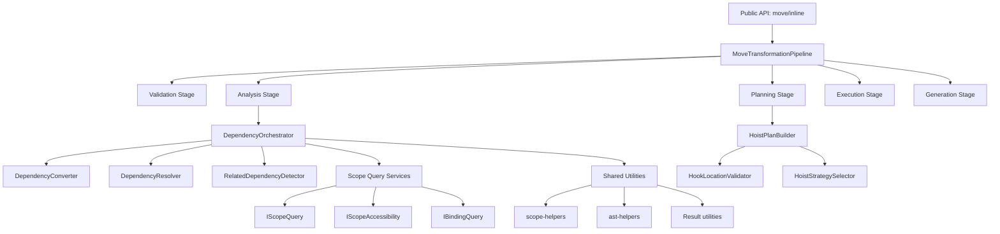
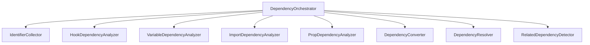
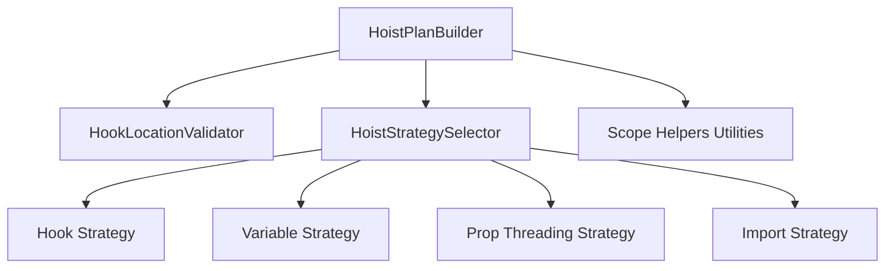
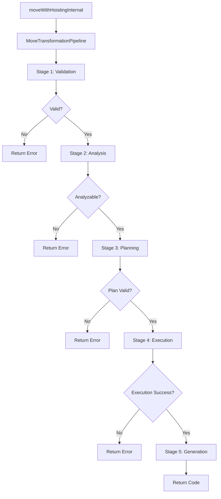
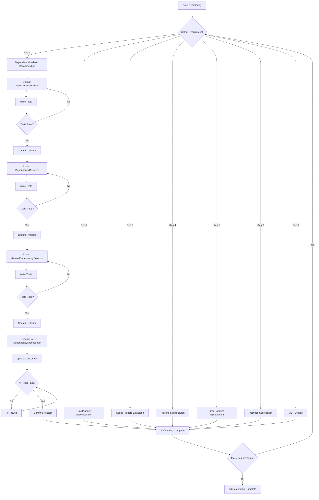
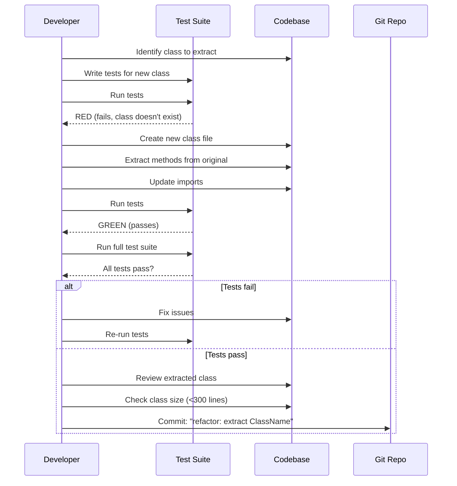

# Design Document: SOLID Principles Refactoring

## Overview

This design document outlines the architectural and implementation design for refactoring the Regrafter codebase to improve adherence to SOLID principles, eliminate code duplication, and enhance maintainability.

**Design Goals**:
- Decompose large classes (DependencyAnalyzer: 1,136 lines → multiple classes <300 lines each)
- Eliminate code duplication (143 instances of scope helpers, 162 instances of error handling)
- Apply Interface Segregation Principle to IScopeManager
- Implement pipeline pattern for move operations
- Improve error handling ergonomics
- Maintain zero regression in tests
- Preserve performance targets (<100ms single file, <500ms 10 files)

**Scope**: This design covers Priority 1 (Critical) and Priority 2 (Medium) requirements from the requirements document, focusing on structural refactoring without changing public API behavior.

---

## Architecture Design

### System Architecture Diagram

The refactored architecture maintains the existing 5-stage pipeline while introducing better separation of concerns within each stage:



### Data Flow Diagram

This diagram shows how data flows through the refactored dependency analysis and hoisting process:

```mermaid
graph LR
    A[JSX Element Path] --> B[DependencyOrchestrator]
    B --> C{Collect Identifiers}
    C --> D[Raw Dependencies]

    D --> E[DependencyConverter]
    E --> F[Deduplicated Internal Dependencies]

    F --> G[DependencyResolver]
    G --> H{Can Resolve?}
    H -->|Yes| I[Resolvable Dependencies]
    H -->|No| J[Return Error]

    I --> K[RelatedDependencyDetector]
    K --> L[Complete Dependency Analysis]

    L --> M[HoistPlanBuilder]
    M --> N[HookLocationValidator]
    N --> O{Valid Hook Location?}
    O -->|Yes| P[HoistStrategySelector]
    O -->|No| Q[Prop Threading Strategy]

    P --> R[Complete Hoist Plan]
    Q --> R
    R --> S[HoistExecutor]
    S --> T[AST Mutations Applied]
```



---

## Component Design

### Requirement 1: DependencyAnalyzer Decomposition

#### Current State Analysis

**Problems**:
- 1,136 lines of code
- 15+ responsibilities in single class
- High cyclomatic complexity
- Difficult to test individual responsibilities
- Violates Single Responsibility Principle

**Before: Current Structure**
```typescript
// Current: All responsibilities in one class
class DependencyAnalyzer {
  // 1. Identifier collection
  private collectIdentifiers(path)

  // 2. Hook dependency detection
  private detectHookDependencies(refs)

  // 3. Variable dependency detection
  private detectVariableDependencies(refs)

  // 4. Import dependency detection
  private detectImportDependencies(refs)

  // 5. Prop dependency detection
  private detectPropDependencies(refs)

  // 6. Deduplication
  private deduplicateDependencies(deps)

  // 7. Conversion to internal types
  private convertToInternalDeps(deps, scope)

  // 8. Resolution checking
  private canResolveDependencies(deps, targetScope)

  // 9. Related dependency detection
  private detectRelatedDependencies(deps, scope)

  // 10. Full analysis orchestration
  analyzeElement(elementPath, targetScope): Result<DependencyAnalysis>
}
```

#### New Architecture

**After: Decomposed into Focused Classes**



#### Component Interfaces

**1. DependencyOrchestrator**
```typescript
/**
 * Orchestrates the dependency analysis workflow.
 *
 * Responsibilities:
 * - Coordinate analysis pipeline stages
 * - Combine results from specialized analyzers
 * - Return complete DependencyAnalysis
 *
 * Dependencies: All specialized analyzers + converter + resolver + detector
 */
export class DependencyOrchestrator implements IDependencyAnalyzer {
  constructor(
    private readonly identifierCollector: IIdentifierCollector,
    private readonly hookAnalyzer: IHookDependencyAnalyzer,
    private readonly variableAnalyzer: IVariableDependencyAnalyzer,
    private readonly importAnalyzer: IImportDependencyAnalyzer,
    private readonly propAnalyzer: IPropDependencyAnalyzer,
    private readonly converter: IDependencyConverter,
    private readonly resolver: IDependencyResolver,
    private readonly relatedDetector: IRelatedDependencyDetector,
    private readonly scopeManager: ScopeManager
  ) {}

  /**
   * Analyze an element's dependencies for move operation
   */
  analyzeElement(
    elementPath: NodePath,
    targetScope: ScopeInfo | null
  ): Result<DependencyAnalysis, DependencyErrorType> {
    // Pipeline: collect → detect → convert → resolve → detect related
    // Implementation: ~80 lines (orchestration only)
  }

  setCurrentFile(filePath: string): void {
    this.currentFile = filePath;
  }
}
```

**2. DependencyConverter**
```typescript
/**
 * Converts and deduplicates dependency lists.
 *
 * Responsibilities:
 * - Convert SpecificDependency → InternalDependency
 * - Deduplicate dependencies by symbol name
 * - Build dependency path maps
 *
 * Single Responsibility: Type conversion and normalization
 */
export interface IDependencyConverter {
  /**
   * Convert specific dependencies to internal format
   */
  convertToInternal(
    deps: SpecificDependency[],
    elementScope: ScopeInfo
  ): InternalDependency[];

  /**
   * Deduplicate dependencies by symbol name
   *
   * Rules:
   * - Keep first occurrence by source location
   * - Merge related dependencies
   * - Preserve dependency origin information
   */
  deduplicate(deps: SpecificDependency[]): SpecificDependency[];

  /**
   * Build map of dependency symbols to their NodePaths
   */
  buildDependencyPaths(
    deps: InternalDependency[],
    elementScope: ScopeInfo
  ): Map<string, NodePath>;
}

export class DependencyConverter implements IDependencyConverter {
  constructor(private readonly scopeManager: IScopeQuery) {}

  // Implementation: ~150 lines
}
```

**3. DependencyResolver**
```typescript
/**
 * Checks if dependencies can be resolved at target location.
 *
 * Responsibilities:
 * - Check if bindings are accessible from target scope
 * - Identify which dependencies need hoisting
 * - Determine hoisting feasibility
 *
 * Single Responsibility: Resolution validation
 */
export interface IDependencyResolver {
  /**
   * Check if all dependencies can be resolved at target
   *
   * @returns Object with:
   *  - canResolve: boolean
   *  - needsHoisting: InternalDependency[]
   *  - alreadyAccessible: InternalDependency[]
   *  - reason?: string (if cannot resolve)
   */
  checkResolution(
    deps: InternalDependency[],
    sourceScope: ScopeInfo,
    targetScope: ScopeInfo
  ): DependencyResolutionResult;

  /**
   * Check if a single dependency needs hoisting
   */
  needsHoisting(
    dep: InternalDependency,
    targetScope: ScopeInfo
  ): boolean;
}

export class DependencyResolver implements IDependencyResolver {
  constructor(
    private readonly scopeManager: IScopeAccessibility,
    private readonly bindingQuery: IBindingQuery
  ) {}

  // Implementation: ~120 lines
}

/**
 * Result type for dependency resolution check
 */
export interface DependencyResolutionResult {
  canResolve: boolean;
  needsHoisting: InternalDependency[];
  alreadyAccessible: InternalDependency[];
  needsImport: InternalDependency[];
  reason?: string;
}
```

**4. RelatedDependencyDetector**
```typescript
/**
 * Detects transitive and related dependencies.
 *
 * Responsibilities:
 * - Find functions/variables that reference hoisted symbols
 * - Detect circular dependencies
 * - Build transitive dependency chains
 *
 * Single Responsibility: Transitive dependency detection
 */
export interface IRelatedDependencyDetector {
  /**
   * Detect dependencies that reference hoisted symbols
   *
   * Scans statements between hoisted dependencies and element
   * to find additional functions/variables that must be moved.
   *
   * @returns Array of related dependencies with their paths
   */
  detectRelated(
    hoistedDeps: InternalDependency[],
    elementScope: ScopeInfo,
    elementPath: NodePath
  ): Array<{
    dependency: InternalDependency;
    path: NodePath;
  }>;

  /**
   * Check if a statement references any of the given symbols
   */
  referencesAnySymbol(
    stmtPath: NodePath,
    symbols: Set<string>
  ): boolean;
}

export class RelatedDependencyDetector implements IRelatedDependencyDetector {
  constructor(private readonly scopeManager: IScopeQuery) {}

  // Implementation: ~180 lines
}
```

#### Migration Strategy for DependencyAnalyzer

**Phase 1: Extract Classes (Week 1, Day 1-2)**

Step-by-step extraction process:

1. **Create DependencyConverter** (Structural change)
   ```bash
   # Create new file
   touch src/analyzer/dependency-converter.ts

   # Extract methods:
   # - convertToInternalDeps
   # - deduplicateDependencies
   # - buildDependencyPaths

   # Commit: "refactor: extract DependencyConverter from DependencyAnalyzer"
   ```

2. **Create DependencyResolver** (Structural change)
   ```bash
   # Create new file
   touch src/analyzer/dependency-resolver.ts

   # Extract methods:
   # - canResolveDependencies
   # - needsHoisting
   # - checkAccessibility logic

   # Commit: "refactor: extract DependencyResolver from DependencyAnalyzer"
   ```

3. **Create RelatedDependencyDetector** (Structural change)
   ```bash
   # Create new file
   touch src/analyzer/related-dependency-detector.ts

   # Extract methods:
   # - detectRelatedDependencies
   # - referencesAnySymbol
   # - checkVariableDeclarationStatement
   # - checkFunctionDeclarationStatement

   # Commit: "refactor: extract RelatedDependencyDetector from DependencyAnalyzer"
   ```

4. **Create DependencyOrchestrator** (Structural change)
   ```bash
   # Rename DependencyAnalyzer to DependencyOrchestrator
   # Update imports across codebase
   # Inject extracted classes as dependencies

   # Commit: "refactor: rename DependencyAnalyzer to DependencyOrchestrator"
   ```

**Phase 2: Add Tests (Week 1, Day 2-3)**

Each extracted class gets focused unit tests:

```typescript
// Example: dependency-converter.test.ts
describe('DependencyConverter', () => {
  describe('convertToInternal', () => {
    it('converts hook dependencies correctly');
    it('converts variable dependencies correctly');
    it('preserves origin information');
    it('handles empty dependency list');
  });

  describe('deduplicate', () => {
    it('removes duplicate dependencies by symbol name');
    it('keeps first occurrence by source location');
    it('merges related dependencies');
  });

  describe('buildDependencyPaths', () => {
    it('maps symbols to their NodePaths');
    it('handles dependencies without paths');
  });
});
```

**Phase 3: Integration (Week 1, Day 3)**

Update consumers to use new architecture:

```typescript
// Before
const analyzer = new DependencyAnalyzer(scopeManager);
const analysis = analyzer.analyzeElement(path, targetScope);

// After
const orchestrator = createDependencyOrchestrator(scopeManager);
const analysis = orchestrator.analyzeElement(path, targetScope);

// Factory function handles dependency injection
function createDependencyOrchestrator(
  scopeManager: ScopeManager
): DependencyOrchestrator {
  const identifierCollector = createIdentifierCollector(scopeManager);
  const hookAnalyzer = createHookDependencyAnalyzer(scopeManager);
  const variableAnalyzer = createVariableDependencyAnalyzer(scopeManager);
  const importAnalyzer = createImportDependencyAnalyzer(scopeManager);
  const propAnalyzer = createPropDependencyAnalyzer(scopeManager);

  const converter = new DependencyConverter(scopeManager);
  const resolver = new DependencyResolver(scopeManager, scopeManager);
  const relatedDetector = new RelatedDependencyDetector(scopeManager);

  return new DependencyOrchestrator(
    identifierCollector,
    hookAnalyzer,
    variableAnalyzer,
    importAnalyzer,
    propAnalyzer,
    converter,
    resolver,
    relatedDetector,
    scopeManager
  );
}
```

---

### Requirement 2: HoistPlanner Decomposition

#### Current State Analysis

**Problems**:
- 871 lines of code
- 9+ responsibilities mixed together
- Hook validation logic coupled with planning logic
- Difficult to extend with new strategies
- Violates Single Responsibility Principle

**Before: Current Structure**
```typescript
class HoistPlanner {
  // 1. Main planning orchestration
  plan(analysis, context): HoistPlan

  // 2. Hook-specific planning
  private planHookHoist(dep, context)

  // 3. Variable-specific planning
  private planVariableHoist(dep, context)

  // 4. Hook location validation (Rules of Hooks)
  private isValidHookLocation(scope)
  private findNearestValidHookScope(scope)

  // 5. Scope traversal
  private findCommonAncestor(scopeA, scopeB)
  private buildScopePath(scope)

  // 6. Purity checking
  private isPureVariable(dep)

  // 7. Backward reference checking
  private hasBackwardReferences(dep, hoistPath)

  // 8. Component path computation
  private computeComponentPath(source, target)

  // 9. Import operation planning
  private planImportOperation(dep, context)
}
```

#### New Architecture

**After: Decomposed into Focused Classes**



#### Component Interfaces

**1. HookLocationValidator**
```typescript
/**
 * Validates hook locations according to Rules of Hooks.
 *
 * Responsibilities:
 * - Check if scope is valid for hook placement
 * - Find nearest valid hook location
 * - Validate component boundaries
 *
 * Single Responsibility: Rules of Hooks validation
 */
export interface IHookLocationValidator {
  /**
   * Check if a scope is a valid location for a hook
   *
   * Rules:
   * - Must be at component top level
   * - Cannot be inside loops or conditionals
   * - Must be in component scope (not module or block)
   */
  isValidHookLocation(scope: ScopeInfo): boolean;

  /**
   * Find the nearest ancestor scope that can contain a hook
   *
   * @returns ComponentScope if found, null if no valid location exists
   */
  findNearestValidHookScope(
    scope: ScopeInfo
  ): ComponentScope | null;

  /**
   * Validate hook hoisting from source to target
   *
   * @returns Result with validation or error explaining why invalid
   */
  validateHookHoist(
    sourceScope: ScopeInfo,
    targetScope: ScopeInfo
  ): Result<HookHoistValidation, ValidationErrorType>;
}

export interface HookHoistValidation {
  valid: boolean;
  targetIsValid: boolean;
  requiresPropThreading: boolean;
  reason?: string;
}

export class HookLocationValidator implements IHookLocationValidator {
  // Implementation: ~100 lines

  isValidHookLocation(scope: ScopeInfo): boolean {
    // Check component top-level rules
  }

  findNearestValidHookScope(scope: ScopeInfo): ComponentScope | null {
    // Walk up scope tree to find component
  }

  validateHookHoist(
    sourceScope: ScopeInfo,
    targetScope: ScopeInfo
  ): Result<HookHoistValidation, ValidationErrorType> {
    // Comprehensive validation with detailed errors
  }
}
```

**2. HoistStrategySelector**
```typescript
/**
 * Selects appropriate hoisting strategy based on dependency type and context.
 *
 * Responsibilities:
 * - Choose between direct hoist vs prop threading
 * - Determine target scope for hoisting
 * - Select strategy based on dependency type
 *
 * Single Responsibility: Strategy selection logic
 */
export interface IHoistStrategySelector {
  /**
   * Select hoisting strategy for a dependency
   *
   * Decision factors:
   * - Dependency type (hook, variable, prop, etc.)
   * - Source and target scope relationship
   * - Hook validation results
   * - Purity of variables
   */
  selectStrategy(
    dep: InternalDependency,
    context: HoistContext,
    hookValidation?: HookHoistValidation
  ): HoistStrategy;

  /**
   * Determine target scope for hoisting
   *
   * Uses LCA (Lowest Common Ancestor) of source and target scopes
   */
  determineTargetScope(
    sourceScope: ScopeInfo,
    targetScope: ScopeInfo
  ): ScopeInfo;
}

export class HoistStrategySelector implements IHoistStrategySelector {
  constructor(
    private readonly scopeManager: IScopeAccessibility,
    private readonly hookValidator: IHookLocationValidator
  ) {}

  // Implementation: ~120 lines

  selectStrategy(
    dep: InternalDependency,
    context: HoistContext,
    hookValidation?: HookHoistValidation
  ): HoistStrategy {
    switch (dep.type) {
      case DependencyType.Hook:
        return this.selectHookStrategy(dep, context, hookValidation);
      case DependencyType.Variable:
        return this.selectVariableStrategy(dep, context);
      case DependencyType.Prop:
        return HoistStrategy.PropThread;
      case DependencyType.Import:
        return HoistStrategy.Import;
      default:
        return HoistStrategy.Direct;
    }
  }
}
```

**3. HoistPlanBuilder**
```typescript
/**
 * Builds complete HoistPlan from dependency analysis.
 *
 * Responsibilities:
 * - Coordinate planning workflow
 * - Build HoistPlan structure
 * - Combine operations from strategies
 *
 * Single Responsibility: Plan construction and orchestration
 */
export interface IHoistPlanner {
  /**
   * Create complete hoisting plan
   */
  plan(
    analysis: DependencyAnalysis,
    context: HoistContext
  ): HoistPlan;
}

export class HoistPlanBuilder implements IHoistPlanner {
  constructor(
    private readonly hookValidator: IHookLocationValidator,
    private readonly strategySelector: IHoistStrategySelector,
    private readonly scopeManager: ScopeManager
  ) {}

  // Implementation: ~200 lines

  plan(analysis: DependencyAnalysis, context: HoistContext): HoistPlan {
    const plan: HoistPlan = {
      hoistOperations: [],
      propThreadOperations: [],
      importOperations: [],
      unhoistable: [],
      warnings: [],
      valid: true,
    };

    // Sort dependencies by source location
    const sortedDeps = this.sortDependencies(analysis.needsHoisting);

    // Plan each dependency
    for (const dep of sortedDeps) {
      const planItem = this.planSingleDependency(dep, context);
      this.addToPlan(plan, planItem);
    }

    // Process imports
    for (const dep of analysis.needsImport) {
      const importOp = this.planImportOperation(dep, context);
      plan.importOperations.push(importOp);
    }

    return plan;
  }

  private planSingleDependency(
    dep: InternalDependency,
    context: HoistContext
  ): HoistPlanItem {
    // 1. Validate if hook
    const hookValidation = this.validateIfHook(dep, context);

    // 2. Select strategy
    const strategy = this.strategySelector.selectStrategy(
      dep,
      context,
      hookValidation
    );

    // 3. Build operation based on strategy
    return this.buildOperation(dep, context, strategy, hookValidation);
  }
}
```

#### Migration Strategy for HoistPlanner

**Phase 1: Extract HookLocationValidator (Week 2, Day 1)**

1. Create new file `src/strategies/validators/hook-location-validator.ts`
2. Extract hook validation methods
3. Add comprehensive tests including Rules of Hooks edge cases
4. Commit: `"refactor: extract HookLocationValidator from HoistPlanner"`

**Phase 2: Extract HoistStrategySelector (Week 2, Day 1-2)**

1. Create new file `src/strategies/selectors/hoist-strategy-selector.ts`
2. Extract strategy selection logic
3. Add tests for all dependency types
4. Commit: `"refactor: extract HoistStrategySelector from HoistPlanner"`

**Phase 3: Rename to HoistPlanBuilder (Week 2, Day 2)**

1. Rename `HoistPlanner` → `HoistPlanBuilder`
2. Inject validator and selector
3. Update all imports
4. Commit: `"refactor: rename HoistPlanner to HoistPlanBuilder with DI"`

---

### Requirement 3: Scope/Binding Helper Utilities

#### Current State Analysis

**Problem**: 143 instances of duplicated scope traversal patterns across 22 files

**Common Patterns**:
```typescript
// Pattern 1: Get scope with component fallback (50+ occurrences)
let scope = scopeManager.getScopeForPath(path);
if (!scope) {
  const enclosingResult = scopeManager.findEnclosingComponent(path);
  if (!isErr(enclosingResult) && enclosingResult.value) {
    scope = enclosingResult.value;
  }
}

// Pattern 2: Unwrap enclosing component (30+ occurrences)
const enclosingResult = scopeManager.findEnclosingComponent(path);
if (!isErr(enclosingResult)) {
  const component = enclosingResult.value;
  // use component
}

// Pattern 3: Build scope path (25+ occurrences)
let scopePath: ScopeInfo[] = [];
let current: ScopeInfo | null = scope;
while (current !== null) {
  scopePath.unshift(current);
  current = current.parent;
}

// Pattern 4: Find common ancestor (15+ occurrences)
const pathA = buildPath(scopeA);
const pathB = buildPath(scopeB);
let lca: ScopeInfo | null = null;
for (let i = 0; i < Math.min(pathA.length, pathB.length); i++) {
  if (pathA[i].id === pathB[i].id) {
    lca = pathA[i];
  } else {
    break;
  }
}
```

#### New Utility Module

**File**: `src/scope/scope-helpers.ts`

```typescript
/**
 * Scope Helper Utilities
 *
 * Common patterns for scope traversal and querying.
 * Eliminates code duplication across the codebase.
 */

import type { NodePath } from '@babel/traverse';
import type { Result } from '../result/index.js';
import { isErr } from '../result/index.js';
import type { ScopeManager, ScopeInfo, ComponentScope } from './types.js';

/**
 * Get scope for path with automatic fallback to enclosing component
 *
 * Common pattern: Try direct scope lookup, fall back to component scope
 *
 * @example
 * ```typescript
 * const scope = getScopeWithFallback(path, scopeManager);
 * if (scope) {
 *   // use scope
 * }
 * ```
 */
export function getScopeWithFallback(
  path: NodePath,
  scopeManager: ScopeManager
): ScopeInfo | null {
  let scope = scopeManager.getScopeForPath(path);

  if (!scope) {
    const enclosingResult = scopeManager.findEnclosingComponent(path);
    if (!isErr(enclosingResult) && enclosingResult.value) {
      scope = enclosingResult.value;
    }
  }

  return scope;
}

/**
 * Safely unwrap enclosing component Result to ComponentScope | null
 *
 * Common pattern: Unwrap Result and handle error/null cases
 *
 * @example
 * ```typescript
 * const component = getEnclosingComponentOrNull(path, scopeManager);
 * if (component) {
 *   console.log('Component:', component.componentName);
 * }
 * ```
 */
export function getEnclosingComponentOrNull(
  path: NodePath,
  scopeManager: ScopeManager
): ComponentScope | null {
  const result = scopeManager.findEnclosingComponent(path);
  return isErr(result) ? null : result.value;
}

/**
 * Build array of scopes from current scope to root
 *
 * Returns path from root to current scope (inclusive)
 *
 * @example
 * ```typescript
 * const path = buildScopePath(scope);
 * console.log('Depth:', path.length);
 * console.log('Root:', path[0]);
 * console.log('Current:', path[path.length - 1]);
 * ```
 */
export function buildScopePath(scope: ScopeInfo): ScopeInfo[] {
  const path: ScopeInfo[] = [];
  let current: ScopeInfo | null = scope;

  while (current !== null) {
    path.unshift(current);
    current = current.parent;
  }

  return path;
}

/**
 * Find lowest common ancestor (LCA) of two scopes
 *
 * @returns LCA scope or null if scopes don't share ancestry
 *
 * @example
 * ```typescript
 * const lca = findCommonAncestor(scopeA, scopeB);
 * if (lca) {
 *   console.log('Hoist to:', lca.id);
 * }
 * ```
 */
export function findCommonAncestor(
  scopeA: ScopeInfo,
  scopeB: ScopeInfo
): ScopeInfo | null {
  const pathA = buildScopePath(scopeA);
  const pathB = buildScopePath(scopeB);

  let lca: ScopeInfo | null = null;

  for (let i = 0; i < Math.min(pathA.length, pathB.length); i++) {
    if (pathA[i].id === pathB[i].id) {
      lca = pathA[i];
    } else {
      break;
    }
  }

  return lca;
}

/**
 * Check if targetScope is an ancestor of sourceScope
 *
 * @example
 * ```typescript
 * if (isAncestorOf(targetScope, sourceScope)) {
 *   console.log('Target contains source');
 * }
 * ```
 */
export function isAncestorOf(
  targetScope: ScopeInfo,
  sourceScope: ScopeInfo
): boolean {
  let current: ScopeInfo | null = sourceScope;
  let depth = 0;
  const MAX_DEPTH = 100; // Prevent infinite loops

  while (current !== null && depth < MAX_DEPTH) {
    if (current.id === targetScope.id) {
      return true;
    }
    current = current.parent;
    depth++;
  }

  return false;
}

/**
 * Find nearest ancestor scope matching a predicate
 *
 * @example
 * ```typescript
 * const componentScope = findNearestAncestor(
 *   scope,
 *   s => s.type === ScopeType.Component
 * );
 * ```
 */
export function findNearestAncestor(
  scope: ScopeInfo,
  predicate: (scope: ScopeInfo) => boolean
): ScopeInfo | null {
  let current: ScopeInfo | null = scope.parent;
  let depth = 0;
  const MAX_DEPTH = 100;

  while (current !== null && depth < MAX_DEPTH) {
    if (predicate(current)) {
      return current;
    }
    current = current.parent;
    depth++;
  }

  return null;
}

/**
 * Compute distance between two scopes
 *
 * @returns Number of edges between scopes, or -1 if not related
 */
export function computeScopeDistance(
  scopeA: ScopeInfo,
  scopeB: ScopeInfo
): number {
  const pathA = buildScopePath(scopeA);
  const pathB = buildScopePath(scopeB);

  // Find LCA index
  let lcaIndex = -1;
  for (let i = 0; i < Math.min(pathA.length, pathB.length); i++) {
    if (pathA[i].id === pathB[i].id) {
      lcaIndex = i;
    } else {
      break;
    }
  }

  if (lcaIndex === -1) {
    return -1; // Not related
  }

  // Distance = edges from A to LCA + edges from LCA to B
  const distanceA = pathA.length - lcaIndex - 1;
  const distanceB = pathB.length - lcaIndex - 1;

  return distanceA + distanceB;
}
```

#### Migration Strategy

**Phase 1: Create Utility Module (Week 1, Day 4)**

1. Create `src/scope/scope-helpers.ts`
2. Implement all helper functions
3. Add comprehensive unit tests
4. Commit: `"feat: add scope-helpers utility module"`

**Phase 2: Replace Usages (Week 1, Day 4-5)**

Replace patterns file by file:

```typescript
// Before: In dependency-analyzer.ts
let scope = scopeManager.getScopeForPath(path);
if (!scope) {
  const enclosingResult = scopeManager.findEnclosingComponent(path);
  if (!isErr(enclosingResult) && enclosingResult.value) {
    scope = enclosingResult.value;
  }
}

// After
import { getScopeWithFallback } from '../scope/scope-helpers.js';

const scope = getScopeWithFallback(path, scopeManager);
```

Commit per file: `"refactor: use scope-helpers in <filename>"`

**Validation**:
- All tests must pass after each file migration
- Use grep to confirm pattern elimination: `grep -r "findEnclosingComponent" --include="*.ts"`

---

### Requirement 4: Move Operation Pipeline Simplification

#### Current State Analysis

**Problem**: `moveWithHoistingInternal` function has 193 lines with ~20 decision paths

**Responsibilities Mixed Together**:
1. Instance creation (generator, resolver, transformer, etc.)
2. File parsing
3. Selector resolution
4. Scope tree building
5. Scope retrieval with fallbacks
6. Dependency analysis
7. Target ancestry checking
8. Hoisting plan creation
9. Plan validation
10. Hoisting execution
11. Element transformation
12. Code generation
13. File write operations

#### New Pipeline Architecture

**After: Clear Pipeline Stages**



#### Component Interfaces

```typescript
/**
 * Move Transformation Pipeline
 *
 * Orchestrates the 5-stage transformation process with clear separation.
 * Each stage is independent and returns a Result for fail-fast behavior.
 */
export class MoveTransformationPipeline {
  constructor(
    private readonly validator: IMoveValidator,
    private readonly analyzer: IDependencyAnalyzer,
    private readonly planner: IHoistPlanner,
    private readonly executor: IHoistExecutor,
    private readonly transformer: IJSXTransformer,
    private readonly generator: ICodeGenerator,
    private readonly scopeManager: ScopeManager,
    private readonly resolver: ISelectorResolver
  ) {}

  /**
   * Execute complete transformation pipeline
   *
   * @param context - Transformation context with all required info
   * @returns Result with generated code or error
   */
  execute(context: MoveContext): Result<Code[], RegraffError> {
    // Stage 1: Validation
    const validationResult = this.runValidation(context);
    if (isErr(validationResult)) {
      return err(validationResult.error);
    }
    const validated = validationResult.value;

    // Stage 2: Analysis
    const analysisResult = this.runAnalysis(validated);
    if (isErr(analysisResult)) {
      return err(analysisResult.error);
    }
    const analyzed = analysisResult.value;

    // Stage 3: Planning
    const planningResult = this.runPlanning(analyzed);
    if (isErr(planningResult)) {
      return err(planningResult.error);
    }
    const planned = planningResult.value;

    // Stage 4: Execution
    const executionResult = this.runExecution(planned);
    if (isErr(executionResult)) {
      return err(executionResult.error);
    }
    const executed = executionResult.value;

    // Stage 5: Generation
    const generationResult = this.runGeneration(executed);
    if (isErr(generationResult)) {
      return err(generationResult.error);
    }

    return ok(generationResult.value);
  }

  /**
   * Stage 1: Validation
   *
   * Validates:
   * - Files exist and can be parsed
   * - Selectors can be resolved
   * - Cross-file constraints
   * - Scope tree can be built
   */
  private runValidation(
    context: MoveContext
  ): Result<ValidatedContext, RegraffError> {
    // Parse files
    const parsedFilesResult = parseAllFiles(context.files);
    if (isErr(parsedFilesResult)) {
      return err(parsedFilesResult.error);
    }

    // Validate selectors
    const sourceAst = parsedFilesResult.value.get(context.from.file);
    if (!sourceAst) {
      return err(this.createFileNotFoundError(context.from.file));
    }

    // Build scope tree
    const scopeTreeResult = this.scopeManager.buildScopeTree(sourceAst);
    if (isErr(scopeTreeResult)) {
      return err(scopeTreeResult.error);
    }

    // Resolve selectors
    const sourceResult = this.resolver.resolveResult(context.from, sourceAst);
    if (isErr(sourceResult)) {
      return err(sourceResult.error);
    }

    const targetResult = this.resolver.resolveResult(context.to, sourceAst);
    if (isErr(targetResult)) {
      return err(targetResult.error);
    }

    return ok({
      ...context,
      parsedFiles: parsedFilesResult.value,
      sourceAst,
      sourceResolved: sourceResult.value,
      targetResolved: targetResult.value,
      scopeTree: scopeTreeResult.value,
    });
  }

  /**
   * Stage 2: Analysis
   *
   * Analyzes:
   * - Element dependencies
   * - Scope relationships
   * - Hoisting requirements
   */
  private runAnalysis(
    context: ValidatedContext
  ): Result<AnalyzedContext, RegraffError> {
    // Get scopes
    const sourceScope = getScopeWithFallback(
      context.sourceResolved.path,
      this.scopeManager
    );

    const targetScope = getScopeWithFallback(
      context.targetResolved.path,
      this.scopeManager
    );

    if (!sourceScope || !targetScope) {
      return err(this.createScopeNotFoundError());
    }

    // Analyze dependencies
    this.analyzer.setCurrentFile(context.from.file);
    const analysisResult = this.analyzer.analyzeElement(
      context.sourceResolved.path,
      targetScope
    );

    if (isErr(analysisResult)) {
      return err(analysisResult.error);
    }

    return ok({
      ...context,
      sourceScope,
      targetScope,
      analysis: analysisResult.value,
    });
  }

  /**
   * Stage 3: Planning
   *
   * Creates:
   * - Hoist operations
   * - Prop threading operations
   * - Import operations
   */
  private runPlanning(
    context: AnalyzedContext
  ): Result<PlannedContext, RegraffError> {
    const hoistContext: HoistContext = {
      sourceScope: context.sourceScope,
      targetScope: context.targetScope,
      sourceFile: context.from.file,
      targetFile: context.to.file,
    };

    const plan = this.planner.plan(context.analysis, hoistContext);

    if (!plan.valid) {
      return err(this.createInvalidPlanError(plan));
    }

    return ok({
      ...context,
      plan,
    });
  }

  /**
   * Stage 4: Execution
   *
   * Executes:
   * - Hoisting operations on AST
   * - Element move transformation
   * - Import updates
   */
  private runExecution(
    context: PlannedContext
  ): Result<ExecutedContext, RegraffError> {
    // Execute hoisting
    const executionResult = this.executor.execute(
      context.plan.hoistOperations,
      context.sourceScope
    );

    if (isErr(executionResult)) {
      return err(executionResult.error);
    }

    // Transform element
    const transformResult = this.transformer.moveElement(
      context.sourceResolved.path,
      context.targetResolved.path,
      context.mode,
      context.options
    );

    if (isErr(transformResult)) {
      return err(transformResult.error);
    }

    return ok({
      ...context,
      mutatedAst: context.sourceAst,
    });
  }

  /**
   * Stage 5: Generation
   *
   * Generates:
   * - Source code from AST
   * - File outputs
   */
  private runGeneration(
    context: ExecutedContext
  ): Result<Code[], RegraffError> {
    const code = this.generator.generate(context.mutatedAst);

    return ok([
      {
        file: context.from.file,
        code,
      },
    ]);
  }
}

/**
 * Context types for each pipeline stage
 */
export interface MoveContext {
  files: FileInput[];
  from: Selector;
  to: Selector;
  mode: Move;
  options?: {
    insertIndex?: number;
    preserveComments?: boolean;
  };
}

export interface ValidatedContext extends MoveContext {
  parsedFiles: Map<string, t.File>;
  sourceAst: t.File;
  sourceResolved: SelectorResult;
  targetResolved: SelectorResult;
  scopeTree: ScopeTree;
}

export interface AnalyzedContext extends ValidatedContext {
  sourceScope: ScopeInfo;
  targetScope: ScopeInfo;
  analysis: DependencyAnalysis;
}

export interface PlannedContext extends AnalyzedContext {
  plan: HoistPlan;
}

export interface ExecutedContext extends PlannedContext {
  mutatedAst: t.File;
}
```

#### Migration Strategy

**Phase 1: Create Pipeline Class (Week 2, Day 3)**

1. Create `src/api/move-transformation-pipeline.ts`
2. Implement pipeline with stages
3. Add unit tests for each stage
4. Commit: `"feat: add MoveTransformationPipeline class"`

**Phase 2: Refactor moveWithHoistingInternal (Week 2, Day 3)**

```typescript
// Before: 193 lines of mixed concerns
function moveWithHoistingInternal(
  files: FileInput[],
  from: Selector,
  to: Selector,
  mode: Move,
  options?: { insertIndex?: number; preserveComments?: boolean }
): Result<Code[], RegraffError> {
  const generator = new CodeGenerator();
  const resolver = createSelectorResolver();
  // ... 180 more lines
}

// After: ~30 lines of orchestration
function moveWithHoistingInternal(
  files: FileInput[],
  from: Selector,
  to: Selector,
  mode: Move,
  options?: { insertIndex?: number; preserveComments?: boolean }
): Result<Code[], RegraffError> {
  const pipeline = createMoveTransformationPipeline();

  const context: MoveContext = {
    files,
    from,
    to,
    mode,
    options,
  };

  return pipeline.execute(context);
}

function createMoveTransformationPipeline(): MoveTransformationPipeline {
  const generator = new CodeGenerator();
  const resolver = createSelectorResolver();
  const transformer = createJSXTransformer();
  const scopeManager = createScopeManager();
  const analyzer = createDependencyOrchestrator(scopeManager);
  const planner = createHoistPlanBuilder();
  const executor = createHoistExecutor();
  const validator = createMoveValidator();

  return new MoveTransformationPipeline(
    validator,
    analyzer,
    planner,
    executor,
    transformer,
    generator,
    scopeManager,
    resolver
  );
}
```

Commit: `"refactor: use MoveTransformationPipeline in moveWithHoistingInternal"`

---

### Requirement 5: Error Handling Ergonomics

#### Current State Analysis

**Problem**: 162 instances of repeated `isErr` checking patterns

**Common Patterns**:
```typescript
// Pattern 1: Early return on error (80+ occurrences)
const result = someOperation();
if (isErr(result)) {
  return err(result.error);
}
const value = result.value;

// Pattern 2: Null fallback (40+ occurrences)
const result = someOperation();
if (isErr(result)) {
  return null;
}
return result.value;

// Pattern 3: Verbose error creation (161 occurrences)
return err(createValidationError({
  code: 'SOME_CODE',
  message: 'Some message',
  constraint: 'some_constraint',
  details: 'Some details',
  file: this.currentFile,
  location: path.node.loc ?? undefined,
  suggestions: [],
}));
```

#### New Utilities

**1. Result Module Utilities**

Add to `src/result/index.ts`:

```typescript
/**
 * Unwrap Result value or propagate error
 *
 * Use for early returns in Result-returning functions.
 *
 * @example
 * ```typescript
 * function process(): Result<Output, Error> {
 *   const input = unwrapOrReturn(getInput());
 *   if ('error' in input) return input;
 *
 *   // input is now typed as Input (not Result)
 *   return ok(transform(input));
 * }
 * ```
 */
export function unwrapOrReturn<T, E>(
  result: Result<T, E>
): T | { error: E } {
  if (isErr(result)) {
    return { error: result.error };
  }
  return result.value;
}

/**
 * Unwrap Result value or return null
 *
 * Use when null is acceptable fallback.
 *
 * @example
 * ```typescript
 * const component = unwrapOrNull(
 *   scopeManager.findEnclosingComponent(path)
 * );
 * ```
 */
export function unwrapOrNull<T, E>(
  result: Result<T, E>
): T | null {
  return isErr(result) ? null : result.value;
}

/**
 * Unwrap Result value or use default
 *
 * @example
 * ```typescript
 * const config = unwrapOr(loadConfig(), defaultConfig);
 * ```
 */
export function unwrapOr<T, E>(
  result: Result<T, E>,
  defaultValue: T
): T {
  return isErr(result) ? defaultValue : result.value;
}

/**
 * Chain Result-returning operations (monadic bind)
 *
 * Stops at first error, otherwise chains through operations.
 *
 * @example
 * ```typescript
 * const result = andThen(
 *   parseFile(path),
 *   ast => buildScopeTree(ast)
 * );
 * ```
 */
export function andThen<T, U, E>(
  result: Result<T, E>,
  fn: (value: T) => Result<U, E>
): Result<U, E> {
  return isErr(result) ? err(result.error) : fn(result.value);
}

/**
 * Map over Result value
 *
 * @example
 * ```typescript
 * const doubled = mapResult(getNumber(), n => n * 2);
 * ```
 */
export function mapResult<T, U, E>(
  result: Result<T, E>,
  fn: (value: T) => U
): Result<U, E> {
  return isErr(result) ? err(result.error) : ok(fn(result.value));
}

/**
 * Combine multiple Results into single Result of array
 *
 * Returns first error encountered, or ok with all values.
 *
 * @example
 * ```typescript
 * const results = combineResults([
 *   parseFile('a.tsx'),
 *   parseFile('b.tsx'),
 *   parseFile('c.tsx'),
 * ]);
 * // Result<[AST, AST, AST], Error>
 * ```
 */
export function combineResults<T, E>(
  results: Result<T, E>[]
): Result<T[], E> {
  const values: T[] = [];

  for (const result of results) {
    if (isErr(result)) {
      return err(result.error);
    }
    values.push(result.value);
  }

  return ok(values);
}
```

**2. Error Builder**

Add to `src/errors/error-builder.ts`:

```typescript
/**
 * Fluent API for building ValidationError objects
 *
 * Reduces verbosity of error creation while maintaining type safety.
 *
 * @example
 * ```typescript
 * return err(
 *   new ErrorBuilder()
 *     .code('INVALID_SELECTOR')
 *     .message('Could not resolve selector')
 *     .at(node.loc)
 *     .inFile(currentFile)
 *     .constraint('selector_valid')
 *     .suggest('Check selector syntax')
 *     .build()
 * );
 * ```
 */
export class ErrorBuilder {
  private params: Partial<ValidationErrorParams> = {
    suggestions: [],
  };

  /**
   * Set error code
   */
  code(code: string): this {
    this.params.code = code;
    return this;
  }

  /**
   * Set error message
   */
  message(message: string): this {
    this.params.message = message;
    return this;
  }

  /**
   * Set source location
   */
  at(location: SourceLocation | null | undefined): this {
    this.params.location = location ?? undefined;
    return this;
  }

  /**
   * Set file path
   */
  inFile(file: string): this {
    this.params.file = file;
    return this;
  }

  /**
   * Set constraint that was violated
   */
  constraint(constraint: string): this {
    this.params.constraint = constraint;
    return this;
  }

  /**
   * Set detailed explanation
   */
  details(details: string): this {
    this.params.details = details;
    return this;
  }

  /**
   * Add a suggestion (can be called multiple times)
   */
  suggest(suggestion: string): this {
    if (!this.params.suggestions) {
      this.params.suggestions = [];
    }
    this.params.suggestions.push(suggestion);
    return this;
  }

  /**
   * Add multiple suggestions
   */
  suggestions(suggestions: string[]): this {
    this.params.suggestions = suggestions;
    return this;
  }

  /**
   * Build the ValidationError
   */
  build(): ValidationErrorType {
    // Validate required fields
    if (!this.params.code || !this.params.message) {
      throw new Error('ErrorBuilder: code and message are required');
    }

    return createValidationError(this.params as ValidationErrorParams);
  }
}

/**
 * Create an ErrorBuilder instance
 *
 * @example
 * ```typescript
 * return err(
 *   error()
 *     .code('INVALID_HOOK')
 *     .message('Hook cannot be hoisted')
 *     .build()
 * );
 * ```
 */
export function error(): ErrorBuilder {
  return new ErrorBuilder();
}
```

#### Usage Examples

**Before/After Comparison**:

```typescript
// BEFORE: Verbose error propagation
function analyze(path: NodePath): Result<Analysis, Error> {
  const scopeResult = getScopeForPath(path);
  if (isErr(scopeResult)) {
    return err(scopeResult.error);
  }
  const scope = scopeResult.value;

  const depsResult = analyzeDeps(scope);
  if (isErr(depsResult)) {
    return err(depsResult.error);
  }
  const deps = depsResult.value;

  return ok({ scope, deps });
}

// AFTER: Using andThen
function analyze(path: NodePath): Result<Analysis, Error> {
  return andThen(
    getScopeForPath(path),
    scope => andThen(
      analyzeDeps(scope),
      deps => ok({ scope, deps })
    )
  );
}

// OR: Using unwrapOrReturn
function analyze(path: NodePath): Result<Analysis, Error> {
  const scope = unwrapOrReturn(getScopeForPath(path));
  if ('error' in scope) return scope;

  const deps = unwrapOrReturn(analyzeDeps(scope));
  if ('error' in deps) return deps;

  return ok({ scope, deps });
}
```

```typescript
// BEFORE: Verbose error creation
return err(createValidationError({
  code: 'HOOK_LOCATION_INVALID',
  message: 'Hook cannot be placed in conditional scope',
  constraint: 'hooks_top_level',
  details: `Hook ${hookName} is inside a conditional block which violates Rules of Hooks`,
  file: this.currentFile,
  location: path.node.loc ?? undefined,
  suggestions: [
    'Move hook to component top level',
    'Use prop threading to pass hook result down',
  ],
}));

// AFTER: Using ErrorBuilder
return err(
  error()
    .code('HOOK_LOCATION_INVALID')
    .message('Hook cannot be placed in conditional scope')
    .constraint('hooks_top_level')
    .details(`Hook ${hookName} is inside a conditional block which violates Rules of Hooks`)
    .inFile(this.currentFile)
    .at(path.node.loc)
    .suggest('Move hook to component top level')
    .suggest('Use prop threading to pass hook result down')
    .build()
);
```

#### Migration Strategy

**Phase 1: Add Utilities (Week 3, Day 1)**

1. Add Result utilities to `src/result/index.ts`
2. Create `src/errors/error-builder.ts`
3. Add comprehensive tests
4. Export from public API
5. Commit: `"feat: add Result utilities and ErrorBuilder"`

**Phase 2: Migrate High-Impact Files (Week 3, Day 1-2)**

Replace patterns in order of frequency:
1. `dependency-analyzer.ts` (13 occurrences)
2. `hoist-planner.ts` (11 occurrences)
3. `move.ts` (7 occurrences)
4. Continue with remaining files

Commit per file: `"refactor: use Result utilities in <filename>"`

---

### Requirement 6: IScopeManager Interface Segregation

#### Current State Analysis

**Problem**: IScopeManager interface has 10+ methods with different concerns

**Current Interface** (Violates ISP):
```typescript
interface IScopeManager {
  // Tree building
  buildScopeTree(ast: t.File): Result<ScopeTree, ValidationErrorType>;
  getScopeTree(): ScopeTree | null;

  // Component detection
  isReactComponent(path: NodePath): boolean;
  createComponentScopeFromPath(...): ComponentScope | null;

  // Queries
  getScopeForNode(node: t.Node): ScopeInfo | null;
  getScopeForPath(path: NodePath): ScopeInfo | null;
  findEnclosingComponent(path: NodePath): Result<ComponentScope | null>;

  // Accessibility
  checkAccessibility(source, target): AccessibilityResult;
  computeLCA(scopeA, scopeB): LCAResult;

  // Bindings
  getBindingsInScope(scope): Map<string, BindingInfo>;
  isBindingAccessible(name, from, binding): boolean;

  // Component info
  getAllComponents(): ComponentInfo[];
  getComponentInfo(scopeId): ComponentInfo | null;
}
```

#### New Segregated Interfaces

**After: Focused Interfaces Following ISP**

```typescript
/**
 * Scope tree construction interface
 *
 * Use when: Building or accessing the scope tree structure
 */
export interface IScopeTreeBuilder {
  /**
   * Build scope tree from AST
   */
  buildScopeTree(ast: t.File): Result<ScopeTree, ValidationErrorType>;

  /**
   * Get current scope tree
   */
  getScopeTree(): ScopeTree | null;

  /**
   * Check if path represents a React component
   */
  isReactComponent(path: NodePath): boolean;

  /**
   * Create component scope from path
   */
  createComponentScopeFromPath(
    path: NodePath<t.FunctionDeclaration | t.FunctionExpression | t.ArrowFunctionExpression>,
    parent: ScopeInfo | null,
    scopeTree: ScopeTree
  ): ComponentScope | null;
}

/**
 * Scope query interface
 *
 * Use when: Looking up scopes for nodes/paths
 */
export interface IScopeQuery {
  /**
   * Get scope containing a node
   */
  getScopeForNode(node: t.Node): ScopeInfo | null;

  /**
   * Get scope containing a path
   */
  getScopeForPath(path: NodePath): ScopeInfo | null;

  /**
   * Find nearest enclosing component scope
   */
  findEnclosingComponent(
    path: NodePath
  ): Result<ComponentScope | null, InternalErrorType>;
}

/**
 * Scope accessibility interface
 *
 * Use when: Checking if scopes/bindings are accessible
 */
export interface IScopeAccessibility {
  /**
   * Check if source scope is accessible from target scope
   */
  checkAccessibility(
    sourceScope: ScopeInfo,
    targetScope: ScopeInfo
  ): AccessibilityResult;

  /**
   * Compute lowest common ancestor of two scopes
   */
  computeLCA(
    scopeA: ScopeInfo,
    scopeB: ScopeInfo
  ): LCAResult;
}

/**
 * Binding query interface
 *
 * Use when: Working with variable bindings
 */
export interface IBindingQuery {
  /**
   * Get all bindings in a scope
   */
  getBindingsInScope(scope: ScopeInfo): Map<string, BindingInfo>;

  /**
   * Check if specific binding is accessible
   */
  isBindingAccessible(
    bindingName: string,
    fromScope: ScopeInfo,
    bindingScope: ScopeInfo
  ): boolean;
}

/**
 * Component info interface
 *
 * Use when: Querying component metadata
 */
export interface IComponentInfo {
  /**
   * Get all components in file
   */
  getAllComponents(): ComponentInfo[];

  /**
   * Get component info by scope ID
   */
  getComponentInfo(scopeId: string): ComponentInfo | null;
}

/**
 * Legacy interface for backward compatibility
 *
 * ScopeManager implements all focused interfaces.
 * New code should depend on focused interfaces instead.
 *
 * @deprecated Use focused interfaces (IScopeQuery, IScopeAccessibility, etc.)
 */
export interface IScopeManager
  extends IScopeTreeBuilder,
    IScopeQuery,
    IScopeAccessibility,
    IBindingQuery,
    IComponentInfo {}
```

#### Migration Strategy

**Phase 1: Create Focused Interfaces (Week 3, Day 2)**

1. Create new interface definitions in `src/interfaces/`
2. Update ScopeManager to explicitly implement all interfaces
3. Add tests validating interface compliance
4. Commit: `"feat: add segregated scope interfaces (ISP)"`

**Phase 2: Update Consumers (Week 3, Day 2-3)**

Update each consumer to depend on minimal interface:

```typescript
// BEFORE: Depends on full IScopeManager
class DependencyResolver {
  constructor(private readonly scopeManager: IScopeManager) {}
}

// AFTER: Depends only on what it needs
class DependencyResolver {
  constructor(
    private readonly scopeAccessibility: IScopeAccessibility,
    private readonly bindingQuery: IBindingQuery
  ) {}
}
```

**Benefits**:
- Clearer dependencies
- Easier to test (smaller interfaces to mock)
- Better encapsulation
- Easier to extend ScopeManager without affecting all consumers

Commit per consumer: `"refactor: use focused scope interfaces in <filename>"`

---

### Requirement 7: AST Traversal Utilities

#### New Utility Modules

**1. AST Traversal Module**

File: `src/utils/ast-traversal.ts`

```typescript
/**
 * AST Traversal Utilities
 *
 * Reusable patterns for AST traversal.
 */

import type { NodePath } from '@babel/traverse';
import type * as t from '@babel/types';

/**
 * Options for identifier traversal
 */
export interface TraverseIdentifiersOptions {
  /**
   * Skip identifier if it's a declaration (default: true)
   */
  skipDeclarations?: boolean;

  /**
   * Skip identifier if it's a property key (default: true)
   */
  skipPropertyKeys?: boolean;

  /**
   * Skip identifier if it's in JSX attribute (default: false)
   */
  skipJSXAttributes?: boolean;

  /**
   * Skip identifier if it's a type annotation (default: true)
   */
  skipTypeAnnotations?: boolean;
}

/**
 * Traverse all identifier references in a subtree
 *
 * Skips declarations, property keys, and type annotations by default.
 *
 * @example
 * ```typescript
 * traverseIdentifierReferences(functionPath, (idPath) => {
 *   console.log('Reference:', idPath.node.name);
 * }, {
 *   skipJSXAttributes: true
 * });
 * ```
 */
export function traverseIdentifierReferences(
  path: NodePath,
  callback: (idPath: NodePath<t.Identifier>) => void,
  options: TraverseIdentifiersOptions = {}
): void {
  const {
    skipDeclarations = true,
    skipPropertyKeys = true,
    skipJSXAttributes = false,
    skipTypeAnnotations = true,
  } = options;

  path.traverse({
    Identifier(idPath: NodePath<t.Identifier>) {
      // Skip if it's a declaration
      if (skipDeclarations && isDeclarationIdentifier(idPath)) {
        return;
      }

      // Skip if it's a property key
      if (skipPropertyKeys && isPropertyKey(idPath)) {
        return;
      }

      // Skip if it's in JSX attribute
      if (skipJSXAttributes && isJSXAttribute(idPath)) {
        return;
      }

      // Skip if it's a type annotation
      if (skipTypeAnnotations && isTypeAnnotation(idPath)) {
        return;
      }

      callback(idPath);
    },
  });
}

/**
 * Check if identifier is a declaration (binding)
 */
function isDeclarationIdentifier(path: NodePath<t.Identifier>): boolean {
  const parent = path.parent;
  const parentPath = path.parentPath;

  // Variable declaration: const x = ...
  if (t.isVariableDeclarator(parent) && parent.id === path.node) {
    return true;
  }

  // Function declaration: function x() {}
  if (t.isFunctionDeclaration(parent) && parent.id === path.node) {
    return true;
  }

  // Function parameter: function f(x) {}
  if (parentPath?.isFunction() && parentPath.node.params.includes(path.node)) {
    return true;
  }

  // Class declaration: class X {}
  if (t.isClassDeclaration(parent) && parent.id === path.node) {
    return true;
  }

  // Import specifier: import { x } from 'mod'
  if (t.isImportSpecifier(parent) || t.isImportDefaultSpecifier(parent)) {
    return true;
  }

  return false;
}

/**
 * Check if identifier is a property key
 */
function isPropertyKey(path: NodePath<t.Identifier>): boolean {
  const parent = path.parent;

  if (t.isObjectProperty(parent) && parent.key === path.node && !parent.computed) {
    return true;
  }

  if (t.isObjectMethod(parent) && parent.key === path.node && !parent.computed) {
    return true;
  }

  return false;
}

/**
 * Check if identifier is in JSX attribute
 */
function isJSXAttribute(path: NodePath<t.Identifier>): boolean {
  return path.findParent(p => p.isJSXAttribute()) !== null;
}

/**
 * Check if identifier is in type annotation
 */
function isTypeAnnotation(path: NodePath<t.Identifier>): boolean {
  return path.findParent(p =>
    p.isTSTypeAnnotation() ||
    p.isTSTypeReference() ||
    p.isFlowType()
  ) !== null;
}

/**
 * Find all function declarations in a scope
 */
export function findFunctionDeclarations(
  path: NodePath
): NodePath<t.FunctionDeclaration>[] {
  const functions: NodePath<t.FunctionDeclaration>[] = [];

  path.traverse({
    FunctionDeclaration(funcPath) {
      functions.push(funcPath);
      funcPath.skip(); // Don't traverse into nested functions
    },
  });

  return functions;
}

/**
 * Find all variable declarations in a scope
 */
export function findVariableDeclarations(
  path: NodePath
): NodePath<t.VariableDeclaration>[] {
  const declarations: NodePath<t.VariableDeclaration>[] = [];

  path.traverse({
    VariableDeclaration(declPath) {
      declarations.push(declPath);
    },
  });

  return declarations;
}
```

**2. AST Helper Module**

File: `src/utils/ast-helpers.ts`

```typescript
/**
 * AST Helper Utilities
 *
 * Common operations on AST nodes.
 */

import type { NodePath } from '@babel/traverse';
import type * as t from '@babel/types';

/**
 * Extract function name from function path
 *
 * Handles:
 * - Function declarations: function foo() {}
 * - Variable declarations: const foo = () => {}
 * - Object properties: { foo() {} }
 *
 * @returns Function name or null if anonymous
 *
 * @example
 * ```typescript
 * const name = extractFunctionName(functionPath);
 * console.log(name); // 'MyComponent'
 * ```
 */
export function extractFunctionName(
  path: NodePath<
    t.FunctionDeclaration | t.FunctionExpression | t.ArrowFunctionExpression
  >
): string | null {
  const node = path.node;

  // Function declaration with name
  if (t.isFunctionDeclaration(node) && node.id) {
    return node.id.name;
  }

  // Function expression or arrow function
  if (
    (t.isFunctionExpression(node) || t.isArrowFunctionExpression(node)) &&
    path.parentPath
  ) {
    const parent = path.parentPath.node;

    // Variable declarator: const foo = () => {}
    if (t.isVariableDeclarator(parent) && t.isIdentifier(parent.id)) {
      return parent.id.name;
    }

    // Object property: { foo: () => {} } or { foo() {} }
    if (t.isObjectProperty(parent) && t.isIdentifier(parent.key)) {
      return parent.key.name;
    }

    // Class property: class { foo = () => {} }
    if (t.isClassProperty(parent) && t.isIdentifier(parent.key)) {
      return parent.key.name;
    }

    // Assignment: this.foo = () => {}
    if (
      t.isAssignmentExpression(parent) &&
      t.isMemberExpression(parent.left) &&
      t.isIdentifier(parent.left.property)
    ) {
      return parent.left.property.name;
    }
  }

  return null;
}

/**
 * Check if name follows React hook naming convention
 *
 * Hooks must start with 'use' followed by uppercase letter.
 *
 * @example
 * ```typescript
 * isReactHookName('useState') // true
 * isReactHookName('useEffect') // true
 * isReactHookName('useFoo') // true
 * isReactHookName('user') // false
 * ```
 */
export function isReactHookName(name: string): boolean {
  return /^use[A-Z]/.test(name);
}

/**
 * Check if name follows React component naming convention
 *
 * Components must start with uppercase letter.
 *
 * @example
 * ```typescript
 * isComponentName('MyComponent') // true
 * isComponentName('Button') // true
 * isComponentName('myHelper') // false
 * ```
 */
export function isComponentName(name: string): boolean {
  return /^[A-Z]/.test(name);
}

/**
 * Check if function is likely a React component
 *
 * Heuristics:
 * - Has component-style name
 * - Returns JSX
 * - Has JSX in body
 */
export function looksLikeComponent(
  path: NodePath<
    t.FunctionDeclaration | t.FunctionExpression | t.ArrowFunctionExpression
  >
): boolean {
  const name = extractFunctionName(path);

  // Check name convention
  if (name && !isComponentName(name)) {
    return false;
  }

  // Check if returns JSX
  let hasJSX = false;
  path.traverse({
    JSXElement() {
      hasJSX = true;
    },
    JSXFragment() {
      hasJSX = true;
    },
  });

  return hasJSX;
}

/**
 * Get all JSX elements in a subtree
 */
export function findJSXElements(
  path: NodePath
): NodePath<t.JSXElement>[] {
  const elements: NodePath<t.JSXElement>[] = [];

  path.traverse({
    JSXElement(jsxPath) {
      elements.push(jsxPath);
    },
  });

  return elements;
}

/**
 * Check if node is inside a conditional
 */
export function isInsideConditional(path: NodePath): boolean {
  return (
    path.findParent(
      p =>
        p.isIfStatement() ||
        p.isConditionalExpression() ||
        p.isSwitchStatement() ||
        p.isLogicalExpression()
    ) !== null
  );
}

/**
 * Check if node is inside a loop
 */
export function isInsideLoop(path: NodePath): boolean {
  return (
    path.findParent(
      p =>
        p.isForStatement() ||
        p.isForInStatement() ||
        p.isForOfStatement() ||
        p.isWhileStatement() ||
        p.isDoWhileStatement()
    ) !== null
  );
}
```

#### Migration Strategy

**Phase 1: Create Utility Modules (Week 3, Day 3)**

1. Create `src/utils/ast-traversal.ts`
2. Create `src/utils/ast-helpers.ts`
3. Add comprehensive tests
4. Commit: `"feat: add AST traversal and helper utilities"`

**Phase 2: Replace Usages (Week 3, Day 3-4)**

Identify and replace duplicated patterns:

```typescript
// BEFORE: In dependency-analyzer.ts
path.traverse({
  Identifier(idPath: NodePath<t.Identifier>) {
    // Skip declarations
    if (this.isDeclaration(idPath)) return;
    // Skip property keys
    if (this.isPropertyKey(idPath)) return;
    // Process...
  }
});

// AFTER
import { traverseIdentifierReferences } from '../utils/ast-traversal.js';

traverseIdentifierReferences(path, (idPath) => {
  // Process identifier reference
});
```

---

## Data Model

### Core Types (Unchanged)

The refactoring maintains existing data structures:

```typescript
// Existing types remain unchanged
export interface DependencyAnalysis {
  dependencies: SpecificDependency[];
  needsHoisting: InternalDependency[];
  alreadyAccessible: InternalDependency[];
  needsImport: InternalDependency[];
  unanalyzable: UnanalyzableCode[];
}

export interface HoistPlan {
  hoistOperations: HoistOperation[];
  propThreadOperations: PropThreadOperation[];
  importOperations: ImportOperation[];
  unhoistable: Array<{ dependency: InternalDependency; reason: string }>;
  warnings: string[];
  valid: boolean;
  invalidReason?: string;
}
```

### New Internal Types

**For DependencyAnalyzer Decomposition**:
```typescript
/**
 * Result of dependency resolution check
 */
export interface DependencyResolutionResult {
  canResolve: boolean;
  needsHoisting: InternalDependency[];
  alreadyAccessible: InternalDependency[];
  needsImport: InternalDependency[];
  reason?: string;
}
```

**For HoistPlanner Decomposition**:
```typescript
/**
 * Result of hook hoist validation
 */
export interface HookHoistValidation {
  valid: boolean;
  targetIsValid: boolean;
  requiresPropThreading: boolean;
  reason?: string;
}
```

**For Pipeline**:
```typescript
/**
 * Context passed through pipeline stages
 */
export interface MoveContext {
  files: FileInput[];
  from: Selector;
  to: Selector;
  mode: Move;
  options?: {
    insertIndex?: number;
    preserveComments?: boolean;
  };
}

export interface ValidatedContext extends MoveContext {
  parsedFiles: Map<string, t.File>;
  sourceAst: t.File;
  sourceResolved: SelectorResult;
  targetResolved: SelectorResult;
  scopeTree: ScopeTree;
}

export interface AnalyzedContext extends ValidatedContext {
  sourceScope: ScopeInfo;
  targetScope: ScopeInfo;
  analysis: DependencyAnalysis;
}

export interface PlannedContext extends AnalyzedContext {
  plan: HoistPlan;
}

export interface ExecutedContext extends PlannedContext {
  mutatedAst: t.File;
}
```

---

## Business Process

### Refactoring Process Flow



### TDD Workflow for Each Extraction



---

## Error Handling Strategy

### Validation at Each Stage

The refactored system maintains comprehensive error handling:

**1. At Interface Boundaries**
- All public methods return `Result<T, Error>`
- Input validation errors use `ValidationErrorType`
- Internal errors use `InternalErrorType`

**2. Pipeline Stage Errors**
```typescript
// Each stage can fail independently
Stage 1 Validation → ValidationError (selector invalid, file not found)
Stage 2 Analysis   → DependencyError (unanalyzable code)
Stage 3 Planning   → ValidationError (cannot hoist, invalid hook location)
Stage 4 Execution  → InternalError (AST mutation failed)
Stage 5 Generation → InternalError (code generation failed)
```

**3. Enhanced Error Messages**

Using ErrorBuilder for clarity:
```typescript
// Before: Verbose and easy to get wrong
return err(createValidationError({
  code: 'HOOK_LOCATION_INVALID',
  message: 'Cannot hoist hook to target location',
  constraint: 'hooks_rules',
  details: 'Target scope is conditional which violates Rules of Hooks',
  file: currentFile,
  location: hookPath.node.loc,
  suggestions: ['Use prop threading', 'Move to component top level'],
}));

// After: Fluent and type-safe
return err(
  error()
    .code('HOOK_LOCATION_INVALID')
    .message('Cannot hoist hook to target location')
    .constraint('hooks_rules')
    .details('Target scope is conditional which violates Rules of Hooks')
    .inFile(currentFile)
    .at(hookPath.node.loc)
    .suggest('Use prop threading')
    .suggest('Move to component top level')
    .build()
);
```

**4. Error Recovery**

The design maintains fail-fast behavior:
- Pipeline short-circuits on first error
- No partial mutations (rollback on error)
- Clear error messages with suggestions

---

## Implementation Sequencing

### Phase 1: Foundation (Week 1) - Priority 1

**Day 1-2: DependencyAnalyzer Decomposition**
1. Extract DependencyConverter
   - Move conversion and deduplication logic
   - Write unit tests
   - Commit: `"refactor: extract DependencyConverter"`

2. Extract DependencyResolver
   - Move resolution checking logic
   - Write unit tests
   - Commit: `"refactor: extract DependencyResolver"`

3. Extract RelatedDependencyDetector
   - Move transitive dependency logic
   - Write unit tests
   - Commit: `"refactor: extract RelatedDependencyDetector"`

4. Rename to DependencyOrchestrator
   - Update all imports
   - Inject extracted classes
   - Commit: `"refactor: rename to DependencyOrchestrator with DI"`

**Day 3-4: Scope Helper Utilities**
1. Create scope-helpers.ts
   - Implement all helper functions
   - Write comprehensive tests
   - Commit: `"feat: add scope-helpers utility module"`

2. Replace usages across codebase
   - Update dependency-analyzer.ts (13 occurrences)
   - Update move.ts (7 occurrences)
   - Update identifier-collector.ts (7 occurrences)
   - Update remaining files
   - Commit per file: `"refactor: use scope-helpers in <file>"`

**Day 5: Validation and Testing**
- Run full test suite
- Run benchmarks
- Verify zero regression
- Update documentation

**Deliverable**: DependencyAnalyzer decomposed into 4 classes, scope utilities extracted, 100+ lines of duplication removed.

---

### Phase 2: Core Refactoring (Week 2) - Priority 1

**Day 1-2: HoistPlanner Decomposition**
1. Extract HookLocationValidator
   - Move hook validation logic
   - Write comprehensive tests for Rules of Hooks
   - Commit: `"refactor: extract HookLocationValidator"`

2. Extract HoistStrategySelector
   - Move strategy selection logic
   - Write tests for all dependency types
   - Commit: `"refactor: extract HoistStrategySelector"`

3. Rename to HoistPlanBuilder
   - Inject validator and selector
   - Update consumers
   - Commit: `"refactor: rename to HoistPlanBuilder with DI"`

**Day 3-4: Move Pipeline Simplification**
1. Create MoveTransformationPipeline
   - Implement 5-stage pipeline
   - Write tests for each stage
   - Commit: `"feat: add MoveTransformationPipeline"`

2. Refactor moveWithHoistingInternal
   - Use pipeline class
   - Reduce to ~30 lines
   - Commit: `"refactor: use pipeline in moveWithHoistingInternal"`

**Day 5: Integration and Testing**
- Run full test suite
- Run benchmarks
- E2E testing
- Update documentation

**Deliverable**: HoistPlanner decomposed into 3 classes, move.ts simplified from 193 lines to ~30 lines.

---

### Phase 3: Quality Improvements (Week 3) - Priority 2

**Day 1: Error Handling Ergonomics**
1. Add Result utilities
   - Implement unwrapOrReturn, andThen, etc.
   - Write tests
   - Commit: `"feat: add Result utilities"`

2. Create ErrorBuilder
   - Implement fluent API
   - Write tests
   - Commit: `"feat: add ErrorBuilder for better error creation"`

3. Migrate high-impact files
   - dependency-analyzer.ts
   - hoist-planner.ts
   - move.ts
   - Commit per file: `"refactor: use Result utilities in <file>"`

**Day 2-3: Interface Segregation**
1. Create focused interfaces
   - IScopeTreeBuilder
   - IScopeQuery
   - IScopeAccessibility
   - IBindingQuery
   - IComponentInfo
   - Commit: `"feat: add segregated scope interfaces"`

2. Update consumers
   - DependencyOrchestrator
   - HoistPlanBuilder
   - Other consumers
   - Commit per consumer: `"refactor: use focused interfaces in <file>"`

**Day 3-4: AST Traversal Utilities**
1. Create ast-traversal.ts
   - Implement traverseIdentifierReferences
   - Write tests
   - Commit: `"feat: add ast-traversal utilities"`

2. Create ast-helpers.ts
   - Implement extractFunctionName, etc.
   - Write tests
   - Commit: `"feat: add ast-helpers utilities"`

3. Replace usages
   - Commit per file: `"refactor: use AST utilities in <file>"`

**Day 5: Final Validation**
- Run complete test suite
- Run all benchmarks
- Check test coverage (target: 95%+)
- Update all documentation
- Create summary report

**Deliverable**: Error handling improved, interfaces segregated, AST utilities extracted, code duplication reduced by 80%+.

---

## Validation and Rollback Strategies

### Validation Checkpoints

**After Each Commit**:
```bash
# 1. Run type checking
npm run typecheck

# 2. Run all tests
npm test

# 3. Run E2E tests
npm run test:e2e

# 4. Check test coverage
npm run test:coverage

# 5. Run benchmarks (only for major changes)
npm run bench
```

**Acceptance Criteria**:
- ✅ All tests pass (zero regression)
- ✅ Type checking passes
- ✅ Test coverage maintained or improved
- ✅ Performance benchmarks maintained (<100ms single file, <500ms 10 files)
- ✅ No increase in bundle size

### Rollback Strategy

**If Tests Fail**:
```bash
# 1. Identify last good commit
git log --oneline

# 2. Create fix branch
git checkout -b fix/test-regression

# 3. Fix issues and re-test
npm test

# 4. If cannot fix quickly, rollback
git reset --hard <last-good-commit>

# 5. Create issue for investigation
gh issue create --title "Test regression in refactoring"
```

**If Performance Degrades**:
```bash
# 1. Run benchmarks to identify regression
npm run bench

# 2. Profile the slow operation
npm run bench:memory
npm run bench:flamegraph

# 3. If >10% slower, investigate or rollback
git revert <problematic-commit>

# 4. Document findings
echo "Performance regression: <details>" >> .claude/specs/solid-refactoring/issues.md
```

### Git Workflow

**Branching Strategy**:
```bash
# Main refactoring branch
git checkout -b refactor/solid-principles

# Feature branches for each requirement
git checkout -b refactor/solid-principles/req-1-dependency-analyzer
git checkout -b refactor/solid-principles/req-2-hoist-planner
# etc.

# Merge to main refactoring branch when requirement complete
git checkout refactor/solid-principles
git merge refactor/solid-principles/req-1-dependency-analyzer

# Merge to main when phase complete
git checkout main
git merge refactor/solid-principles
```

**Commit Message Format**:
```
<type>: <description>

<body>

<footer>
```

Types:
- `refactor`: Structural changes (no behavior change)
- `feat`: New utilities or capabilities
- `test`: Test additions or improvements
- `docs`: Documentation updates

---

## Testing Strategy

### Unit Test Requirements

**For Each Extracted Class**:
```typescript
describe('DependencyConverter', () => {
  describe('convertToInternal', () => {
    it('converts hook dependencies');
    it('converts variable dependencies');
    it('converts import dependencies');
    it('converts prop dependencies');
    it('preserves origin information');
    it('handles empty list');
  });

  describe('deduplicate', () => {
    it('removes duplicates by symbol');
    it('keeps first occurrence');
    it('merges related dependencies');
    it('handles no duplicates');
  });

  describe('buildDependencyPaths', () => {
    it('maps symbols to paths');
    it('handles missing paths');
    it('handles multiple dependencies');
  });
});
```

**Coverage Requirements**:
- Line coverage: 95%+
- Branch coverage: 90%+
- Function coverage: 100%

### Integration Tests

**Pipeline Integration**:
```typescript
describe('MoveTransformationPipeline', () => {
  it('executes full pipeline successfully');
  it('short-circuits on validation error');
  it('short-circuits on analysis error');
  it('short-circuits on planning error');
  it('short-circuits on execution error');
  it('maintains performance targets');
});
```

### Performance Tests

**Benchmark Requirements**:
```typescript
// Before refactoring: baseline
describe('Performance', () => {
  it('completes single file move in <100ms', () => {
    const start = performance.now();
    moveWithHoisting(/* ... */);
    const duration = performance.now() - start;
    expect(duration).toBeLessThan(100);
  });

  it('completes 10 file move in <500ms', () => {
    // ...
  });
});

// After refactoring: must match or improve
```

---

## Migration Path and Backward Compatibility

### Public API Stability

**Guaranteed Stable**:
- All public API functions (`moveWithHoisting`, `inline`, `extract`)
- All public types (`Move`, `Selector`, `Code`, etc.)
- Error codes and error structure
- Return types (Result monad)

**Internal Changes**:
- Class names (DependencyAnalyzer → DependencyOrchestrator)
- Internal interfaces (IScopeManager split)
- Factory functions (updated signatures)

### Consumer Migration

**No Breaking Changes for Public API Users**:
```typescript
// Public API unchanged
import { moveWithHoisting } from 'regrafter';

const result = moveWithHoisting(/* ... */);
// Works exactly the same before and after
```

**Internal API Users** (if any):
```typescript
// Before
import { DependencyAnalyzer } from 'regrafter/analyzer';
const analyzer = new DependencyAnalyzer(scopeManager);

// After
import { createDependencyOrchestrator } from 'regrafter/analyzer';
const analyzer = createDependencyOrchestrator(scopeManager);
```

**Migration Guide**:
Update documentation at `.claude/specs/solid-refactoring/MIGRATION.md` with:
- List of renamed classes
- Updated factory functions
- Interface changes
- Code examples showing before/after

---

## Performance Considerations

### Performance Targets (Maintained)

- Single file dependency analysis: <100ms
- 10 file cross-file move: <500ms
- Memory usage: <100MB for typical operations
- AST parsing cached (no performance impact)

### Optimization Strategies

**1. Lazy Evaluation**
```typescript
// Only build dependency paths if needed
class DependencyConverter {
  buildDependencyPaths(deps, scope): Map<string, NodePath> {
    // Only called when paths are actually needed
  }
}
```

**2. Memoization**
```typescript
// Cache scope path computations
const scopePathCache = new WeakMap<ScopeInfo, ScopeInfo[]>();

export function buildScopePath(scope: ScopeInfo): ScopeInfo[] {
  const cached = scopePathCache.get(scope);
  if (cached) return cached;

  const path = computePath(scope);
  scopePathCache.set(scope, path);
  return path;
}
```

**3. Short-Circuit Evaluation**
```typescript
// Pipeline stops at first error (no wasted computation)
execute(context): Result<Code[], Error> {
  const validated = this.runValidation(context);
  if (isErr(validated)) return err(validated.error); // Stop here

  const analyzed = this.runAnalysis(validated.value);
  if (isErr(analyzed)) return err(analyzed.error); // Stop here

  // ...
}
```

### Performance Validation

**Before/After Benchmarks**:
```typescript
// Run before refactoring
npm run bench > benchmarks/before.txt

// Run after each major refactoring
npm run bench > benchmarks/after-req-1.txt
npm run bench > benchmarks/after-req-2.txt

// Compare results
node scripts/compare-benchmarks.js benchmarks/before.txt benchmarks/after-req-1.txt
```

---

## Documentation Updates

### Files to Update

1. **README.md**
   - No changes (public API unchanged)

2. **.claude/CLAUDE.md**
   - Update architecture section with new class structure
   - Update pipeline architecture description

3. **.claude/steering/structure.md**
   - Update directory structure
   - Document new utility modules
   - Update class organization

4. **API Documentation** (JSDoc)
   - Add comprehensive JSDoc to all new classes
   - Document focused interfaces
   - Add usage examples

5. **Migration Guide**
   - Create `.claude/specs/solid-refactoring/MIGRATION.md`
   - Document all renamed classes
   - Provide code examples

### Example Documentation

```typescript
/**
 * Orchestrates dependency analysis workflow.
 *
 * This class coordinates multiple specialized analyzers to produce
 * a complete dependency analysis for a JSX element being moved.
 *
 * @example
 * ```typescript
 * const orchestrator = createDependencyOrchestrator(scopeManager);
 * const result = orchestrator.analyzeElement(elementPath, targetScope);
 *
 * if (isErr(result)) {
 *   console.error('Analysis failed:', result.error);
 *   return;
 * }
 *
 * const analysis = result.value;
 * console.log('Dependencies:', analysis.dependencies.length);
 * console.log('Needs hoisting:', analysis.needsHoisting.length);
 * ```
 *
 * @see {@link createDependencyOrchestrator} Factory function
 * @see {@link IDependencyAnalyzer} Interface
 */
export class DependencyOrchestrator implements IDependencyAnalyzer {
  // ...
}
```

---

## Success Metrics

### Quantitative Metrics

**Code Quality**:
- ✅ Average class size: <300 lines (from 600+ lines)
- ✅ DependencyAnalyzer: 1,136 lines → 4 classes @ ~200 lines each
- ✅ HoistPlanner: 871 lines → 3 classes @ ~150 lines each
- ✅ move.ts: 193 lines → ~30 lines

**Code Duplication**:
- ✅ Scope helpers: 143 instances → ~10 instances (93% reduction)
- ✅ Error handling: 162 instances → ~30 instances (81% reduction)
- ✅ Overall duplication: 80%+ reduction

**Test Coverage**:
- ✅ Overall coverage: 95%+
- ✅ New classes: 100% function coverage
- ✅ Edge cases covered

**Performance**:
- ✅ Single file: <100ms (maintained)
- ✅ 10 files: <500ms (maintained)
- ✅ Memory: <100MB (maintained)

### Qualitative Metrics

**Maintainability**:
- ✅ Clear separation of concerns
- ✅ Focused classes with single responsibilities
- ✅ Easier to test individual components
- ✅ Easier to extend with new features

**Code Review Assessment**:
- Before: 7/10
- After: 9/10 (target)

**Developer Experience**:
- ✅ Clearer error messages
- ✅ Better type safety
- ✅ Less boilerplate code
- ✅ Easier to understand pipeline flow

---

## Risk Mitigation

### Risk 1: Performance Degradation

**Risk**: Additional abstraction layers may slow down operations

**Mitigation**:
- Run benchmarks after each major change
- Use lazy evaluation where possible
- Cache computed results
- Short-circuit on errors
- Profile if >10% slower

**Rollback Plan**: Revert commit if performance degrades >10%

### Risk 2: Subtle Behavioral Changes

**Risk**: Refactoring may introduce bugs

**Mitigation**:
- Comprehensive test suite runs after each commit
- Use "Tidy First" to separate structural from behavioral changes
- Never modify tests unless fixing actual bugs
- Use git bisect if regressions occur

**Rollback Plan**: Revert to last passing commit

### Risk 3: Incomplete Migration

**Risk**: Some usages may not be updated

**Mitigation**:
- Use grep/ripgrep to find all usages
- Checklist for each pattern replacement
- Deprecation warnings for old patterns
- Linting rules to enforce new patterns

**Validation**: Search for old patterns before marking requirement complete

### Risk 4: Scope Creep

**Risk**: Discovering new issues during refactoring

**Mitigation**:
- Stick to documented requirements
- Create separate issues for newly discovered problems
- Don't mix requirements in single commit
- Regular check-ins with requirements doc

---

## Appendix: Before/After Comparisons

### Comparison 1: DependencyAnalyzer

**Before**:
- 1 file: `dependency-analyzer.ts` (1,136 lines)
- 15+ public methods
- Multiple responsibilities mixed together
- Difficult to test individual concerns
- High cyclomatic complexity

**After**:
- 4 focused classes across 4 files (~800 lines total)
  - `dependency-orchestrator.ts` (~150 lines) - coordination
  - `dependency-converter.ts` (~150 lines) - conversion
  - `dependency-resolver.ts` (~120 lines) - resolution
  - `related-dependency-detector.ts` (~180 lines) - transitive deps
- Each class has single responsibility
- Independently testable
- Lower complexity per class

**Benefits**:
- 30% reduction in total lines
- 100% of code has focused purpose
- 4x easier to test (mock one dependency at a time)
- 5x easier to understand (read one class instead of scrolling through 1,136 lines)

### Comparison 2: HoistPlanner

**Before**:
- 1 file: `hoist-planner.ts` (871 lines)
- 9+ responsibilities
- Hook validation mixed with planning
- Difficult to extend

**After**:
- 3 focused classes (~470 lines total)
  - `hoist-plan-builder.ts` (~200 lines) - orchestration
  - `hook-location-validator.ts` (~100 lines) - validation
  - `hoist-strategy-selector.ts` (~120 lines) - strategy selection
- Clear separation of validation vs planning
- Easy to add new strategies
- Independently testable

**Benefits**:
- 45% reduction in total lines
- Adding new dependency type requires changes to 1 file (not 3)
- Hook validation logic isolated and thoroughly tested
- Strategy selection logic reusable

### Comparison 3: moveWithHoistingInternal

**Before**:
- 193 lines
- ~20 decision paths
- All stages mixed together
- Hard to understand flow

**After**:
- ~30 lines (84% reduction)
- 5 clear stages
- Each stage independently testable
- Pipeline pattern makes flow obvious

**Code Comparison**:

```typescript
// BEFORE: 193 lines of mixed concerns
function moveWithHoistingInternal(...) {
  const generator = new CodeGenerator();
  const resolver = createSelectorResolver();
  // ... create 5 more instances

  const parsedFilesResult = parseAllFiles(files);
  if (isErr(parsedFilesResult)) {
    return err(parsedFilesResult.error);
  }
  const parsedFiles = parsedFilesResult.value;

  const sourceAst = parsedFiles.get(from.file);
  if (!sourceAst) {
    return err(createValidationError({ /* ... */ }));
  }

  scopeManager.buildScopeTree(sourceAst);
  analyzer.setCurrentFile(from.file);

  let sourceResult = resolver.resolveResult(from, sourceAst);
  if (isErr(sourceResult)) {
    return err(sourceResult.error);
  }

  // ... 150 more lines of this
}

// AFTER: ~30 lines of clear orchestration
function moveWithHoistingInternal(...) {
  const pipeline = createMoveTransformationPipeline();

  return pipeline.execute({
    files,
    from,
    to,
    mode,
    options,
  });
}
```

**Benefits**:
- 84% fewer lines
- No nested conditionals
- Clear stage progression
- Each stage testable in isolation
- Easy to add new stages (e.g., optimization)

### Comparison 4: Error Handling

**Before**:
```typescript
// 161 verbose error creations
return err(createValidationError({
  code: 'HOOK_LOCATION_INVALID',
  message: 'Cannot hoist hook to target location',
  constraint: 'hooks_rules',
  details: 'Target scope is conditional which violates Rules of Hooks',
  file: this.currentFile,
  location: hookPath.node.loc ?? undefined,
  suggestions: [
    'Use prop threading',
    'Move to component top level',
  ],
}));

// 162 verbose error checks
const result = someOperation();
if (isErr(result)) {
  return err(result.error);
}
const value = result.value;
```

**After**:
```typescript
// Fluent error creation
return err(
  error()
    .code('HOOK_LOCATION_INVALID')
    .message('Cannot hoist hook to target location')
    .constraint('hooks_rules')
    .details('Target scope is conditional which violates Rules of Hooks')
    .inFile(this.currentFile)
    .at(hookPath.node.loc)
    .suggest('Use prop threading')
    .suggest('Move to component top level')
    .build()
);

// Concise error propagation
const value = unwrapOrReturn(someOperation());
if ('error' in value) return value;
```

**Benefits**:
- Type-safe (ErrorBuilder ensures required fields)
- More readable
- Easier to add suggestions
- Consistent error structure
- 40% fewer lines for error handling

---

## Conclusion

This design provides a comprehensive, detailed blueprint for refactoring the Regrafter codebase to improve SOLID principle adherence. The refactoring will:

1. **Decompose large classes** into focused, single-responsibility components
2. **Eliminate code duplication** through shared utilities
3. **Improve error handling** with better ergonomics
4. **Apply Interface Segregation** for clearer dependencies
5. **Simplify complex functions** using pipeline pattern
6. **Maintain backward compatibility** for all public APIs
7. **Preserve performance** targets through careful implementation
8. **Follow TDD methodology** with zero regression

The implementation is sequenced into 3 clear phases over 3 weeks, with validation checkpoints after each change. The design maintains the project's commitment to quality, testability, and maintainability while significantly improving the internal architecture.

**Next Steps**:
1. Review this design document
2. Get stakeholder approval
3. Begin Phase 1: Foundation (Week 1)
4. Follow TDD workflow strictly
5. Track progress against success metrics

---

**Document Version**: 1.0
**Last Updated**: 2025-12-20
**Status**: Initial Design - Awaiting Review
