# Implementation Tasks: SOLID Principles Refactoring

**Project**: Regrafter SOLID Principles Refactoring
**Timeline**: 3 weeks (15 working days)
**Approach**: Test-Driven Development (TDD) + Tidy First methodology
**Success Criteria**: Zero regression, 95%+ test coverage, 80%+ duplication reduction

---

## Week 1: Foundation (Priority 1)

### Phase 1.1: DependencyAnalyzer Decomposition (Days 1-2)

- [x] 1. Extract DependencyConverter class
  - Create new file `src/analyzer/dependency-converter.ts`
  - Extract `convertToInternalDeps`, `deduplicateDependencies`, `buildDependencyPaths` methods from DependencyAnalyzer
  - Implement IDependencyConverter interface
  - **Acceptance**: DependencyConverter class <200 lines, all extracted methods work identically
  - **Commit**: `refactor: extract DependencyConverter from DependencyAnalyzer`
  - _Requirements: 1.2, 1.3_

- [ ] 1.1 Write unit tests for DependencyConverter
  - Test `convertToInternal()` for all dependency types (hook, variable, import, prop)
  - Test `deduplicate()` removes duplicates by symbol name
  - Test `buildDependencyPaths()` maps symbols to NodePaths
  - Test edge cases: empty lists, missing paths, null handling
  - **Acceptance**: 95%+ line coverage for DependencyConverter
  - **Commit**: `test: add comprehensive tests for DependencyConverter`
  - _Requirements: 1.6_

- [ ] 2. Extract DependencyResolver class
  - Create new file `src/analyzer/dependency-resolver.ts`
  - Extract `canResolveDependencies`, `needsHoisting`, accessibility checking logic
  - Implement IDependencyResolver interface
  - Inject IScopeAccessibility and IBindingQuery dependencies
  - **Acceptance**: DependencyResolver class <150 lines, resolution logic unchanged
  - **Commit**: `refactor: extract DependencyResolver from DependencyAnalyzer`
  - _Requirements: 1.3_

- [ ] 2.1 Write unit tests for DependencyResolver
  - Test `checkResolution()` identifies hoisting needs correctly
  - Test `needsHoisting()` for accessible vs inaccessible dependencies
  - Test cross-scope resolution scenarios
  - Test error cases: circular dependencies, unreachable scopes
  - **Acceptance**: 95%+ line coverage for DependencyResolver
  - **Commit**: `test: add comprehensive tests for DependencyResolver`
  - _Requirements: 1.6_

- [ ] 3. Extract RelatedDependencyDetector class
  - Create new file `src/analyzer/related-dependency-detector.ts`
  - Extract `detectRelatedDependencies`, `referencesAnySymbol` methods
  - Implement IRelatedDependencyDetector interface
  - **Acceptance**: RelatedDependencyDetector class <200 lines, detects transitive deps correctly
  - **Commit**: `refactor: extract RelatedDependencyDetector from DependencyAnalyzer`
  - _Requirements: 1.4_

- [ ] 3.1 Write unit tests for RelatedDependencyDetector
  - Test detection of functions that reference hoisted symbols
  - Test detection of variables that reference hoisted symbols
  - Test transitive dependency chain detection
  - Test circular dependency detection
  - **Acceptance**: 95%+ line coverage for RelatedDependencyDetector
  - **Commit**: `test: add comprehensive tests for RelatedDependencyDetector`
  - _Requirements: 1.6_

- [ ] 4. Rename DependencyAnalyzer to DependencyOrchestrator
  - Rename class and file: `dependency-analyzer.ts` → `dependency-orchestrator.ts`
  - Inject DependencyConverter, DependencyResolver, RelatedDependencyDetector as dependencies
  - Reduce orchestrator to ~80 lines (coordination only)
  - Update all imports across codebase
  - **Acceptance**: DependencyOrchestrator <150 lines, all existing tests pass without modification
  - **Commit**: `refactor: rename DependencyAnalyzer to DependencyOrchestrator with DI`
  - _Requirements: 1.1, 1.5, 1.7_

- [ ] 4.1 Create factory function for DependencyOrchestrator
  - Implement `createDependencyOrchestrator()` factory in `src/analyzer/index.ts`
  - Factory handles dependency injection of all analyzers and helpers
  - Update consumers to use factory instead of direct constructor
  - **Acceptance**: All consumers use factory, tests pass
  - **Commit**: `refactor: add factory function for DependencyOrchestrator`
  - _Requirements: 1.1_

- [ ] 4.2 Run validation checkpoint after DependencyAnalyzer decomposition
  - Run `npm run typecheck` (must pass)
  - Run `npm test` (must pass with zero regression)
  - Run `npm run test:e2e` (must pass)
  - Run `npm run bench` (must maintain <100ms single file target)
  - Verify DependencyAnalyzer reduced from 1,136 lines to <300 lines across 4 classes
  - **Acceptance**: All validation checks pass, class size targets met
  - _Requirements: 1.7, 1.8_

### Phase 1.2: Scope/Binding Helper Utilities (Days 3-4)

- [x] 5. Create scope-helpers utility module
  - Create new file `src/scope/scope-helpers.ts`
  - Implement `getScopeWithFallback()` function
  - Implement `getEnclosingComponentOrNull()` function
  - Implement `buildScopePath()` function
  - Implement `findCommonAncestor()` function
  - Implement `isAncestorOf()` function
  - Implement `findNearestAncestor()` function
  - Implement `computeScopeDistance()` function
  - Add comprehensive JSDoc documentation for each function
  - **Acceptance**: scope-helpers.ts exports 7 utility functions, each <30 lines
  - **Commit**: `feat: add scope-helpers utility module`
  - _Requirements: 3.1, 3.2, 3.3, 3.4_

- [x] 5.1 Write unit tests for scope-helpers
  - Test `getScopeWithFallback()` with direct scope and component fallback
  - Test `buildScopePath()` builds correct ancestor chain
  - Test `findCommonAncestor()` LCA computation for various scope trees
  - Test `isAncestorOf()` for parent-child and sibling relationships
  - Test edge cases: null scopes, circular references, max depth limits
  - **Acceptance**: 100% test coverage for scope-helpers module
  - **Commit**: `test: add comprehensive tests for scope-helpers`
  - _Requirements: 3.9_

- [x] 6. Replace scope helper patterns in DependencyOrchestrator
  - Import scope-helpers functions
  - Replace 13 instances of duplicated scope traversal patterns
  - Verify behavior is unchanged (run tests after each replacement)
  - **Acceptance**: DependencyOrchestrator reduced by ~50 lines, tests pass
  - **Commit**: `refactor: use scope-helpers in DependencyOrchestrator`
  - _Requirements: 3.6, 3.7, 3.8_

- [x] 6.1 Replace scope helper patterns in move.ts
  - Replace 7 instances of duplicated scope patterns
  - Verify moveWithHoistingInternal still works correctly
  - **Acceptance**: move.ts reduced by ~30 lines, tests pass
  - **Commit**: `refactor: use scope-helpers in move.ts`
  - _Requirements: 3.6, 3.8_

- [x] 6.2 Replace scope helper patterns in identifier-collector.ts
  - Replace 7 instances of duplicated scope patterns
  - Verify identifier collection logic unchanged
  - **Acceptance**: identifier-collector.ts reduced by ~25 lines, tests pass
  - **Commit**: `refactor: use scope-helpers in identifier-collector.ts`
  - _Requirements: 3.6, 3.8_

- [x] 6.3 Replace scope helper patterns in remaining files (batch)
  - Update hoist-planner.ts, scope-manager.ts, and other files with duplicated patterns
  - Process in batches of 3-5 files
  - Run tests after each batch
  - **Acceptance**: 143 instances reduced to <30, 100+ lines removed
  - **Commit**: `refactor: use scope-helpers across remaining files`
  - _Requirements: 3.6, 3.7, 3.8_

- [x] 6.4 Run validation checkpoint after scope-helpers migration
  - Run `npm run typecheck`
  - Run `npm test`
  - Use `grep -r "findEnclosingComponent" --include="*.ts" src/` to verify pattern reduction
  - Verify at least 100 fewer lines of duplicated code
  - **Acceptance**: All tests pass, duplication significantly reduced
  - _Requirements: 3.7, 3.8_

### Phase 1.3: Week 1 Final Validation (Day 5)

- [ ] 7. Run comprehensive Week 1 validation
  - Run `npm run typecheck` (must pass)
  - Run `npm test` (must pass with zero regression)
  - Run `npm run test:e2e` (must pass)
  - Run `npm run test:coverage` (must be ≥95% for refactored modules)
  - Run `npm run bench` (must maintain <100ms single file, <500ms 10 files)
  - Verify no bundle size increase
  - **Acceptance**: All validation checks pass, coverage targets met
  - _Requirements: 1.7, 1.8, 3.8_

- [ ] 7.1 Update Week 1 documentation
  - Document class extraction decisions in design.md
  - Update inline code comments for extracted classes
  - Add migration notes to MIGRATION.md if needed
  - **Acceptance**: Documentation is up-to-date
  - **Commit**: `docs: update documentation for Week 1 refactoring`

---

## Week 2: Core Refactoring (Priority 1)

### Phase 2.1: HoistPlanner Decomposition (Days 1-2)

- [ ] 8. Extract HookLocationValidator class
  - Create new file `src/strategies/validators/hook-location-validator.ts`
  - Extract `isValidHookLocation()`, `findNearestValidHookScope()` methods
  - Implement `validateHookHoist()` method with comprehensive Rules of Hooks validation
  - Implement IHookLocationValidator interface
  - **Acceptance**: HookLocationValidator class <120 lines, validation logic unchanged
  - **Commit**: `refactor: extract HookLocationValidator from HoistPlanner`
  - _Requirements: 2.1_

- [ ] 8.1 Write unit tests for HookLocationValidator
  - Test `isValidHookLocation()` for component top-level (valid)
  - Test `isValidHookLocation()` for conditional scopes (invalid)
  - Test `isValidHookLocation()` for loop scopes (invalid)
  - Test `findNearestValidHookScope()` walks up to component
  - Test `validateHookHoist()` for all Rules of Hooks scenarios
  - Test edge cases: nested components, arrow functions, class components
  - **Acceptance**: 95%+ coverage, all Rules of Hooks enforced correctly
  - **Commit**: `test: add comprehensive tests for HookLocationValidator`
  - _Requirements: 2.4, 2.5_

- [ ] 9. Extract HoistStrategySelector class
  - Create new file `src/strategies/selectors/hoist-strategy-selector.ts`
  - Extract strategy selection logic for all dependency types
  - Implement `selectStrategy()` and `determineTargetScope()` methods
  - Inject HookLocationValidator as dependency
  - Implement IHoistStrategySelector interface
  - **Acceptance**: HoistStrategySelector class <150 lines, strategy selection unchanged
  - **Commit**: `refactor: extract HoistStrategySelector from HoistPlanner`
  - _Requirements: 2.2_

- [ ] 9.1 Write unit tests for HoistStrategySelector
  - Test `selectStrategy()` for hook dependencies (direct vs prop threading)
  - Test `selectStrategy()` for variable dependencies (pure vs impure)
  - Test `selectStrategy()` for prop dependencies
  - Test `selectStrategy()` for import dependencies
  - Test `determineTargetScope()` LCA computation
  - **Acceptance**: 95%+ coverage, all dependency types handled
  - **Commit**: `test: add comprehensive tests for HoistStrategySelector`
  - _Requirements: 2.5_

- [ ] 10. Rename HoistPlanner to HoistPlanBuilder
  - Rename class and file: `hoist-planner.ts` → `hoist-plan-builder.ts`
  - Inject HookLocationValidator and HoistStrategySelector
  - Reduce builder to ~200 lines (orchestration only)
  - Update all imports across codebase
  - **Acceptance**: HoistPlanBuilder <250 lines, all tests pass without modification
  - **Commit**: `refactor: rename HoistPlanner to HoistPlanBuilder with DI`
  - _Requirements: 2.3, 2.6, 2.7_

- [ ] 10.1 Create factory function for HoistPlanBuilder
  - Implement `createHoistPlanBuilder()` factory in `src/strategies/index.ts`
  - Factory handles dependency injection of validator and selector
  - Update consumers to use factory
  - **Acceptance**: All consumers use factory, tests pass
  - **Commit**: `refactor: add factory function for HoistPlanBuilder`
  - _Requirements: 2.1_

- [ ] 10.2 Run validation checkpoint after HoistPlanner decomposition
  - Run `npm run typecheck`
  - Run `npm test` (zero regression)
  - Run `npm run bench` (maintain performance)
  - Verify HoistPlanner reduced from 871 lines to <250 lines across 3 classes
  - **Acceptance**: All validation checks pass, class size targets met
  - _Requirements: 2.6_

### Phase 2.2: Move Pipeline Simplification (Days 3-4)

- [ ] 11. Create MoveTransformationPipeline class
  - Create new file `src/api/move-transformation-pipeline.ts`
  - Define context interfaces: MoveContext, ValidatedContext, AnalyzedContext, PlannedContext, ExecutedContext
  - Implement constructor with all dependencies injected
  - **Acceptance**: Pipeline skeleton created, compiles successfully
  - _Requirements: 4.2_

- [ ] 11.1 Implement Stage 1: Validation
  - Implement `runValidation()` method
  - Parse all files
  - Validate selectors can be resolved
  - Build scope tree
  - Return ValidatedContext or error
  - **Acceptance**: Validation stage returns correct context or fails fast
  - _Requirements: 4.3_

- [ ] 11.2 Implement Stage 2: Analysis
  - Implement `runAnalysis()` method
  - Get source and target scopes using scope-helpers
  - Analyze element dependencies
  - Return AnalyzedContext or error
  - **Acceptance**: Analysis stage correctly analyzes dependencies
  - _Requirements: 4.3_

- [ ] 11.3 Implement Stage 3: Planning
  - Implement `runPlanning()` method
  - Create HoistContext
  - Build hoist plan using HoistPlanBuilder
  - Validate plan
  - Return PlannedContext or error
  - **Acceptance**: Planning stage creates valid plans
  - _Requirements: 4.3, 4.4_

- [ ] 11.4 Implement Stage 4: Execution
  - Implement `runExecution()` method
  - Execute hoisting operations
  - Transform element
  - Return ExecutedContext or error
  - **Acceptance**: Execution stage applies transformations correctly
  - _Requirements: 4.3_

- [ ] 11.5 Implement Stage 5: Generation
  - Implement `runGeneration()` method
  - Generate source code from mutated AST
  - Return Code[] array
  - **Acceptance**: Generation stage produces correct output
  - _Requirements: 4.3_

- [ ] 11.6 Implement pipeline execute() orchestration
  - Implement main `execute()` method
  - Chain all 5 stages with fail-fast error handling
  - Short-circuit on first error
  - **Acceptance**: Pipeline executes all stages in sequence, stops on error
  - **Commit**: `feat: add MoveTransformationPipeline class`
  - _Requirements: 4.1, 4.3, 4.4_

- [ ] 11.7 Write unit tests for MoveTransformationPipeline
  - Test successful full pipeline execution
  - Test short-circuit on validation error
  - Test short-circuit on analysis error
  - Test short-circuit on planning error
  - Test short-circuit on execution error
  - Test context threading through stages
  - **Acceptance**: 95%+ coverage, all error paths tested
  - **Commit**: `test: add comprehensive tests for MoveTransformationPipeline`
  - _Requirements: 4.6_

- [ ] 12. Refactor moveWithHoistingInternal to use pipeline
  - Create `createMoveTransformationPipeline()` factory function
  - Inject all dependencies (validator, analyzer, planner, executor, transformer, generator, scopeManager, resolver)
  - Replace 193 lines of mixed logic with pipeline.execute() call
  - Reduce moveWithHoistingInternal to ~30 lines
  - **Acceptance**: moveWithHoistingInternal <50 lines, all tests pass
  - **Commit**: `refactor: use MoveTransformationPipeline in moveWithHoistingInternal`
  - _Requirements: 4.5, 4.7, 4.8_

- [ ] 12.1 Run validation checkpoint after pipeline refactoring
  - Run `npm run typecheck`
  - Run `npm test` (zero regression)
  - Run `npm run test:e2e`
  - Run `npm run bench` (maintain performance)
  - Verify moveWithHoistingInternal reduced from 193 lines to <50 lines
  - **Acceptance**: All validation checks pass, function size target met
  - _Requirements: 4.7, 4.8_

### Phase 2.3: Week 2 Final Validation (Day 5)

- [ ] 13. Run comprehensive Week 2 validation
  - Run `npm run typecheck`
  - Run `npm test` (zero regression)
  - Run `npm run test:e2e`
  - Run `npm run test:coverage` (≥95%)
  - Run `npm run bench` (maintain targets)
  - Run `npm run bench:memory` (verify no memory leaks)
  - **Acceptance**: All validation checks pass
  - _Requirements: 2.6, 4.7_

- [ ] 13.1 Update Week 2 documentation
  - Document pipeline architecture in design.md
  - Update consumer migration guide
  - Add code examples for pipeline usage
  - **Acceptance**: Documentation complete and accurate
  - **Commit**: `docs: update documentation for Week 2 refactoring`

---

## Week 3: Quality Improvements (Priority 2)

### Phase 3.1: Error Handling Ergonomics (Day 1)

- [x] 14. Add Result utility functions to Result module
  - Add `unwrapOrReturn()` function to `src/result/index.ts`
  - Add `unwrapOrNull()` function
  - Add `unwrapOr()` function
  - Add `andThen()` function for chaining
  - Add `mapResult()` function
  - Add `combineResults()` function for array of Results
  - Add comprehensive JSDoc for each utility
  - **Acceptance**: 6 new utility functions exported, well-documented
  - _Requirements: 5.1, 5.2, 5.3_

- [x] 14.1 Write unit tests for Result utilities
  - Test `unwrapOrReturn()` with success and error cases
  - Test `unwrapOrNull()` fallback behavior
  - Test `andThen()` chaining and short-circuit behavior
  - Test `combineResults()` with all success, partial failure, all failure
  - Test all edge cases and type safety
  - **Acceptance**: 100% coverage for Result utilities
  - **Commit**: `feat: add Result utility functions for ergonomic error handling`
  - _Requirements: 5.7_

- [x] 15. Create ErrorBuilder class
  - Create new file `src/errors/error-builder.ts`
  - Implement ErrorBuilder with fluent API: code(), message(), at(), inFile(), constraint(), details(), suggest()
  - Implement `build()` method with validation
  - Create `error()` factory function
  - **Acceptance**: ErrorBuilder provides fluent interface, validates required fields
  - _Requirements: 5.4, 5.5_

- [x] 15.1 Write unit tests for ErrorBuilder
  - Test fluent API chaining
  - Test `build()` creates correct ValidationError
  - Test required field validation
  - Test multiple suggestions
  - **Acceptance**: 100% coverage for ErrorBuilder
  - **Commit**: `feat: add ErrorBuilder for fluent error creation`
  - _Requirements: 5.7_

- [ ] 16. Migrate DependencyOrchestrator to use Result utilities and ErrorBuilder
  - Replace 13 instances of verbose isErr patterns with unwrapOrReturn or andThen
  - Replace verbose error creation with ErrorBuilder
  - Verify behavior unchanged (run tests)
  - **Acceptance**: Code more concise, ~50 lines reduced, tests pass
  - **Commit**: `refactor: use Result utilities and ErrorBuilder in DependencyOrchestrator`
  - _Requirements: 5.6, 5.8_

- [ ] 16.1 Migrate HoistPlanBuilder to use Result utilities and ErrorBuilder
  - Replace 11 instances of verbose error handling
  - Use ErrorBuilder for all error creation
  - **Acceptance**: Code more concise, ~40 lines reduced, tests pass
  - **Commit**: `refactor: use Result utilities and ErrorBuilder in HoistPlanBuilder`
  - _Requirements: 5.6, 5.8_

- [ ] 16.2 Migrate move.ts and other high-impact files
  - Update move.ts (7 instances)
  - Update other files with high pattern frequency
  - Run tests after each file
  - **Acceptance**: At least 50 instances of boilerplate eliminated
  - **Commit**: `refactor: use Result utilities and ErrorBuilder across codebase`
  - _Requirements: 5.6, 5.8_

### Phase 3.2: IScopeManager Interface Segregation (Days 2-3)

- [ ] 17. Create segregated scope interfaces
  - Create directory `src/interfaces/`
  - Create `IScopeTreeBuilder` interface in `src/interfaces/scope-interfaces.ts`
  - Create `IScopeQuery` interface
  - Create `IScopeAccessibility` interface
  - Create `IBindingQuery` interface
  - Create `IComponentInfo` interface
  - Mark legacy `IScopeManager` as deprecated, extend all focused interfaces
  - Add comprehensive JSDoc for each interface
  - **Acceptance**: 5 focused interfaces created, IScopeManager extends all
  - **Commit**: `feat: add segregated scope interfaces (ISP)`
  - _Requirements: 6.1, 6.2, 6.3, 6.4, 6.5, 6.8_

- [ ] 17.1 Update ScopeManager to implement focused interfaces
  - Explicitly implement all 5 focused interfaces
  - Organize methods by interface in implementation
  - Add interface compliance tests
  - **Acceptance**: ScopeManager explicitly implements all interfaces, tests pass
  - **Commit**: `refactor: update ScopeManager to implement focused interfaces`
  - _Requirements: 6.5, 6.7_

- [ ] 18. Update DependencyOrchestrator to use focused interfaces
  - Change constructor to inject IScopeQuery and IScopeAccessibility instead of IScopeManager
  - Update factory function to provide focused interfaces
  - Verify all functionality works
  - **Acceptance**: DependencyOrchestrator depends on minimal interfaces, tests pass
  - **Commit**: `refactor: use focused scope interfaces in DependencyOrchestrator`
  - _Requirements: 6.6_

- [ ] 18.1 Update DependencyResolver to use focused interfaces
  - Inject IScopeAccessibility and IBindingQuery
  - Remove dependency on full IScopeManager
  - **Acceptance**: DependencyResolver depends on minimal interfaces, tests pass
  - **Commit**: `refactor: use focused scope interfaces in DependencyResolver`
  - _Requirements: 6.6_

- [ ] 18.2 Update HoistPlanBuilder to use focused interfaces
  - Inject IScopeAccessibility and IScopeQuery
  - Remove dependency on full IScopeManager
  - **Acceptance**: HoistPlanBuilder depends on minimal interfaces, tests pass
  - **Commit**: `refactor: use focused scope interfaces in HoistPlanBuilder`
  - _Requirements: 6.6_

- [ ] 18.3 Update remaining consumers to use focused interfaces
  - Update all other classes that depend on IScopeManager
  - Process in batches, run tests after each batch
  - **Acceptance**: All consumers use minimal required interfaces
  - **Commit**: `refactor: use focused scope interfaces across remaining consumers`
  - _Requirements: 6.6, 6.7_

### Phase 3.3: AST Traversal Utilities (Days 3-4)

- [x] 19. Create AST traversal utility module
  - Create new file `src/utils/ast-traversal.ts`
  - Implement `traverseIdentifierReferences()` with configurable options
  - Implement helper functions: `isDeclarationIdentifier()`, `isPropertyKey()`, `isJSXAttribute()`, `isTypeAnnotation()`
  - Add comprehensive JSDoc and usage examples
  - **Acceptance**: ast-traversal.ts exports traversal utilities, well-documented
  - _Requirements: 7.1, 7.2, 7.3_

- [x] 19.1 Write unit tests for AST traversal utilities
  - Test `traverseIdentifierReferences()` with various options
  - Test skipping declarations, property keys, JSX attributes, type annotations
  - Test on complex AST structures
  - **Acceptance**: 100% coverage for ast-traversal module
  - **Commit**: `feat: add ast-traversal utility module`
  - _Requirements: 7.8_

- [x] 20. Create AST helper utility module
  - Create new file `src/utils/ast-helpers.ts`
  - Implement `extractFunctionName()` function
  - Implement `isReactHookName()` function
  - Implement `isComponentName()` function
  - Add comprehensive JSDoc
  - **Acceptance**: ast-helpers.ts exports name extraction utilities
  - _Requirements: 7.4, 7.5_

- [x] 20.1 Write unit tests for AST helper utilities
  - Test `extractFunctionName()` for all function types
  - Test `isReactHookName()` for valid/invalid hook names
  - Test `isComponentName()` for valid/invalid component names
  - **Acceptance**: 100% coverage for ast-helpers module
  - **Commit**: `feat: add ast-helpers utility module`
  - _Requirements: 7.8_

- [x] 21. Replace duplicated AST traversal patterns
  - Update dependency-analyzer.ts to use traverseIdentifierReferences
  - Update hoist-executor.ts to use traversal utilities
  - Update scope-manager.ts to use extractFunctionName
  - Update hoist-planner.ts to use name extraction utilities
  - Run tests after each file
  - **Acceptance**: Duplicated traversal patterns eliminated, tests pass
  - **Commit**: `refactor: use AST utilities to eliminate duplication`
  - _Requirements: 7.6, 7.7_

### Phase 3.4: Week 3 Final Validation (Day 5)

- [ ] 22. Run comprehensive Week 3 and final validation
  - Run `npm run typecheck`
  - Run `npm test` (zero regression)
  - Run `npm run test:e2e`
  - Run `npm run test:coverage` (verify ≥95% for all refactored modules)
  - Run `npm run bench` (verify <100ms single file, <500ms 10 files)
  - Run `npm run bench:memory`
  - Verify no bundle size increase
  - **Acceptance**: All validation checks pass, all targets met
  - _Requirements: 5.8, 6.7, 7.7_

- [ ] 22.1 Measure and verify success metrics
  - Verify DependencyAnalyzer reduced from 1,136 lines to <300 lines across classes
  - Verify HoistPlanner reduced from 871 lines to <250 lines across classes
  - Verify moveWithHoistingInternal reduced from 193 lines to <50 lines
  - Verify code duplication reduced by 80%+ (from 143 instances to <30)
  - Verify test coverage ≥95% for all refactored modules
  - Document metrics in summary report
  - **Acceptance**: All success metrics achieved and documented

- [ ] 22.2 Create final summary report
  - Document all changes made during refactoring
  - List all extracted classes and their responsibilities
  - Report before/after metrics (lines of code, duplication, coverage)
  - List any known issues or future work
  - Create report at `.claude/specs/solid-refactoring/SUMMARY.md`
  - **Acceptance**: Complete summary report created
  - **Commit**: `docs: add final summary report for SOLID refactoring`

- [ ] 22.3 Update all project documentation
  - Update CLAUDE.md with new class structure
  - Update architecture diagrams
  - Update API documentation
  - Update contributing guide if needed
  - **Acceptance**: All documentation reflects refactored codebase
  - **Commit**: `docs: update project documentation for refactored architecture`

---

## Optional: Priority 3 Requirements (If Time Permits)

### Test Coverage Enhancement (Requirement 8)

- [ ] 23. Enhance HoistExecutor test coverage
  - Add tests for all mutation edge cases
  - Test hoisting to different scope levels
  - Test prop threading mutations
  - Test import mutations
  - **Acceptance**: HoistExecutor coverage ≥95%
  - _Requirements: 8.1, 8.2, 8.8_

- [ ] 23.1 Enhance cross-file strategy test coverage
  - Add integration tests for circular dependency scenarios
  - Add tests for transitive dependency resolution
  - Test multi-file moves
  - **Acceptance**: Cross-file strategy coverage ≥95%
  - _Requirements: 8.3, 8.4, 8.8_

### Dependency Handler Strategy Pattern (Requirement 9)

- [ ] 24. Create DependencyHandler strategy pattern
  - Define IDependencyHandler interface with getName(), plan(), execute() methods
  - Create concrete handlers: HookDependencyHandler, VariableDependencyHandler, PropDependencyHandler, ImportDependencyHandler
  - Create DependencyHandlerRegistry class
  - Replace switch statements with registry lookups
  - **Acceptance**: All dependency types use handler pattern, switch statements eliminated
  - _Requirements: 9.1, 9.2, 9.3, 9.4, 9.5, 9.6_

### Factory Function Standardization (Requirement 10)

- [ ] 25. Standardize all factory functions
  - Add factory functions for all public API classes
  - Update tests to use factories
  - Restrict direct constructor usage to factories only
  - Follow naming convention: create{ClassName}()
  - **Acceptance**: All public classes have factories, consistent naming
  - _Requirements: 10.1, 10.2, 10.3, 10.4, 10.5_

---

## Task Dependency Diagram

```mermaid
flowchart TD
    %% Week 1: Foundation
    T1[Task 1: Extract DependencyConverter]
    T1_1[Task 1.1: Test DependencyConverter]
    T2[Task 2: Extract DependencyResolver]
    T2_1[Task 2.1: Test DependencyResolver]
    T3[Task 3: Extract RelatedDependencyDetector]
    T3_1[Task 3.1: Test RelatedDependencyDetector]
    T4[Task 4: Rename to DependencyOrchestrator]
    T4_1[Task 4.1: Factory function]
    T4_2[Task 4.2: Validation checkpoint]

    T5[Task 5: Create scope-helpers]
    T5_1[Task 5.1: Test scope-helpers]
    T6[Task 6: Replace patterns in DependencyOrchestrator]
    T6_1[Task 6.1: Replace in move.ts]
    T6_2[Task 6.2: Replace in identifier-collector.ts]
    T6_3[Task 6.3: Replace in remaining files]
    T6_4[Task 6.4: Validation checkpoint]

    T7[Task 7: Week 1 validation]
    T7_1[Task 7.1: Update documentation]

    %% Week 2: Core Refactoring
    T8[Task 8: Extract HookLocationValidator]
    T8_1[Task 8.1: Test HookLocationValidator]
    T9[Task 9: Extract HoistStrategySelector]
    T9_1[Task 9.1: Test HoistStrategySelector]
    T10[Task 10: Rename to HoistPlanBuilder]
    T10_1[Task 10.1: Factory function]
    T10_2[Task 10.2: Validation checkpoint]

    T11[Task 11: Create MoveTransformationPipeline]
    T11_1[Task 11.1: Stage 1 Validation]
    T11_2[Task 11.2: Stage 2 Analysis]
    T11_3[Task 11.3: Stage 3 Planning]
    T11_4[Task 11.4: Stage 4 Execution]
    T11_5[Task 11.5: Stage 5 Generation]
    T11_6[Task 11.6: Pipeline execute]
    T11_7[Task 11.7: Test pipeline]
    T12[Task 12: Refactor moveWithHoistingInternal]
    T12_1[Task 12.1: Validation checkpoint]

    T13[Task 13: Week 2 validation]
    T13_1[Task 13.1: Update documentation]

    %% Week 3: Quality Improvements
    T14[Task 14: Add Result utilities]
    T14_1[Task 14.1: Test Result utilities]
    T15[Task 15: Create ErrorBuilder]
    T15_1[Task 15.1: Test ErrorBuilder]
    T16[Task 16: Migrate DependencyOrchestrator]
    T16_1[Task 16.1: Migrate HoistPlanBuilder]
    T16_2[Task 16.2: Migrate remaining files]

    T17[Task 17: Create segregated interfaces]
    T17_1[Task 17.1: Update ScopeManager]
    T18[Task 18: Update DependencyOrchestrator]
    T18_1[Task 18.1: Update DependencyResolver]
    T18_2[Task 18.2: Update HoistPlanBuilder]
    T18_3[Task 18.3: Update remaining consumers]

    T19[Task 19: Create ast-traversal]
    T19_1[Task 19.1: Test ast-traversal]
    T20[Task 20: Create ast-helpers]
    T20_1[Task 20.1: Test ast-helpers]
    T21[Task 21: Replace AST patterns]

    T22[Task 22: Week 3 validation]
    T22_1[Task 22.1: Measure metrics]
    T22_2[Task 22.2: Summary report]
    T22_3[Task 22.3: Update docs]

    %% Dependencies - Week 1
    T1 --> T1_1
    T1_1 --> T2
    T2 --> T2_1
    T2_1 --> T3
    T3 --> T3_1
    T3_1 --> T4
    T4 --> T4_1
    T4_1 --> T4_2

    T4_2 --> T5
    T5 --> T5_1
    T5_1 --> T6
    T6 --> T6_1
    T6_1 --> T6_2
    T6_2 --> T6_3
    T6_3 --> T6_4

    T6_4 --> T7
    T7 --> T7_1

    %% Dependencies - Week 2
    T7_1 --> T8
    T8 --> T8_1
    T8_1 --> T9
    T9 --> T9_1
    T9_1 --> T10
    T10 --> T10_1
    T10_1 --> T10_2

    T10_2 --> T11
    T11 --> T11_1
    T11_1 --> T11_2
    T11_2 --> T11_3
    T11_3 --> T11_4
    T11_4 --> T11_5
    T11_5 --> T11_6
    T11_6 --> T11_7
    T11_7 --> T12
    T12 --> T12_1

    T12_1 --> T13
    T13 --> T13_1

    %% Dependencies - Week 3
    T13_1 --> T14
    T13_1 --> T17
    T13_1 --> T19

    T14 --> T14_1
    T14_1 --> T15
    T15 --> T15_1
    T15_1 --> T16
    T16 --> T16_1
    T16_1 --> T16_2

    T17 --> T17_1
    T17_1 --> T18
    T18 --> T18_1
    T18_1 --> T18_2
    T18_2 --> T18_3

    T19 --> T19_1
    T19_1 --> T20
    T20 --> T20_1
    T20_1 --> T21

    T16_2 --> T22
    T18_3 --> T22
    T21 --> T22
    T22 --> T22_1
    T22_1 --> T22_2
    T22_2 --> T22_3

    %% Styling
    style T1 fill:#e1f5fe
    style T2 fill:#e1f5fe
    style T3 fill:#e1f5fe
    style T4 fill:#e1f5fe
    style T5 fill:#c8e6c9
    style T8 fill:#e1f5fe
    style T9 fill:#e1f5fe
    style T10 fill:#e1f5fe
    style T11 fill:#c8e6c9
    style T14 fill:#fff9c4
    style T15 fill:#fff9c4
    style T17 fill:#fff9c4
    style T19 fill:#fff9c4
    style T20 fill:#fff9c4
    style T22 fill:#ffccbc
```



**Legend**:
- Blue: Class extraction/decomposition tasks
- Green: New utility/infrastructure tasks
- Yellow: Enhancement/improvement tasks
- Orange: Validation and documentation tasks

---

## Notes

### TDD Workflow Reminder

For each task that involves code changes:

1. **Red**: Write failing test first
2. **Green**: Implement minimum code to make test pass
3. **Refactor**: Improve code structure while keeping tests green
4. **Validate**: Run full test suite to ensure no regression

### Tidy First Commit Strategy

- **Structural changes** (refactor): Moving code, renaming, extracting classes
  - Prefix: `refactor:`
  - Must not change test outcomes
  - Example: `refactor: extract DependencyConverter from DependencyAnalyzer`

- **Behavioral changes** (feat/fix): New features, bug fixes, new utilities
  - Prefix: `feat:` or `fix:`
  - Must have passing tests
  - Example: `feat: add scope-helpers utility module`

- **Test changes** (test): Adding or updating tests
  - Prefix: `test:`
  - Example: `test: add comprehensive tests for DependencyConverter`

- **Documentation** (docs): Documentation only
  - Prefix: `docs:`
  - Example: `docs: update documentation for Week 1 refactoring`

**Never mix structural and behavioral changes in the same commit.**

### Performance Targets

All refactoring must maintain or improve:
- Single file dependency analysis: <100ms
- 10 file cross-file move: <500ms
- Memory usage: <100MB for typical operations
- Zero increase in bundle size

### Test Coverage Targets

- Line coverage: ≥95%
- Branch coverage: ≥90%
- Function coverage: 100%
- Refactored modules: ≥95%

### Validation Checkpoints

Run after each major phase:
```bash
npm run typecheck
npm test
npm run test:e2e
npm run test:coverage
npm run bench
```

All must pass before proceeding to next phase.
